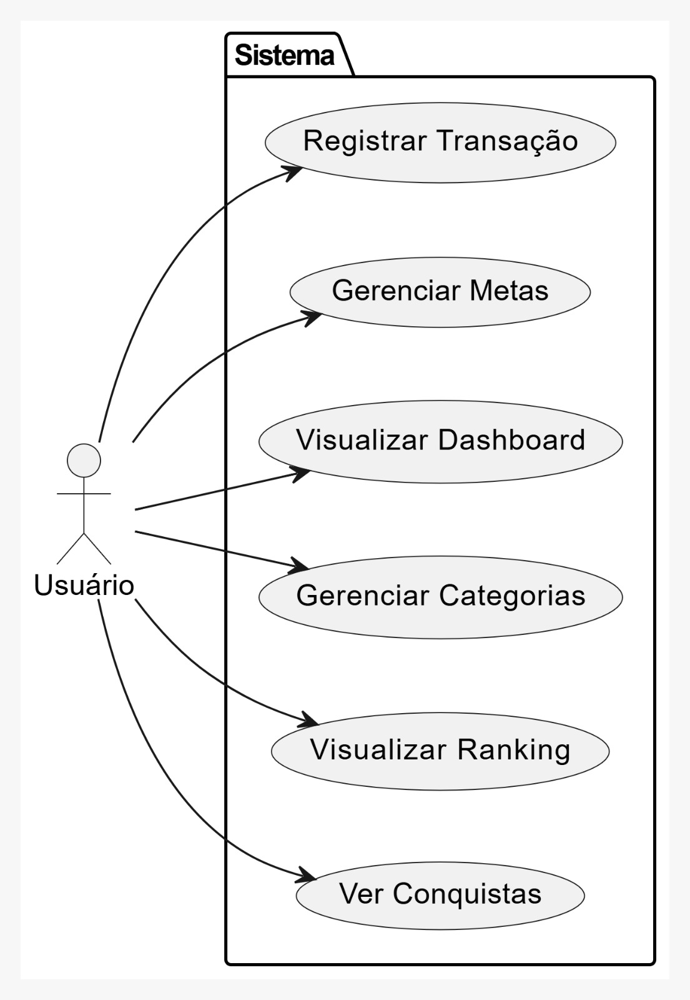
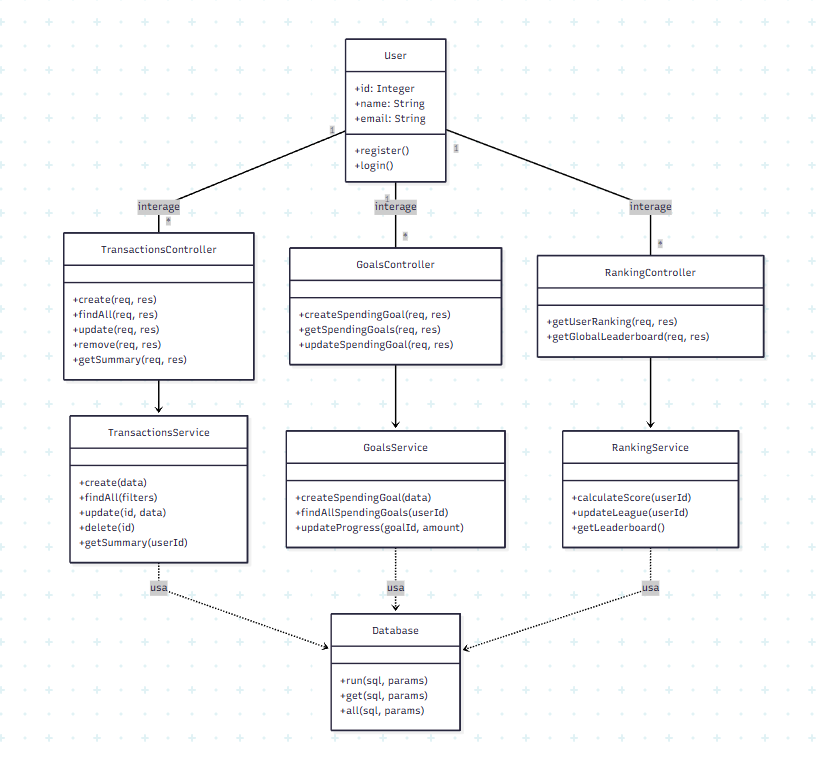
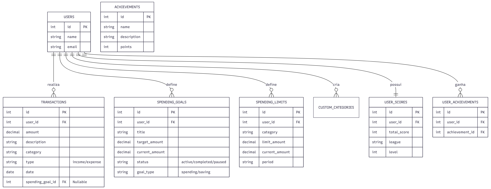
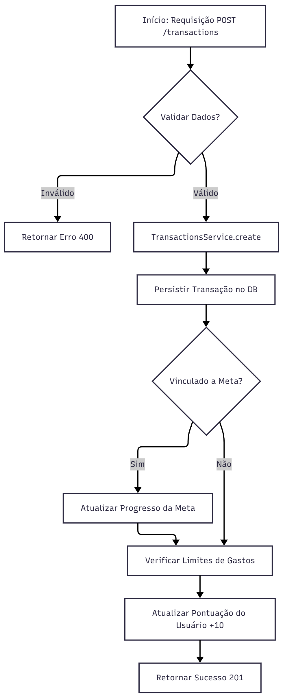
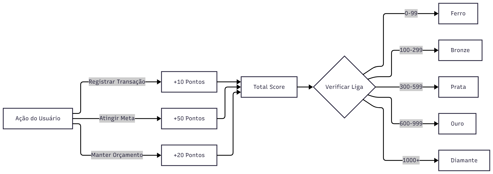
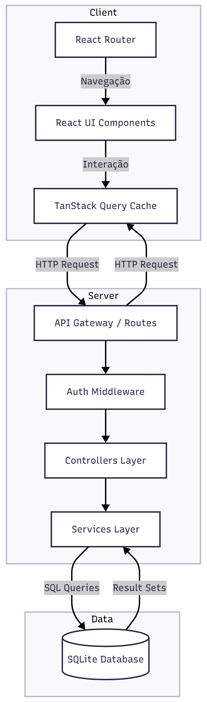
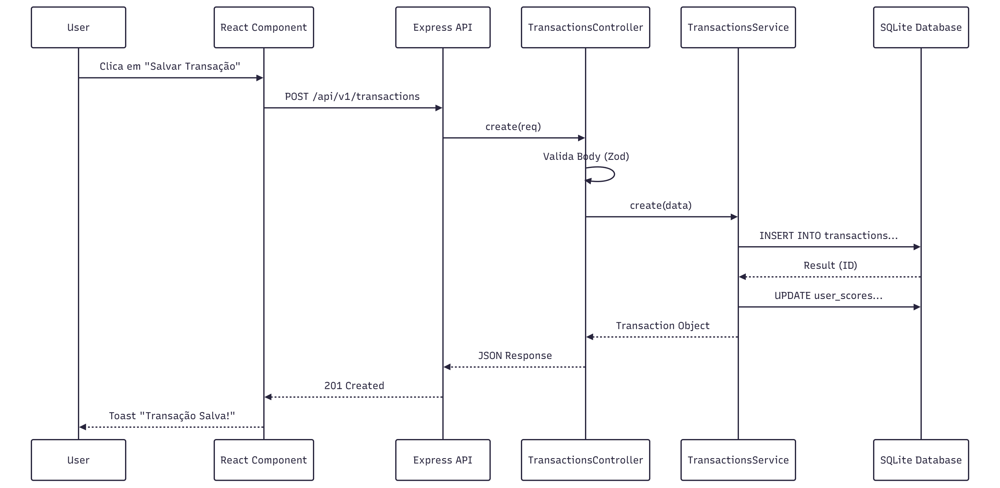

# Documentação Técnica de Desenvolvimento - FYNX (Rev. 04)

## Projeto FYNX - Sistema de Gestão Financeira

**Desenvolvido por:** Matheus Bernardes, Giulianna Mota, Danilo Paiva  
**Revisão Técnica:** Agentic AI (Baseado na Codebase Atual)

## Sumário

1.  **Descrição Geral do Sistema**
    *   1.1. Tema e Objetivo
    *   1.2. Justificativa e Delimitação do Problema
    *   1.3. Público-Alvo
2.  **Engenharia de Requisitos**
    *   2.1. Regras de Negócio
    *   2.2. Requisitos Funcionais (RF)
    *   2.3. Requisitos Não Funcionais (RNF)
3.  **Modelagem e Design do Sistema**
    *   3.1. Diagramas de Caso de Uso (Mermaid + Fluxos Detalhados)
    *   3.2. Estrutura de Classes - Backend (Mermaid + Cartões CRC)
    *   3.3. Modelagem de Dados - ERD (Mermaid + Dicionário de Dados)
    *   3.4. Fluxos de Processos e Lógica (Mermaid)
4.  **Arquitetura de Desenvolvimento**
    *   4.1. Visão Geral da Arquitetura
    *   4.2. Diagrama de Arquitetura do Sistema
    *   4.3. Stack Tecnológico Detalhado
    *   4.4. Estrutura de Diretórios
5.  **Documentação da API**
    *   5.1. Rotas, Endpoints e Payloads
    *   5.2. Diagramas de Sequência

---

## 1. Descrição Geral do Sistema

### 1.1. Tema e Objetivo
O projeto aborda o desenvolvimento de uma plataforma digital para gestão de finanças pessoais, denominada **FYNX**. O objetivo é fornecer uma solução web moderna, acessível e motivadora para que usuários possam monitorar suas finanças, estabelecer metas de economia e acompanhar sua evolução financeira por meio de métricas de desempenho gamificadas.

### 1.2. Justificativa e Delimitação do Problema
A gestão financeira pessoal é frequentemente percebida como complexa e tediosa. O FYNX soluciona este problema centralizando as finanças e integrando dashboards, metas e orçamentos a um sistema motivacional. A gamificação transforma o monitoramento de gastos em uma "jornada", onde a economia gera pontos e reconhecimento (Ligas e Rankings).

### 1.3. Público-Alvo
Destina-se a qualquer pessoa que busca estruturar e controlar suas finanças de forma prática, otimizada e descontraída.

---

## 2. Engenharia de Requisitos

### 2.1. Requisitos Funcionais (RF)

### 2.1. Módulo de Autenticação e Usuários

**RF001 - Autenticação de Usuário**
- **Descrição**: O sistema permite que usuários acessem suas contas de forma segura.
- **Detalhes**:
  - Login via email e senha.
  - Validação de credenciais no backend com retorno de mensagens de erro específicas.
  - Redirecionamento automático para o Dashboard após sucesso.
  - Persistência de sessão (o usuário permanece logado ao recarregar).
- **Status**: ✅ Implementado (`AuthController`, `AuthContext`).

**RF002 - Gestão de Perfil**
- **Descrição**: O usuário pode visualizar seus dados básicos e encerrar a sessão.
- **Detalhes**:
  - Exibição do nome e email do usuário logado na interface.
  - Funcionalidade de Logout com confirmação.
  - Proteção de rotas (redirecionamento para login se não autenticado).
- **Status**: ✅ Implementado.

### 2.2. Módulo de Transações

**RF003 - Registro de Transações**
- **Descrição**: Permitir o cadastro detalhado de receitas e despesas.
- **Detalhes**:
  - Campos: Valor, Descrição, Categoria, Tipo (Receita/Despesa), Data.
  - Campos Opcionais: Método de Pagamento, Notas, Vinculação a Meta.
  - Validação de dados (valores positivos, campos obrigatórios).
  - Categorização automática sugerida ou seleção manual.
- **Status**: ✅ Implementado (`TransactionsController`, `AddTransactionSheet`).

**RF004 - Listagem e Filtros Avançados**
- **Descrição**: Visualização do histórico financeiro com ferramentas de busca.
- **Detalhes**:
  - **Paginação**: Suporte a grandes volumes de dados (carregamento sob demanda).
  - **Filtros**: Por Tipo (Receita/Despesa), Categoria, Intervalo de Datas.
  - **Busca**: Pesquisa textual por descrição.
  - **Ordenação**: Por Data, Valor ou Categoria.
- **Status**: ✅ Implementado (`useList` hook, filtros no backend).

**RF005 - Edição e Exclusão**
- **Descrição**: Manutenção dos registros financeiros.
- **Detalhes**:
  - Edição de qualquer campo de uma transação existente.
  - Exclusão unitária com confirmação (modal de alerta).
  - **Exclusão em Lote**: Seleção múltipla de transações para remoção simultânea.
- **Status**: ✅ Implementado.

### 2.3. Módulo de Metas (Goals)

**RF006 - Gestão de Metas de Economia (Saving Goals)**
- **Descrição**: Criar objetivos para acumular dinheiro.
- **Detalhes**:
  - Definição de valor alvo e data limite.
  - Vinculação de receitas específicas para compor o progresso da meta.
  - Visualização de barra de progresso e percentual concluído.
- **Status**: ✅ Implementado (`GoalsController`, `WalletGoalsWidget`).

**RF007 - Gestão de Metas de Gastos (Spending Goals)**
- **Descrição**: Estabelecer tetos de gastos para controle orçamentário.
- **Detalhes**:
  - Definição de limite de gasto por categoria e período (mensal, semanal).
  - Monitoramento em tempo real do valor consumido vs. limite.
  - Alertas visuais (cores) conforme o limite se aproxima.
- **Status**: ✅ Implementado.

### 2.4. Módulo de Dashboard e Analytics

**RF008 - Visão Geral (Overview)**
- **Descrição**: Painel principal com indicadores chave de desempenho (KPIs).
- **Detalhes**:
  - Cards de Saldo Total, Receita Mensal, Despesa Mensal e Taxa de Economia.
  - Indicadores de tendência (comparativo com período anterior).
- **Status**: ✅ Implementado (`DashboardController`, `Index.tsx`).

**RF009 - Visualizações Gráficas**
- **Descrição**: Gráficos interativos para análise financeira.
- **Detalhes**:
  - **Distribuição por Categoria**: Gráfico de Pizza (Pie Chart) alternável entre Receitas e Despesas.
  - **Evolução Diária**: Gráfico de Área comparando Receitas vs. Despesas ao longo do tempo.
  - **Performance Mensal**: Gráfico de Barras com histórico dos últimos meses.
- **Status**: ✅ Implementado (biblioteca `Recharts`).

### 2.5. Módulo de Gamificação

**RF010 - Sistema de Pontuação (FYNX Score)**
- **Descrição**: Recompensar bons comportamentos financeiros com pontos.
- **Regras Implementadas**:
  - +10 pontos por registrar transação.
  - +50 pontos por atingir uma meta.
  - +20 pontos por manter-se dentro do orçamento.
  - -30 pontos por estourar o orçamento.
- **Status**: ✅ Implementado (`UserScores`, triggers no backend).

**RF011 - Ranking e Ligas**
- **Descrição**: Sistema competitivo para engajamento.
- **Detalhes**:
  - Classificação dos usuários em Ligas: Ferro, Bronze, Prata, Ouro, Diamante.
  - Leaderboard global mostrando a posição de todos os usuários.
  - Destaque para a posição do usuário atual.
- **Status**: ✅ Implementado (`RankingController`, página `Ranking`).

**RF012 - Conquistas (Achievements)**
- **Descrição**: Badges desbloqueáveis por marcos alcançados.
- **Detalhes**:
  - Sistema de verificação de critérios para desbloqueio.
  - Exibição de conquistas no perfil do usuário.
- **Status**: ✅ Implementado (Tabelas `achievements` e `user_achievements`).

### 2.6. Funcionalidades Auxiliares

**RF013 - Categorias Personalizadas**
- **Descrição**: Flexibilidade na categorização.
- **Detalhes**:
  - Usuário pode criar suas próprias categorias além das padrão do sistema.
  - Categorias personalizadas aparecem nos filtros e formulários.
- **Status**: ✅ Implementado (`CustomCategoriesController`).

**RF014 - Limites de Gastos (Spending Limits)**
- **Descrição**: Controle rígido por categoria.
- **Detalhes**:
  - Definição de limite máximo para categorias específicas.
  - Monitoramento de progresso e status (Normal, Alerta, Excedido).
- **Status**: ✅ Implementado.

**RF015 - Onboarding (Tour Guiado)**
- **Descrição**: Tutorial interativo para novos usuários.
- **Detalhes**:
  - Tour passo-a-passo explicando as funcionalidades do Dashboard.
  - Detecção de primeiro acesso.
  - Opção de pular o tutorial.
- **Status**: ✅ Implementado (`Driver.js`, `useTour`).

---

## 2. Requisitos Não Funcionais (RNF)

### 2.1. Performance

**RNF001 - Tempo de Resposta da API**
- **Critério**: Endpoints críticos (listagem, dashboard) devem responder em < 200ms.
- **Implementação**: Otimização de queries SQL, uso de índices no SQLite e paginação de dados.

**RNF002 - Renderização Frontend**
- **Critério**: Interface fluida e sem travamentos.
- **Implementação**:
  - Uso de **Virtualização** (`react-window`) para listas longas de transações.
  - **Lazy Loading** de rotas e componentes pesados.
  - Gerenciamento de estado otimizado com **TanStack Query** (caching e deduping de requisições).

**RNF003 - Tamanho do Bundle**
- **Critério**: Carregamento inicial rápido.
- **Implementação**: Build otimizado com **Vite**, tree-shaking de bibliotecas (lucide-react, recharts).

### 2.2. Usabilidade e UX

**RNF004 - Responsividade (Mobile-First)**
- **Critério**: Layout adaptável a qualquer tamanho de tela (Mobile, Tablet, Desktop).
- **Implementação**: Uso extensivo de classes utilitárias do **TailwindCSS** (`grid-cols-1 md:grid-cols-2 lg:grid-cols-4`).

**RNF005 - Feedback Visual**
- **Critério**: O usuário deve sempre saber o status de suas ações.
- **Implementação**:
  - Sistema de **Toasts** para sucesso/erro em operações.
  - Skeletons e Spinners durante carregamento de dados.
  - Confirmações (Dialogs) para ações destrutivas.

**RNF006 - Tema e Acessibilidade**
- **Critério**: Conforto visual e acessibilidade básica.
- **Implementação**:
  - Suporte a **Dark Mode** e Light Mode.
  - Componentes baseados em **Radix UI** (focados em acessibilidade, navegação por teclado).

### 2.3. Confiabilidade e Segurança

**RNF007 - Persistência de Dados**
- **Critério**: Garantia de que dados não sejam perdidos.
- **Implementação**: Banco de dados relacional **SQLite** (arquivo `fynx.db`) com transações ACID.

**RNF008 - Segurança de Dados Sensíveis**
- **Critério**: Proteção de credenciais.
- **Implementação**: Senhas armazenadas apenas como hash (**bcrypt**). Nenhuma senha em texto plano.

**RNF009 - Validação de Dados**
- **Critério**: Integridade dos dados inseridos.
- **Implementação**: Validação dupla:
  - **Frontend**: Zod schemas nos formulários.
  - **Backend**: Zod middlewares nas rotas da API.

**RNF010 - Tratamento de Erros**
- **Critério**: O sistema não deve quebrar silenciosamente.
- **Implementação**: Blocos try-catch nos controllers e Error Boundaries no React para capturar falhas de renderização.

---

## 3. Regras de Negócio (RN)

### 3.1. Transações Financeiras

**RN001 - Validação de Valores**
- O valor de qualquer transação (receita ou despesa) deve ser estritamente positivo (> 0).
- O sistema deve armazenar valores com precisão de 2 casas decimais.

**RN002 - Categorização Obrigatória**
- Toda transação deve pertencer a uma categoria.
- Se uma categoria personalizada for excluída, as transações associadas devem ser preservadas (soft delete ou manutenção do histórico).

**RN003 - Tipagem Estrita**
- Uma transação só pode ser do tipo 'income' (receita) ou 'expense' (despesa). Não há tipos híbridos.

### 3.2. Metas e Orçamentos

**RN004 - Metas de Economia (Saving Goals)**
- O progresso de uma meta de economia é calculado somando-se as receitas vinculadas explicitamente a ela.
- Uma meta não pode ter data de término anterior à data de início.

**RN005 - Metas de Gastos (Spending Goals)**
- O progresso é calculado somando-se todas as despesas da categoria selecionada dentro do período definido.
- O status da meta deve ser atualizado automaticamente para 'Excedido' se o valor atual ultrapassar o alvo.

### 3.3. Sistema de Gamificação

**RN006 - Cálculo de Pontuação**
- A pontuação é cumulativa e baseada em eventos (triggers):
  - **Registro de Transação**: +10 pontos.
  - **Meta Atingida**: +50 pontos.
  - **Manter-se no Orçamento**: +20 pontos.
  - **Estourar Orçamento**: -30 pontos.

**RN007 - Progressão de Ligas**
- A liga do usuário é determinada pela sua pontuação total atual:
  - **Ferro**: 0 - 99 pontos.
  - **Bronze**: 100 - 299 pontos.
  - **Prata**: 300 - 599 pontos.
  - **Ouro**: 600 - 999 pontos.
  - **Diamante**: 1000+ pontos.
- A atualização de liga deve ocorrer imediatamente após a mudança de pontuação.

### 3.4. Limites de Gastos

**RN008 - Monitoramento de Limites**
- Um limite de gastos é definido por Categoria e Período.
- O sistema deve alertar o usuário quando o consumo atingir 75% do limite estabelecido.
- O cálculo do consumo deve considerar apenas transações do tipo 'expense' dentro do intervalo de datas do período.

## 3. Modelagem e Design do Sistema

### 3.1. Diagramas de Caso de Uso




#### Detalhamento dos Casos de Uso

**CSU01: Fazer Login**
| Detalhe | Descrição |
| :--- | :--- |
| **Ator Primário** | Usuário |
| **Pré-condições** | Usuário registrado. |
| **Fluxo Principal** | 1. Usuário informa credenciais.<br>2. Sistema valida.<br>3. Acesso concedido. |
| **Pós-condições** | Usuário autenticado. |

**CSU02: Registrar Usuário**
| Detalhe | Descrição |
| :--- | :--- |
| **Ator Primário** | Usuário |
| **Pré-condições** | Nenhuma. |
| **Fluxo Principal** | 1. Usuário preenche dados (nome, email).<br>2. Sistema cria registro no DB.<br>3. Sistema cria pontuação inicial (Level 1). |
| **Pós-condições** | Novo usuário criado. |

**CSU03: Adicionar Transação**
| Detalhe | Descrição |
| :--- | :--- |
| **Ator Primário** | Usuário |
| **Pré-condições** | Usuário logado. |
| **Fluxo Principal** | 1. Usuário acessa "Nova Transação".<br>2. Preenche valor, descrição, data e seleciona categoria.<br>3. (Opcional) Vincula a uma Meta de Economia.<br>4. Confirma a operação.<br>5. Sistema valida dados (RN001, RN003).<br>6. Sistema persiste a transação.<br>7. Sistema atualiza saldo e pontuação (+10 pts). |
| **Pós-condições** | Transação salva, saldo atualizado, pontuação incrementada. |

**CSU04: Criar Metas de Gasto (Orçamento)**
| Detalhe | Descrição |
| :--- | :--- |
| **Ator Primário** | Usuário |
| **Pré-condições** | Usuário logado. |
| **Fluxo Principal** | 1. Usuário seleciona "Criar Meta de Gasto".<br>2. Define categoria e valor limite.<br>3. Sistema salva meta com type='spending'. |
| **Pós-condições** | Limite de gasto ativo. |

**CSU05: Criar Metas de Economia**
| Detalhe | Descrição |
| :--- | :--- |
| **Ator Primário** | Usuário |
| **Pré-condições** | Usuário logado. |
| **Fluxo Principal** | 1. Usuário seleciona "Criar Meta de Economia".<br>2. Define valor alvo e data.<br>3. Sistema salva meta com type='saving'. |
| **Pós-condições** | Meta de economia ativa. |

**CSU06: Adicionar Transação a uma Meta**
| Detalhe | Descrição |
| :--- | :--- |
| **Ator Primário** | Usuário |
| **Pré-condições** | Meta existente. |
| **Fluxo Principal** | 1. No formulário de transação, usuário seleciona uma meta.<br>2. Sistema vincula o ID da meta à transação.<br>3. Sistema atualiza `current_amount` da meta. |
| **Pós-condições** | Progresso da meta atualizado. |

**CSU07: Visualizar Dashboard**
| Detalhe | Descrição |
| :--- | :--- |
| **Ator Primário** | Usuário |
| **Pré-condições** | Usuário logado. |
| **Fluxo Principal** | 1. Sistema busca saldo total.<br>2. Sistema busca últimas transações.<br>3. Sistema calcula totais por categoria.<br>4. Exibe gráficos e resumos. |
| **Pós-condições** | Visão geral apresentada. |

**CSU08: Visualizar Ranking Global**
| Detalhe | Descrição |
| :--- | :--- |
| **Ator Primário** | Usuário |
| **Pré-condições** | Usuário logado. |
| **Fluxo Principal** | 1. Usuário acessa "Ranking".<br>2. Sistema calcula pontuação total (FynxScore).<br>3. Sistema determina a Liga atual (RN006).<br>4. Sistema exibe lista ordenada de usuários.<br>5. Usuário vê sua posição e badge da liga. |
| **Pós-condições** | Usuário ciente de sua classificação. |

### 3.2. Estrutura de Classes (Backend)

O backend segue o padrão **Controller-Service-Repository**.

> **Nota sobre a Classe Usuário:** Embora não exista um `UsersController` explícito na implementação atual (pois o foco é na gestão financeira e a autenticação é simplificada), a entidade `User` é fundamental para o modelo de dados e é representada implicitamente em todas as operações através do `userId`.



#### Cartões CRC (Class-Responsibility-Collaborator)

**User**
| Responsabilidades | Colaboradores |
| :--- | :--- |
| Representar a identidade do usuário no sistema. | - |
| Fornecer dados para autenticação e perfil. | TransactionsController, GoalsController, RankingController |

**TransactionsController**
| Responsabilidades | Colaboradores |
| :--- | :--- |
| Receber requisições HTTP de transações. | TransactionsService |
| Validar dados de entrada (Body/Query). | - |
| Formatar respostas JSON para o cliente. | - |

**TransactionsService**
| Responsabilidades | Colaboradores |
| :--- | :--- |
| Implementar regras de negócio de transações. | Database |
| Calcular totais e resumos financeiros. | GoalsService (atualizar metas) |
| Validar consistência dos dados. | RankingService (atualizar pontuação) |

**GoalsController**
| Responsabilidades | Colaboradores |
| :--- | :--- |
| Gerenciar endpoints de metas e orçamentos. | GoalsService |
| Validar payloads de criação/edição de metas. | - |

**GoalsService**
| Responsabilidades | Colaboradores |
| :--- | :--- |
| Gerenciar ciclo de vida de metas (Active/Completed). | Database |
| Calcular progresso das metas. | TransactionsService |
| Verificar se orçamentos foram estourados. | - |

**RankingController**
| Responsabilidades | Colaboradores |
| :--- | :--- |
| Expor endpoints de gamificação e ranking. | RankingService |

**RankingService**
| Responsabilidades | Colaboradores |
| :--- | :--- |
| Calcular FynxScore e nível do usuário. | Database |
| Gerenciar sistema de Ligas e Conquistas. | - |
| Gerar leaderboard global. | - |

**Database**
| Responsabilidades | Colaboradores |
| :--- | :--- |
| Gerenciar conexão com o banco SQLite. | - |
| Executar queries SQL (run, get, all). | Services (Transactions, Goals, Ranking) |
| Inicializar schema e seed de dados. | - |

### 3.3. Modelagem de Dados (ERD e Dicionário)




#### Dicionário de Dados (Entidades Detalhadas)

**Tabela: USERS**
| Coluna | Tipo | Restrição | Descrição |
| :--- | :--- | :--- | :--- |
| `id` | INTEGER | PK, AutoInc | Identificador único do usuário. |
| `name` | TEXT | Not Null | Nome completo. |
| `email` | TEXT | Unique, Not Null | E-mail de login. |

**Tabela: TRANSACTIONS**
| Coluna | Tipo | Restrição | Descrição |
| :--- | :--- | :--- | :--- |
| `id` | INTEGER | PK, AutoInc | Identificador único da transação. |
| `user_id` | INTEGER | FK, Not Null | Referência ao usuário dono da transação. |
| `amount` | DECIMAL(10,2) | Not Null | Valor monetário da transação. |
| `description` | TEXT | Not Null | Descrição curta (ex: "Almoço"). |
| `category` | TEXT | Not Null | Categoria (ex: "Alimentação"). |
| `type` | TEXT | Check('income','expense') | Tipo da movimentação. |
| `date` | DATE | Not Null | Data da ocorrência. |
| `spending_goal_id` | INTEGER | FK, Nullable | Vínculo opcional com uma meta. |

**Tabela: SPENDING_GOALS (Metas)**
| Coluna | Tipo | Restrição | Descrição |
| :--- | :--- | :--- | :--- |
| `id` | INTEGER | PK, AutoInc | Identificador único da meta. |
| `title` | TEXT | Not Null | Nome da meta (ex: "Viagem 2024"). |
| `target_amount` | DECIMAL | Not Null | Valor alvo a ser atingido. |
| `current_amount` | DECIMAL | Default 0 | Valor já economizado/gasto. |
| `goal_type` | TEXT | Default 'spending' | Tipo: 'spending' (limite) ou 'saving' (economia). |
| `status` | TEXT | Check('active'...) | Estado atual da meta. |

**Tabela: SPENDING_LIMITS**
| Coluna | Tipo | Restrição | Descrição |
| :--- | :--- | :--- | :--- |
| `id` | INTEGER | PK, AutoInc | Identificador único. |
| `category` | TEXT | Not Null | Categoria monitorada. |
| `limit_amount` | DECIMAL | Not Null | Valor limite para o período. |
| `period` | TEXT | Check('monthly'...) | Periodicidade do limite. |

**Tabela: CUSTOM_CATEGORIES**
| Coluna | Tipo | Restrição | Descrição |
| :--- | :--- | :--- | :--- |
| `id` | INTEGER | PK, AutoInc | Identificador único. |
| `name` | TEXT | Not Null | Nome da categoria personalizada. |
| `type` | TEXT | Check('income','expense') | Tipo da categoria. |

**Tabela: USER_SCORES (Gamificação)**
| Coluna | Tipo | Restrição | Descrição |
| :--- | :--- | :--- | :--- |
| `user_id` | INTEGER | FK, Unique | Usuário a que se refere o score. |
| `total_score` | INTEGER | Default 0 | Pontuação acumulada na temporada. |
| `league` | TEXT | Default 'Bronze' | Liga atual (Ferro, Bronze, etc.). |
| `level` | INTEGER | Default 1 | Nível do usuário (RPG-like). |

**Tabela: ACHIEVEMENTS (Conquistas)**
| Coluna | Tipo | Restrição | Descrição |
| :--- | :--- | :--- | :--- |
| `id` | INTEGER | PK, AutoInc | Identificador único. |
| `name` | TEXT | Not Null | Nome da conquista. |
| `points` | INTEGER | Not Null | Pontos concedidos ao desbloquear. |

### 3.4. Fluxos de Processos e Lógica

#### Fluxo de Processamento de Transação
Visualiza o caminho desde a requisição até a persistência e efeitos colaterais (atualização de saldo e metas).



#### Lógica de Ranking e Gamificação
Como as ações do usuário influenciam sua posição e liga.



---

## 4. Arquitetura de Desenvolvimento

### 4.1. Visão Geral
O FYNX utiliza uma arquitetura monolítica modularizada para o backend (API) e uma Single Page Application (SPA) para o frontend.

*   **Frontend:** React com Vite, comunicando-se via REST API.
*   **Backend:** Node.js com Express, servindo dados JSON.
*   **Database:** SQLite (arquivo local `fynx.db`) para desenvolvimento ágil.

### 4.2. Diagrama de Arquitetura do Sistema

Este diagrama ilustra a comunicação entre os componentes principais do sistema.




### 4.3. Stack Tecnológico

| Camada | Tecnologia | Versão/Detalhe |
|---|---|---|
| **Frontend** | React | 18.3 |
| | TypeScript | 5.6 |
| | Vite | 5.4 |
| | TailwindCSS | 3.4 (Estilização) |
| | TanStack Query | v5 (Gerenciamento de Estado Server-side) |
| **Backend** | Node.js | 20+ |
| | Express | 5.1.0 |
| | SQLite3 | Driver nativo |
| | Zod | Validação de Schemas |

### 4.4. Estrutura de Diretórios

```
ProjetoFynx/
├── FynxApi/ (Backend)
│   ├── src/
│   │   ├── database/ (Conexão e Migrations manuais)
│   │   ├── modules/ (Feature-based: transactions, goals, ranking...)
│   │   ├── routes/ (Definição de rotas da API)
│   │   └── server.ts (Entry point)
│
├── FynxV2/ (Frontend)
│   ├── src/
│   │   ├── components/ (UI e Widgets)
│   │   ├── pages/ (Views: Index, Ranking, Goal...)
│   │   ├── services/ (Axios/Fetch calls)
│   │   └── tours/ (Guias de usuário Driver.js)
│   │   └── tours/ (Guias de usuário Driver.js)
```

---

## 5. Documentação da API

### 5.1. Rotas, Endpoints e Payloads

Abaixo estão detalhados os endpoints principais e os dados necessários para realizar as requisições.

#### **Transações**

*   **POST** `/api/v1/transactions`
    *   **Descrição:** Cria uma nova transação financeira.
    *   **Payload (JSON):**
        ```json
        {
          "userId": 1,
          "amount": 150.00,
          "description": "Compras Supermercado",
          "category": "Alimentação",
          "type": "expense",
          "date": "2024-11-24",
          "spendingGoalId": 5  // Opcional, vincula a uma meta
        }
        ```
    *   **Resposta (201):** Objeto da transação criada.

*   **GET** `/api/v1/transactions`
    *   **Descrição:** Lista transações com filtros.
    *   **Query Params:** `?userId=1&type=expense&category=Alimentação&dateFrom=2024-01-01`

#### **Metas (Goals)**

*   **POST** `/api/v1/goals`
    *   **Descrição:** Cria uma nova meta de economia ou limite de gastos.
    *   **Payload (JSON):**
        ```json
        {
          "userId": 1,
          "title": "Viagem Férias",
          "target_amount": 5000.00,
          "goal_type": "saving", // ou 'spending'
          "period": "monthly",   // se for spending
          "end_date": "2025-12-31"
        }
        ```

#### **Ranking**

*   **GET** `/api/v1/ranking`
    *   **Descrição:** Retorna a posição do usuário e o leaderboard global.
    *   **Query Params:** `?userId=1`
    *   **Resposta (200):**
        ```json
        {
          "userRank": { "position": 5, "score": 1200, "league": "Ouro" },
          "leaderboard": [ ... ]
        }
        ```

### 5.2. Diagrama de Sequência: Ciclo de Vida da Requisição

Exemplo de como uma requisição flui do componente React até o banco de dados.



