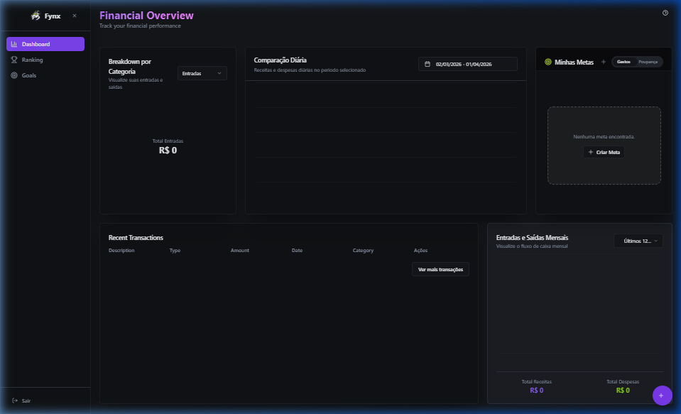
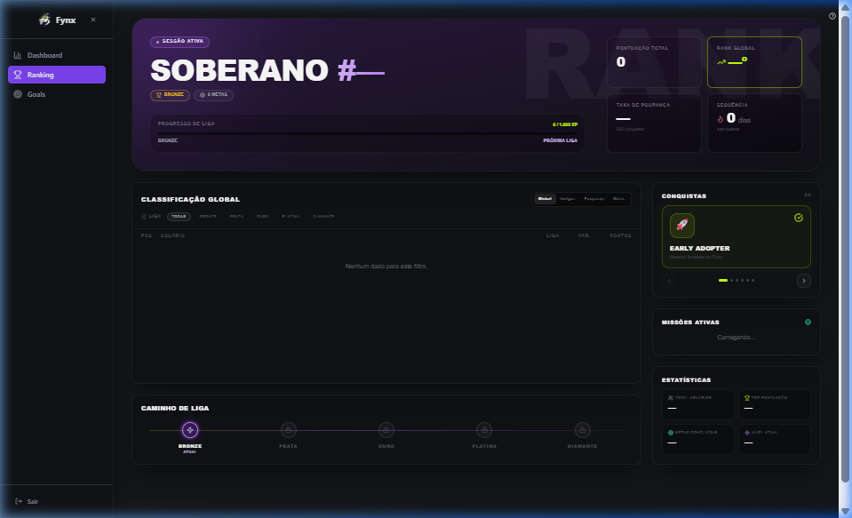
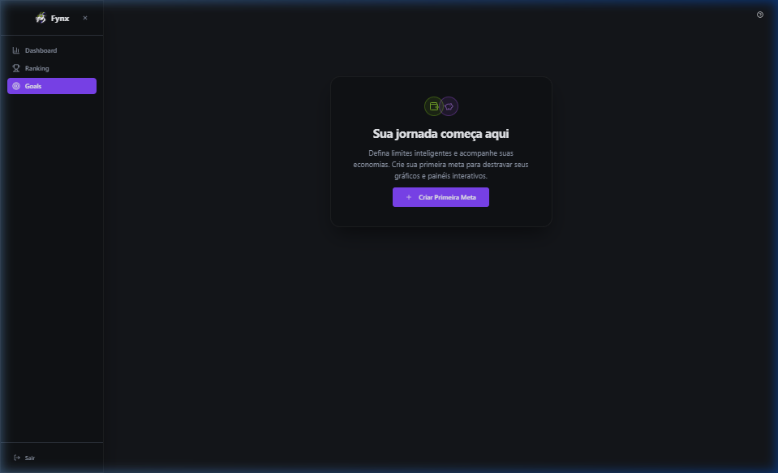
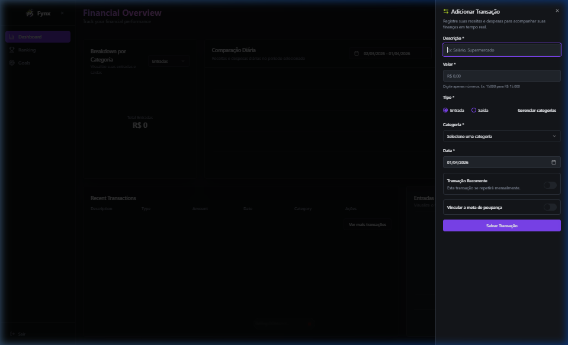
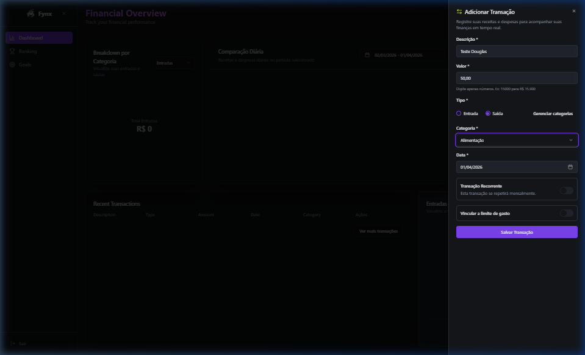
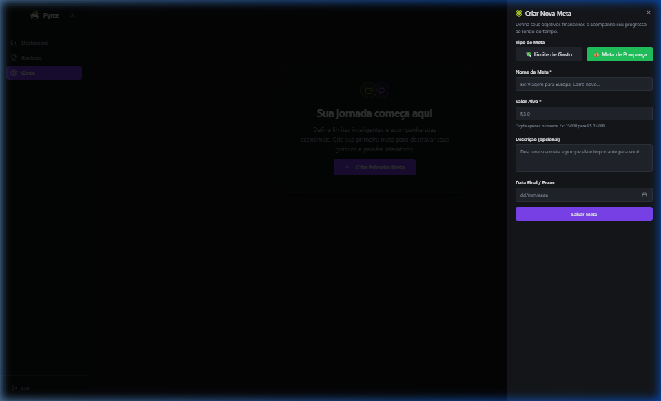
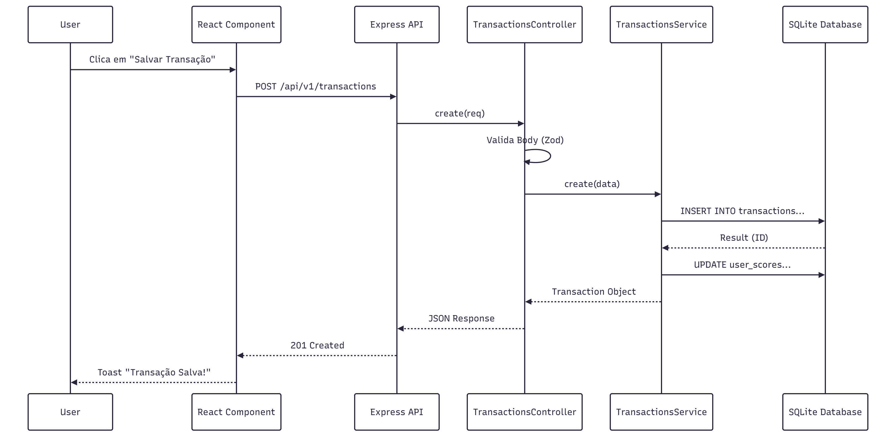

# Documentação Técnica de Desenvolvimento — FYNX (Rev. 06)

## Projeto FYNX — Sistema de Gestão Financeira

**Desenvolvido por:** Matheus Bernardes, Giulianna Mota, Danilo Paiva
**Revisão Técnica:** Agentic AI (Baseado na Codebase Atual — Rev. 06)

---

## Controle de Revisões

| Revisão | Data | Responsáveis | Descrição Principal |
|---|---|---|---|
| Rev. 01–04 | 2025 | Equipe Fynx | Versões anteriores — estrutura inicial, modelagem e requisitos base |
| Rev. 05 | Abr/2026 | Matheus, Giulianna, Danilo | Adição do Módulo WhatsApp (planejado), Diagrama de Classes atualizado |
| Rev. 06 | Abr/2026 | Matheus, Giulianna, Danilo | Reestruturação completa: RNFs, Stack Técnica, API Reference, Setup, Glossário, correção de inconsistências |

---

## Sumário

1. **Descrição Geral do Sistema**
   - 1.1. Tema e Objetivo
   - 1.2. Justificativa e Delimitação do Problema
   - 1.3. Público-Alvo
   - 1.4. Stack Tecnológica
   - 1.5. Estrutura do Repositório

2. **Engenharia de Requisitos**
   - 2.1. Requisitos Funcionais (RF)
   - 2.2. Requisitos Não Funcionais (RNF)
   - 2.3. Regras de Negócio (RN)

3. **Modelagem e Design do Sistema**
   - 3.1. Diagramas de Caso de Uso
   - 3.2. Mapeamento de Processos (BPMN)
   - 3.3. Diagrama de Classes

4. **Projeto de Banco de Dados**
   - 4.1. Justificativa e Seleção de Arquitetura
   - 4.2. Modelo Conceitual (DER)
   - 4.3. Modelo Lógico
   - 4.4. Modelo Físico — DDL Atual
   - 4.5. Migrations Planejadas
   - 4.6. Dicionário de Dados Estratégico
   - 4.7. Políticas de Integridade e Regras de Negócio

5. **API Reference**
   - 5.1. Autenticação e Segurança
   - 5.2. Módulo de Autenticação
   - 5.3. Módulo de Transações
   - 5.4. Módulo de Metas (Goals)
   - 5.5. Módulo de Dashboard
   - 5.6. Módulo de Ranking
   - 5.7. Módulo de Categorias Customizadas
   - 5.8. Módulo de Limites de Gastos

6. **Setup e Operação**
   - 6.1. Pré-requisitos
   - 6.2. Variáveis de Ambiente
   - 6.3. Instalação e Execução Local
   - 6.4. Usuário Demo

7. **Mapeamento do Fluxo do Usuário (Navegação e Interações)**

8. **Glossário**

---

## 1. Descrição Geral do Sistema

### 1.1. Tema e Objetivo

O projeto aborda o desenvolvimento de uma plataforma digital para gestão de finanças pessoais, denominada **FYNX**. O objetivo é fornecer uma solução web moderna, acessível e motivadora para que usuários possam monitorar suas finanças, estabelecer metas de economia e acompanhar sua evolução financeira por meio de métricas de desempenho gamificadas.

### 1.2. Justificativa e Delimitação do Problema

A gestão financeira pessoal é frequentemente percebida como complexa e tediosa. O FYNX soluciona este problema centralizando as finanças e integrando dashboards, metas e orçamentos a um sistema motivacional. A gamificação transforma o monitoramento de gastos em uma "jornada", onde a economia gera pontos e reconhecimento (Ligas e Rankings).

### 1.3. Público-Alvo

Destina-se a qualquer pessoa que busca estruturar e controlar suas finanças de forma prática, otimizada e descontraída.

### 1.4. Stack Tecnológica

#### Backend (`FynxApi`)

| Camada | Tecnologia | Versão | Papel |
|---|---|---|---|
| Framework HTTP | Express | 5.x | Servidor e roteamento da API REST |
| Linguagem | TypeScript | 5.x | Tipagem estática em todo o backend |
| Banco de Dados (Dev) | SQLite 3 | — | Banco relacional embarcado para desenvolvimento |
| Banco de Dados (Prod) | PostgreSQL | Planejado | Migração prevista para produção |
| Driver de DB | sqlite3 (nativo) | 6.x | Acesso direto ao SQLite sem ORM |
| Autenticação | jsonwebtoken (JWT) | 9.x | Emissão e validação de tokens de acesso |
| Criptografia | bcrypt | 6.x | Hashing de senhas com salt |
| Validação | Zod | 4.x | Validação de schemas de entrada nas rotas |
| Rate Limiting | express-rate-limit | 7.x | Proteção contra abuso de endpoints |
| Logger | Winston (utils/logger) | — | Logging estruturado de requisições HTTP e erros |

#### Frontend (`FynxV2`)

| Camada | Tecnologia | Versão | Papel |
|---|---|---|---|
| Framework | React | 18.x | Biblioteca de UI com renderização baseada em componentes |
| Bundler | Vite | 7.x | Servidor de desenvolvimento e build otimizado |
| Linguagem | TypeScript | 5.x | Tipagem estática em todo o frontend |
| Estilização | Tailwind CSS | 3.x | Utilitários CSS para estilização rápida |
| Componentes | shadcn/ui + Radix UI | — | Componentes acessíveis e estilizáveis |
| Roteamento | React Router DOM | 6.x | Navegação client-side (SPA) |
| Data Fetching | TanStack Query (React Query) | 5.x | Cache e sincronização de estado do servidor |
| Framework CRUD | Refine | 4.x | Abstração para operações de data provider |
| Gráficos | Recharts | 2.x | Gráficos de pizza, área e barras interativos |
| Animações | Framer Motion | 12.x | Animações de layout e transições fluidas |
| Formulários | React Hook Form + Zod | — | Formulários performáticos com validação integrada |
| Tour Interativo | Driver.js | 1.x | Tour guiado para onboarding de novos usuários |
| HTTP Client | Axios | 1.x | Chamadas à API REST do backend |

### 1.5. Estrutura do Repositório

O projeto é organizado como um monorepo com dois diretórios principais de aplicação:

```
ProjetoFynx/
│
├── FynxApi/                      → Backend Node.js/Express
│   ├── src/
│   │   ├── modules/              → Módulos por domínio de negócio
│   │   │   ├── auth/             → Autenticação (login, registro)
│   │   │   ├── transactions/     → Gestão de transações financeiras
│   │   │   ├── goals/            → Metas de economia e gasto (+ orçamentos)
│   │   │   ├── ranking/          → Sistema de pontuação e ligas
│   │   │   ├── dashboard/        → Dados consolidados do painel
│   │   │   ├── custom-categories/→ Categorias personalizadas por usuário
│   │   │   └── spending-limits/  → Limites de gastos por categoria [parcial]
│   │   ├── database/
│   │   │   ├── schema.ts         → DDL principal das tabelas (SCHEMA object)
│   │   │   ├── database.ts       → Inicialização, migrations e seed
│   │   │   └── seed.ts           → Dados iniciais (categorias, badges, achievements)
│   │   ├── middleware/
│   │   │   └── auth.middleware.ts→ Validação de token JWT (authenticateToken)
│   │   ├── routes/
│   │   │   └── index.ts          → Registro central de todas as rotas
│   │   ├── utils/
│   │   │   └── logger.ts         → Logger Winston
│   │   └── server.ts             → Entry point — Express app, middlewares globais
│   ├── data/                     → Diretório do arquivo fynx.db (SQLite)
│   ├── .env                      → Variáveis de ambiente (não versionado)
│   └── package.json
│
└── FynxV2/                       → Frontend React/Vite
    ├── src/
    │   ├── pages/
    │   │   ├── Index.tsx          → Dashboard (rota /dashboard)
    │   │   ├── Login.tsx          → Autenticação (rota /login)
    │   │   ├── Ranking.tsx        → Gamificação (rota /ranking)
    │   │   ├── Goal.tsx           → Metas (rota /goals)
    │   │   └── NotFound.tsx       → Página 404
    │   ├── components/
    │   │   ├── AddTransactionSheet.tsx  → Drawer de nova transação
    │   │   ├── CreateGoalSheet.tsx      → Sheet de nova meta
    │   │   ├── WalletGoalsWidget.tsx    → Widget de metas na sidebar
    │   │   ├── AppSidebar.tsx           → Navegação lateral
    │   │   └── ui/                      → Componentes shadcn/ui
    │   ├── context/
    │   │   └── AuthContext.tsx    → Estado global de autenticação (JWT)
    │   ├── hooks/                 → Custom hooks (useList, useTour, etc.)
    │   ├── services/              → Chamadas à API (Axios)
    │   ├── refine/
    │   │   └── providers.ts       → Configuração do Refine data provider
    │   └── App.tsx                → Roteamento principal e providers
    └── package.json
```

---

## 2. Engenharia de Requisitos

### 2.1. Requisitos Funcionais (RF)

### 2.1.1. Módulo de Autenticação e Usuários

**RF001 - Autenticação de Usuário**
- **Descrição**: O sistema permite que usuários acessem suas contas de forma segura.
- **Detalhes**:
  - Login via email e senha.
  - Validação de credenciais no backend com retorno de mensagens de erro específicas.
  - Redirecionamento automático para o Dashboard após sucesso.
  - Persistência de sessão (o usuário permanece logado ao recarregar).
- **Status**: ✅ Implementado (`AuthController`, `AuthContext`).

**RF002 - Gestão de Perfil**
- **Descrição**: O usuário pode visualizar seus dados básicos e encerrar a sessão.
- **Detalhes**:
  - Exibição do nome e email do usuário logado na interface.
  - Funcionalidade de Logout com confirmação.
  - Proteção de rotas (redirecionamento para login se não autenticado).
- **Status**: ✅ Implementado.

### 2.1.2. Módulo de Transações

**RF003 - Registro de Transações**
- **Descrição**: Permitir o cadastro detalhado de receitas e despesas.
- **Detalhes**:
  - Campos: Valor, Descrição, Categoria, Tipo (Receita/Despesa), Data.
  - Campos Opcionais: Notas, Vinculação a Meta.
  - Validação de dados (valores positivos, campos obrigatórios).
  - Categorização automática sugerida ou seleção manual.
- **Status**: ✅ Implementado (`TransactionsController`, `AddTransactionSheet`).

**RF004 - Listagem e Filtros Avançados**
- **Descrição**: Visualização do histórico financeiro com ferramentas de busca.
- **Detalhes**:
  - **Paginação**: Suporte a grandes volumes de dados (carregamento sob demanda).
  - **Filtros**: Por Tipo (Receita/Despesa), Categoria, Intervalo de Datas, Valor Mínimo/Máximo.
  - **Busca**: Pesquisa textual por descrição, categoria ou notas.
  - **Ordenação**: Por Data, Valor, Categoria, Descrição ou data de criação.
- **Status**: ✅ Implementado (`TransactionsService.getTransactions()`, filtros no backend).

**RF005 - Edição e Exclusão**
- **Descrição**: Manutenção dos registros financeiros.
- **Detalhes**:
  - Edição de qualquer campo de uma transação existente.
  - Exclusão unitária com confirmação (modal de alerta).
  - **Exclusão em Lote**: Seleção múltipla de transações para remoção simultânea via endpoint `/bulk`.
- **Status**: ✅ Implementado.

### 2.1.3. Módulo de Metas (Goals)

**RF006 - Gestão de Metas de Economia (Saving Goals)**
- **Descrição**: Criar objetivos para acumular dinheiro.
- **Detalhes**:
  - Definição de valor alvo e data limite.
  - Vinculação de receitas específicas durante o registro de transações para compor o progresso da meta.
  - Visualização de barra de progresso e percentual concluído.
- **Status**: ✅ Implementado (`GoalsController`, `WalletGoalsWidget`).

**RF007 - Gestão de Metas de Gastos (Spending Goals)**
- **Descrição**: Estabelecer tetos de gastos para controle orçamentário.
- **Detalhes**:
  - Definição de limite de gasto por categoria e período (mensal, semanal, anual).
  - Monitoramento em tempo real do valor consumido vs. limite.
  - Alertas visuais (cores) conforme o limite se aproxima.
- **Status**: ✅ Implementado.

### 2.1.4. Módulo de Dashboard e Analytics

**RF008 - Visão Geral (Overview)**
- **Descrição**: Painel principal com indicadores chave de desempenho (KPIs).
- **Detalhes**:
  - Cards de Saldo Total, Receita Mensal, Despesa Mensal e Taxa de Economia.
  - Indicadores de tendência (comparativo com período anterior).
- **Status**: ✅ Implementado (`DashboardController`, `Index.tsx`).

**RF009 - Visualizações Gráficas**
- **Descrição**: Gráficos interativos para análise financeira.
- **Detalhes**:
  - **Distribuição por Categoria**: Gráfico de Pizza (Pie Chart) alternável entre Receitas e Despesas.
  - **Evolução Diária**: Gráfico de Área comparando Receitas vs. Despesas ao longo do tempo.
  - **Performance Mensal**: Gráfico de Barras com histórico dos últimos meses.
- **Status**: ✅ Implementado (biblioteca `Recharts`).

### 2.1.5. Módulo de Gamificação

**RF010 - Sistema de Pontuação (FYNX Score)**
- **Descrição**: Recompensar bons comportamentos financeiros com pontos.
- **Regras Implementadas**:
  - Score calculado com base na fórmula de Economia, Consistência e Penalidades (ver **RN009**).
  - Check-in diário concede pontos com bônus progressivo por streak.
- **Status**: ✅ Implementado (`RankingService`, `user_scores`).

**RF011 - Ranking e Ligas**
- **Descrição**: Sistema competitivo para engajamento.
- **Detalhes**:
  - Classificação dos usuários em 5 Ligas por percentil: **Bronze, Prata, Ouro, Platina, Diamante**.
  - Leaderboard global mostrando a posição de todos os usuários.
  - Destaque para a posição do usuário atual.
- **Status**: ✅ Implementado (`RankingController`, página `Ranking`).

**RF012 - Conquistas (Achievements)**
- **Descrição**: Badges desbloqueáveis por marcos alcançados.
- **Detalhes**:
  - Sistema de verificação de critérios para desbloqueio automático.
  - Exibição de conquistas no perfil do usuário.
- **Status**: ✅ Implementado (tabelas `achievements` e `user_achievements`).

### 2.1.6. Funcionalidades Auxiliares

**RF013 - Categorias Personalizadas**
- **Descrição**: Flexibilidade na categorização.
- **Detalhes**:
  - Usuário pode criar suas próprias categorias além das padrão do sistema.
  - Categorias personalizadas aparecem nos filtros e formulários.
- **Status**: ✅ Implementado (`CustomCategoriesController`).

**RF014 - Limites de Gastos (Spending Limits)**
- **Descrição**: Controle rígido por categoria.
- **Detalhes**:
  - Definição de limite máximo para categorias específicas.
  - Monitoramento de progresso e status (Normal, Excedido).
- **Status**: ⚠️ Módulo implementado (service, controller, routes), mas rota ainda não exposta na API principal. Ver Seção 5.8.

**RF015 - Onboarding (Tour Guiado)**
- **Descrição**: Tutorial interativo para novos usuários.
- **Detalhes**:
  - Tour passo-a-passo explicando as funcionalidades do Dashboard.
  - Detecção de primeiro acesso.
  - Opção de pular o tutorial.
- **Status**: ✅ Implementado (`Driver.js`, `useTour`).

---

> ---
> ### ⚠️ Módulo em Desenvolvimento — Integração WhatsApp
>
> Os requisitos **RF016 a RF019** descrevem funcionalidades **planejadas para implementação futura**.
> O código correspondente **ainda não existe** na codebase atual. A documentação abaixo representa o
> **design técnico aprovado** para guiar o desenvolvimento da próxima fase do produto.
>
> **Infraestrutura do Canal:** Arquitetura híbrida — **Meta Cloud API** (conversação bidirecional) + **Evolution API** (notificações proativas).
>
> ---

### 2.1.7. Módulo de Acesso via WhatsApp [PLANEJADO]

**RF016 - Vinculação de Número de WhatsApp** 🔲 A implementar
- **Descrição**: O usuário associa seu número de WhatsApp à conta FYNX por meio da plataforma web.
- **Detalhes**:
  - Na tela de Perfil, o sistema exibe a seção "Conectar WhatsApp".
  - O usuário informa seu número (com DDI) e aciona a verificação.
  - O sistema envia um **código OTP de 6 dígitos** via WhatsApp (Meta Cloud API) com validade de 10 minutos.
  - Após validação, o número é vinculado ao `user_id` e persiste no banco.
  - Cada número deve ser único no sistema (constraint UNIQUE na coluna `whatsapp_phone`).
  - O usuário pode desvincular ou alterar o número a qualquer momento.

**RF017 - Registro e Gestão de Transações via WhatsApp** 🔲 A implementar
- **Descrição**: Registro de receitas e despesas por mensagem em linguagem natural, processada por IA.
- **Detalhes**:
  - Usuário envia mensagem livre (ex.: *"gastei 45 reais no mercado hoje"*).
  - LLM extrai: Tipo, Valor, Categoria, Data e Descrição.
  - Caso algum campo obrigatório falte, a IA solicita de forma contextualizada.
  - A IA confirma o registro com um resumo ao usuário.
  - Operações suportadas via linguagem natural: **Listar**, **Editar** e **Excluir** transações.

**RF018 - Consulta de Metas e Gamificação via WhatsApp** 🔲 A implementar
- **Descrição**: Consulta de status de metas, pontuação e ranking via mensagem.
- **Detalhes**:
  - Metas de Economia: progresso, valor acumulado e prazo.
  - Metas de Gastos: consumo atual vs. limite por categoria.
  - FYNX Score: pontuação atual e eventos recentes.
  - Ranking e Liga: posição global e liga atual.

**RF019 - Notificações Proativas via WhatsApp** 🔲 A implementar
- **Descrição**: Alertas automáticos enviados pelo sistema via Evolution API.
- **Detalhes**:
  - **Alerta de Orçamento (75%)**: Ao atingir 75% do limite de gastos de uma categoria.
  - **Orçamento Excedido**: Imediatamente ao ultrapassar o limite.
  - **Meta de Economia Concluída**: Ao atingir 100% de uma saving goal.
  - **Resumo Periódico** *(opcional)*: Resumo financeiro semanal ou mensal.
  - O usuário pode desativar tipos específicos de notificação no Perfil.
  - Enviadas exclusivamente para o número vinculado e verificado (RF016).

---

### 2.2. Requisitos Não Funcionais (RNF)

| ID | Categoria | Requisito | Critério de Aceitação |
|---|---|---|---|
| **RNF001** | Desempenho | Tempo de resposta da API | Resposta < 500ms para 95% das requisições em condições normais |
| **RNF002** | Disponibilidade | Uptime do serviço | ≥ 99% em ambiente de produção |
| **RNF003** | Segurança — Autenticação | Proteção de acesso | Token JWT obrigatório em todas as rotas protegidas; bcrypt com salt no hash de senhas |
| **RNF004** | Segurança — Rate Limiting | Proteção contra abuso | Máximo de 100 req/15min por IP (global); máximo de 5 tentativas de login por hora por IP |
| **RNF005** | Segurança — Dados | Proteção de informações | Senhas jamais armazenadas em texto puro; logs não devem expor dados sensíveis |
| **RNF006** | Escalabilidade | Portabilidade de banco | Arquitetura preparada para migração de SQLite (dev) → PostgreSQL (produção) sem reescrita de lógica de negócio |
| **RNF007** | Compatibilidade | Suporte a navegadores | Chrome ≥ 90, Firefox ≥ 88, Safari ≥ 14, Edge ≥ 90 |
| **RNF008** | Manutenibilidade | Qualidade de código | TypeScript com tipagem estrita; módulos independentes por domínio; sem acoplamento entre módulos |
| **RNF009** | Usabilidade | Onboarding | Usuário novo deve ser capaz de registrar sua primeira transação em menos de 3 minutos, auxiliado pelo tour interativo |
| **RNF010** | Confiabilidade — DB | Integridade transacional | Operações que tocam múltiplas tabelas devem ser executadas em transações SQL atômicas com rollback em caso de falha |

---

### 2.3. Regras de Negócio (RN)

#### 2.3.1. Módulo de Transações

**RN001 - Valor Positivo Obrigatório**
- Toda transação deve ter `amount > 0`. Valores nulos ou negativos são rejeitados com erro de validação.

**RN002 - Tipo Binário de Transação**
- O campo `type` só aceita os valores `'income'` (receita) ou `'expense'` (despesa), garantido por constraint CHECK no DDL.

**RN003 - Data Obrigatória**
- O campo `date` é obrigatório em toda transação e não pode ser nulo.

**RN004 - Vinculação Opcional a Metas**
- Uma transação pode ser vinculada opcionalmente a uma meta de economia (`saving_goal_id`) ou a uma meta de gasto (`spending_goal_id`). Ao ser vinculada, o progresso da meta correspondente é atualizado automaticamente.

#### 2.3.2. Módulo de Usuários e Autenticação

**RN005 - Unicidade de Email**
- O email de cadastro de cada usuário deve ser único no sistema, garantido por constraint `UNIQUE` na tabela `users`.

**RN006 - Criação Automática de Score ao Registrar**
- Ao criar um novo usuário, o sistema deve inicializar automaticamente um registro em `user_scores` com `total_score = 0`, `level = 1` e liga `'Bronze'`.

#### 2.3.3. Módulo de Gamificação

**RN007 - Atualização Assíncrona do Score**
- O FYNX Score é recalculado a cada nova transação registrada. O cálculo ocorre de forma **assíncrona** (fire-and-forget), não bloqueando a resposta ao usuário.

**RN008 - Concessão Automática de Badges**
- `badge_novice`: concedido automaticamente na primeira transação registrada pelo usuário.
- `badge_saver`: concedido quando o saldo acumulado total do usuário supera R$ 1.000.
- `badge_fire`: concedido ao atingir uma sequência de check-ins (streak) de 7 ou mais dias.

---

**RN009 — Sistema de Ligas e Pontuação (FYNX Score)**

O FYNX Score é calculado periodicamente e compõe o ranking competitivo da plataforma.

**Fórmula:**
```
Score Total = Score de Economia + Score de Consistência + Carry-Over − Penalidade
```

| Componente | Cálculo | Condição |
|---|---|---|
| **Score de Economia** | `((Receita − Despesa) / Receita) × 1000` | Aplicado apenas quando Receita > Despesa no mês |
| **Score de Consistência** | `Dias com transação × 5` + bônus de streak | Calculado mensalmente |
| **Bônus de Streak** | +20pts (≥3d), +50pts (≥7d), +250pts (≥30d) | Cumulativo dentro da consistência |
| **Carry-Over** | 20% do score da temporada anterior | Preservado no Reset de Temporada |
| **Penalidade** | `(Despesa − Receita) × Multiplicador da Liga` | Aplicada apenas quando Despesa > Receita |

**Multiplicadores de Penalidade por Liga:**

| Liga | Multiplicador de Penalidade |
|---|---|
| 🥉 Bronze | 1× |
| 🥈 Prata | 1,5× |
| 🥇 Ouro | 2× |
| 💎 Platina | 3× |
| 🏆 Diamante | 5× |

**Classificação de Ligas — baseada em percentil global:**

| Liga | Critério |
|---|---|
| 🏆 Diamante | Top 1% dos usuários (maior score) |
| 💎 Platina | Top 5% dos usuários |
| 🥇 Ouro | Top 20% dos usuários |
| 🥈 Prata | Top 50% dos usuários |
| 🥉 Bronze | Abaixo do Top 50% |

**Reset de Temporada:** Periodicamente, todos os scores são reduzidos a 20% do valor atual (`carry_over_score = total_score × 0.2; total_score = carry_over_score`). A posição relativa entre usuários é preservada, pois todos sofrem a mesma redução proporcional.

#### 2.3.4. Módulo de Limites de Gastos

**RN010 - Monitoramento de Limites**
- Um limite de gastos é definido por Categoria e Período.
- O sistema deve alertar o usuário quando o consumo atingir 75% do limite estabelecido.
- O status do limite muda para `'exceeded'` ao ultrapassar o `limit_amount`.

---

## 3. Modelagem e Design do Sistema

### 3.1. Diagramas de Caso de Uso

Nesta seção, apresentamos os casos de uso detalhados, incluindo o módulo de acesso via WhatsApp (planejado), interações com IA e as automações proativas do sistema.


#### Detalhamento dos Casos de Uso

**CSU01: Fazer Login**
| Detalhe | Descrição |
| :--- | :--- |
| **Ator Primário** | Usuário |
| **Pré-condições** | Usuário registrado. |
| **Fluxo Principal** | 1. Usuário informa credenciais.<br>2. Sistema valida.<br>3. Acesso concedido. |
| **Pós-condições** | Usuário autenticado. |

**CSU02: Registrar Usuário**
| Detalhe | Descrição |
| :--- | :--- |
| **Ator Primário** | Usuário |
| **Pré-condições** | Nenhuma. |
| **Fluxo Principal** | 1. Usuário preenche dados (nome, email, senha).<br>2. Sistema verifica unicidade do email.<br>3. Sistema cria registro no DB.<br>4. Sistema inicializa pontuação (`user_scores`, Liga Bronze, 0 pontos). |
| **Pós-condições** | Novo usuário criado com score inicializado. |

**CSU03: Adicionar Transação**
| Detalhe | Descrição |
| :--- | :--- |
| **Ator Primário** | Usuário |
| **Pré-condições** | Usuário logado. |
| **Fluxo Principal** | 1. Usuário acessa "Nova Transação".<br>2. Preenche valor, descrição, data e seleciona categoria.<br>3. (Opcional) Vincula a uma Meta de Economia — aciona **CSU06** via `<<extend>>`.<br>4. Confirma a operação.<br>5. Sistema valida dados (RN001, RN002, RN003).<br>6. Sistema persiste a transação em transação atômica SQL.<br>7. Sistema atualiza progresso de metas vinculadas.<br>8. Sistema recalcula score assincronamente (RN007). |
| **Pós-condições** | Transação salva, score atualizado, badges verificados. |

**CSU04: Criar Metas de Gasto (Orçamento)**
| Detalhe | Descrição |
| :--- | :--- |
| **Ator Primário** | Usuário |
| **Pré-condições** | Usuário logado. |
| **Fluxo Principal** | 1. Usuário seleciona "Criar Meta de Gasto".<br>2. Define categoria, valor limite e período.<br>3. Sistema salva com `goal_type='spending'`. |
| **Pós-condições** | Limite de gasto ativo. |

**CSU05: Criar Metas de Economia**
| Detalhe | Descrição |
| :--- | :--- |
| **Ator Primário** | Usuário |
| **Pré-condições** | Usuário logado. |
| **Fluxo Principal** | 1. Usuário seleciona "Criar Meta de Economia".<br>2. Define valor alvo e data limite.<br>3. Sistema salva com `goal_type='saving'`. |
| **Pós-condições** | Meta de economia ativa. |

**CSU06: Adicionar Transação a uma Meta**
| Detalhe | Descrição |
| :--- | :--- |
| **Ator Primário** | Usuário |
| **Relacionamento** | `<<extend>>` de **CSU03** — acionado opcionalmente durante o registro. |
| **Pré-condições** | Usuário logado e pelo menos uma meta de economia ativa. |
| **Fluxo Principal** | 1. Durante o fluxo de CSU03, usuário opta por vincular a transação a uma meta.<br>2. Sistema exibe metas de economia disponíveis.<br>3. Usuário seleciona a meta desejada.<br>4. Sistema vincula o ID da meta à transação.<br>5. Sistema atualiza `current_amount` da meta. |
| **Pós-condições** | Progresso da meta atualizado. |

**CSU07: Visualizar Dashboard**
| Detalhe | Descrição |
| :--- | :--- |
| **Ator Primário** | Usuário |
| **Pré-condições** | Usuário logado. |
| **Fluxo Principal** | 1. Sistema busca saldo total.<br>2. Sistema busca últimas transações.<br>3. Sistema calcula totais por categoria.<br>4. Exibe gráficos e resumos. |
| **Pós-condições** | Visão geral apresentada. |

**CSU08: Visualizar Ranking Global**
| Detalhe | Descrição |
| :--- | :--- |
| **Ator Primário** | Usuário |
| **Pré-condições** | Usuário logado. |
| **Fluxo Principal** | 1. Usuário acessa "Ranking".<br>2. Sistema recalcula FYNX Score do usuário.<br>3. Sistema determina Liga atual (RN009).<br>4. Sistema exibe leaderboard ordenado por score.<br>5. Usuário vê sua posição e badge da liga. |
| **Pós-condições** | Usuário ciente de sua classificação. |

**CSU09: Vincular WhatsApp** *(Planejado)*
| Detalhe | Descrição |
| :--- | :--- |
| **Ator Primário** | Usuário |
| **Pré-condições** | Usuário logado na plataforma web. |
| **Fluxo Principal** | 1. Usuário acessa "Conectar WhatsApp" no perfil.<br>2. Informa número de telefone com DDI.<br>3. Sistema aciona **"Enviar OTP"** via `<<include>>`, disparando código via Meta API.<br>4. Usuário insere o OTP recebido.<br>5. Sistema valida OTP (máx. 10 minutos) e vincula o número. |
| **Pós-condições** | Número verificado e vinculado à conta. |

**CSU10: Gerenciar Transações via WhatsApp** *(Planejado)*
| Detalhe | Descrição |
| :--- | :--- |
| **Ator Primário** | Usuário (WhatsApp) |
| **Atores Secundários** | IA (LLM), via caso de uso *Processar NLP* |
| **Pré-condições** | Número de WhatsApp vinculado e validado. |
| **Fluxo Principal** | 1. Usuário envia mensagem de registro, edição ou exclusão.<br>2. Sistema valida remetente na tabela de vínculos.<br>3. Sistema aciona **"Processar NLP"** via `<<include>>`.<br>4. IA extrai intenção e parâmetros.<br>5. (Opcional) IA solicita campos faltantes.<br>6. Sistema processa operação no banco.<br>7. Sistema responde com resumo. |
| **Pós-condições** | Transação registrada, alterada ou removida corretamente. |

**CSU11: Consultar Status via WhatsApp** *(Planejado)*
| Detalhe | Descrição |
| :--- | :--- |
| **Ator Primário** | Usuário (WhatsApp) |
| **Atores Secundários** | IA (LLM) |
| **Pré-condições** | Número vinculado e validado. |
| **Fluxo Principal** | 1. Usuário envia mensagem consultando metas, orçamentos, score ou ranking.<br>2. Sistema valida remetente.<br>3. IA interpreta a intenção de consulta.<br>4. Sistema busca dados no banco.<br>5. IA formata resposta em linguagem natural. |
| **Pós-condições** | Usuário recebe informação atualizada. |

**CSU12: Enviar Notificações Proativas** *(Planejado)*
| Detalhe | Descrição |
| :--- | :--- |
| **Ator Primário** | Sistema FYNX |
| **Atores Secundários** | Usuário (WhatsApp); Meta / Evolution API |
| **Pré-condições** | Número vinculado e validado. Notificações habilitadas. |
| **Fluxo Principal** | 1. Sistema detecta evento gatilho (orçamento ≥ 75%, meta concluída).<br>2. Sistema seleciona template de mensagem correspondente.<br>3. Sistema aciona Meta / Evolution API via `<<include>>`.<br>4. Usuário recebe alerta no WhatsApp. |
| **Pós-condições** | Usuário notificado proativamente. |

---

### 3.2. Mapeamento de Processos (BPMN)

Este manual define a modelagem dos processos do FYNX, separando as responsabilidades por **Raias (Lanes)**.

#### Definição Global das Raias

Ao desenhar qualquer processo abaixo, considere uma **Pool** chamada "Sistema FYNX" dividida em 5 raias:

1. **Raia do Usuário:** Ações humanas (clicar, digitar, ler).
2. **Raia do Frontend (Interface):** Validações visuais, botões, animações e alertas.
3. **Raia do Backend (Servidor):** Onde as regras de negócio e os cálculos acontecem.
4. **Raia do Banco de Dados (DB):** Onde a informação é gravada, apagada ou alterada.
5. **Raia Externa (WhatsApp/IA):** Sistemas de terceiros (Meta, Evolution, LLM).

#### MÓDULO 1: ACESSO E CONTA

**Processo 1.1: Registro de Novo Usuário**
- **[Raia Usuário]**: Preenche formulário e clica em "Criar Conta".
- **[Raia Frontend]**: Valida formato do e-mail (Zod). Se erro, exibe alerta. Se ok, envia POST.
- **[Raia Backend]**: Recebe dados, verifica se o e-mail existe no Banco (RN005).
- **[Raia Backend]**: Aplica criptografia na senha (Bcrypt).
- **[Raia Backend]**: Inicializa Ranking (**Liga Bronze**, 0 Pontos) — RN006.
- **[Raia Banco de Dados]**: Grava novo registro nas tabelas `users` e `user_scores`.
- **[Raia Backend]**: Gera Token JWT.
- **[Raia Frontend]**: Recebe Token, salva no navegador e abre o Dashboard.


#### MÓDULO 2: INTEGRAÇÃO WHATSAPP [STATUS: PLANEJADO]

**Processo 2.1: Vinculação de Número (OTP)**
- **[Raia Usuário]**: Digita número de telefone na tela de Perfil.
- **[Raia Backend]**: Gera código de 6 dígitos e inicia cronômetro de 10 minutos.
- **[Raia Externa (WhatsApp)]**: Envia mensagem para o celular do usuário via Meta Cloud API.
- **[Raia Usuário]**: Lê o código e digita na plataforma.
- **[Raia Backend]**: Valida código e verifica se não expirou.
- **[Raia Banco de Dados]**: Atualiza `whatsapp_verified = true` e persiste o número.


#### MÓDULO 3: GESTÃO DE TRANSAÇÕES

**Processo 3.1: Cadastro de Transação (O Fluxo de Entrada)**
- **[Raia Usuário]**: Abre o modal, preenche dados e escolhe se vincula a uma Meta.
- **[Raia Backend]**: Inicia uma **Transação Atômica SQL (BEGIN TRANSACTION)**.
- **[Raia Backend]**: Se houver Meta, calcula o novo progresso.
- **[Raia Banco de Dados]**: Tenta gravar a Transação e atualizar a Meta.
- **[Raia Backend]**: **[Gateway de Erro]** Ocorreu erro no Banco?
  - *Sim:* Dispara **ROLLBACK** (desfaz tudo). Retorna erro ao Frontend.
  - *Não:* Dispara **COMMIT** (grava definitivamente).
- **[Raia Backend]**: (Background assíncrono) Recalcula Score e verifica Badges — RN007, RN008.


**Processo 3.3: Exclusão de Transação (Fluxo de Reprocessamento Completo)**

Este processo é crítico pois exige "voltar no tempo" para corrigir saldos e ligas.
- **[Raia Usuário]**: Clica no ícone de lixeira em uma transação.
- **[Raia Frontend]**: Exibe Modal de Confirmação.
- **[Raia Backend]**: Recebe pedido de exclusão e inicia **Transação SQL**.
- **[Raia Backend]**: **[Passo de Auditoria]**: Verifica se a transação estava vinculada a alguma Meta.
- **[Raia Backend]**: **[Lógica de Estorno]**:
  - Se era uma DESPESA: Subtrai o valor do consumo da meta de gasto.
  - Se era uma RECEITA: Subtrai o valor do progresso da meta de economia.
- **[Raia Banco de Dados]**: Deleta o registro da transação.
- **[Raia Backend]**: Recalcula Score e reavalia Liga do usuário (RN009).
- **[Raia Frontend]**: Remove a linha da tela e atualiza gráficos.


#### MÓDULO 4: PLANEJAMENTO E METAS

**Processo 4.2: Meta de Gastos (Spending Goals)**
- **[Raia Usuário]**: Define categoria e valor máximo.
- **[Raia Backend]**: Cria registro com `goal_type = 'spending'`.
- **[Raia Banco de Dados]**: Salva meta.
- **[Raia Backend]**: (Monitoramento) A cada nova transação, o sistema verifica se o limite foi atingido.


#### MÓDULO 5: DASHBOARDS E RANKING (GAMIFICAÇÃO)

**Processo 5.1: Carregamento do Painel**
- **[Raia Frontend]**: Ao abrir a tela, pede os dados (GET /api/v1/dashboard).
- **[Raia Backend]**: Executa consultas SQL agregadas por categoria e período.
- **[Raia Frontend]**: Recebe o JSON e renderiza os gráficos com Recharts.


**Processo 5.2: Robô de Gamificação (Cálculo de Pontos e Ligas)**

O processo abaixo descreve a lógica de cálculo do FYNX Score conforme implementada em `RankingService.calculateScore()`:

**Fórmula do FYNX Score:**
`Score Total = Score de Economia + Score de Consistência + Carry-Over − Penalidade`

| Componente | Cálculo |
|---|---|
| Score de Economia | `((Receita − Despesa) / Receita) × 1000` — apenas se Receita > Despesa no mês |
| Score de Consistência | `Dias com transação × 5` + bônus de streak (3d: +20pts, 7d: +50pts, 30d: +250pts) |
| Carry-Over | 20% do score da temporada anterior, preservado no Reset |
| Penalidade | `(Despesa − Receita) × Multiplicador da Liga` — apenas se Despesa > Receita |

**Multiplicadores de Penalidade por Liga:**

| Liga | Multiplicador |
|---|---|
| Bronze | 1× |
| Prata | 1,5× |
| Ouro | 2× |
| Platina | 3× |
| Diamante | 5× |

**[Gateway de Decisão] — Em qual percentil o usuário se encontra?**
- **Top 1%** → Promove/Mantém em **Diamante** 🏆
- **Top 5%** → Promove/Mantém em **Platina** 💎
- **Top 20%** → Promove/Mantém em **Ouro** 🥇
- **Top 50%** → Promove/Mantém em **Prata** 🥈
- **Abaixo de 50%** → Rebaixa/Mantém em **Bronze** 🥉

**[Raia Banco de Dados]**: Grava a nova liga e o score atualizado em `user_scores`.

**Reset de Temporada:** Todos os scores são reduzidos a 20% do valor atual (`carry_over = total × 0.2`). A posição relativa entre usuários é preservada, pois todos sofrem a mesma redução proporcional.


#### MÓDULO 6: NOTIFICAÇÕES E IA [STATUS: PLANEJADO]

**Processo 6.1: Alertas de Teto de Gastos**
- **[Raia Backend]**: Verifica se consumo da Meta ≥ 75% do limite.
- **[Raia Externa (WhatsApp)]**: Dispara mensagem de alerta para o celular via Evolution API.


**Processo 6.2: Registro por Linguagem Natural (WhatsApp + IA)**
- **[Raia Usuário]**: Envia mensagem de texto (ou áudio) no WhatsApp.
- **[Raia Externa (IA)]**: LLM transcreve (se áudio) e extrai valor, tipo e categoria.
- **[Raia Backend]**: Recebe dados estruturados e inicia o **Processo 3.1 (Cadastro)**.
- **[Raia Externa (WhatsApp)]**: Responde ao usuário confirmando o registro.


---

### 3.3. Diagrama de Classes

O diagrama abaixo representa a arquitetura orientada a objetos do FYNX organizada em três camadas — **Entidades de Domínio**, **Serviços** e **Controladores** — com o **Módulo WhatsApp** como extensão planejada.

> **Legenda de estereótipos:**
> - Classes sem estereótipo → **já implementadas** na codebase atual.
> - `<<planned>>` → **novas classes** a serem criadas para o módulo WhatsApp.

> 

#### 3.3.1. Visão Geral da Arquitetura

A arquitetura do FYNX é orientada a objetos e segmentada em três camadas lógicas, isolando responsabilidades de negócio e controle.

#### 3.3.2. Entidades de Domínio (Camada de Dados)

Mapeiam a base de persistência SQLite, definindo regras estruturais e vínculos via chaves estrangeiras.

---

**User**
**Descrição:** Raiz do sistema. Centraliza dados cadastrais, autenticação e, futuramente, integração WhatsApp.

| Atributo | Tipo | Descrição |
|---|---|---|
| id | integer | Identificador único (PK, AUTOINCREMENT) |
| name | string | Nome completo |
| email | string | Email de login (UNIQUE) |
| password | string | Hash da senha (bcrypt) |
| whatsapp_phone | string | Número de WhatsApp vinculado [PLANEJADO] |
| whatsapp_verified | boolean | Status de verificação OTP [PLANEJADO] |
| whatsapp_otp | string | Código OTP temporário [PLANEJADO] |
| otp_expires_at | Date | Expiração do OTP [PLANEJADO] |
| notifications_enabled | boolean | Flag para notificações via WhatsApp [PLANEJADO] |

---

**UserScore**
**Descrição:** Gerencia a pontuação, nível, liga e streak do usuário para gamificação. Relação 1:1 com User.

| Atributo | Tipo | Descrição |
|---|---|---|
| id | integer | PK |
| user_id | integer | FK → users (UNIQUE — garante 1:1) |
| total_score | integer | Pontuação acumulada (FYNX Score) |
| carry_over_score | integer | Bônus de temporadas anteriores (20% do total anterior) |
| level | integer | Nível derivado do score (nível = floor(score/500) + 1) |
| league | string | Liga atual: Bronze / Prata / Ouro / Platina / Diamante |
| current_streak | integer | Dias consecutivos de check-in ativo |
| max_streak | integer | Maior streak histórica do usuário |
| last_checkin | Date | Data do último check-in |

---

**Transaction**
**Descrição:** Representa uma movimentação financeira (receita ou despesa). Entidade de maior volume do sistema.

| Atributo | Tipo | Descrição |
|---|---|---|
| id | integer | PK |
| user_id | integer | FK → users |
| type | 'income' \| 'expense' | Tipo da transação (CHECK constraint) |
| amount | DECIMAL(10,2) | Valor monetário (NOT NULL, > 0) |
| description | string | Descrição (NOT NULL) |
| category | string | Categoria da transação |
| date | Date | Data do evento (NOT NULL) |
| notes | string | Notas opcionais |
| spending_goal_id | integer | FK → spending_goals (nullable) |
| saving_goal_id | integer | FK → spending_goals (nullable) |

---

**SpendingGoal**
**Descrição:** Meta financeira unificada — discriminador `goal_type` diferencia poupança (`saving`) de controle de gastos (`spending`).

| Atributo | Tipo | Descrição |
|---|---|---|
| id | integer | PK |
| user_id | integer | FK → users |
| title | string | Nome da meta |
| category | string | Categoria associada |
| goal_type | 'spending' \| 'saving' | Discriminador de tipo |
| target_amount | DECIMAL(10,2) | Valor alvo ou limite |
| current_amount | DECIMAL(10,2) | Progresso atual |
| period | 'monthly' \| 'weekly' \| 'yearly' | Janela de acumulação |
| start_date / end_date | Date | Intervalo da meta |
| status | 'active' \| 'completed' \| 'paused' | Estado atual |

---

**Budget**
**Descrição:** Orçamento mensal ou anual vinculado a um usuário. Tabela ativa criada em `database.ts`.

| Atributo | Tipo | Descrição |
|---|---|---|
| id | integer | PK |
| user_id | integer | FK → users |
| name | string | Nome do orçamento |
| total_amount | DECIMAL(10,2) | Valor total planejado |
| spent_amount | DECIMAL(10,2) | Valor já gasto |
| period | 'monthly' \| 'yearly' | Periodicidade |
| start_date / end_date | Date | Vigência |

---

**SpendingLimit**
**Descrição:** Limite rígido de gastos por categoria com alertas automáticos de status.
> **⚠️ Nota:** A implementação atual não possui `user_id` — os limites são globais por categoria, não vinculados a usuários específicos. Ponto pendente de revisão técnica.

| Atributo | Tipo | Descrição |
|---|---|---|
| id | integer | PK |
| category | string | Categoria monitorada |
| limit_amount | DECIMAL(10,2) | Teto de gasto |
| current_spent | DECIMAL(10,2) | Valor já consumido |
| period | string | Período de referência |
| status | 'active' \| 'exceeded' | Status do limite |

---

**CustomCategory**
**Descrição:** Categoria personalizada criada pelo usuário, com suporte a soft-delete via flag `is_active`.

| Atributo | Tipo | Descrição |
|---|---|---|
| id | integer | PK |
| user_id | integer | FK → users |
| name | string | Nome da categoria |
| type | 'income' \| 'expense' | Tipo da categoria |
| is_active | boolean | Flag de soft-delete |

---

**Achievement / UserAchievement**
**Descrição:** Conquista global (catálogo) e relação N:N com usuários.

| Achievement | Tipo | Descrição |
|---|---|---|
| id | integer | PK |
| name | string | Nome da conquista |
| description | string | Descrição |
| icon | string | Ícone representativo |
| points | integer | Pontos concedidos |

---

**Badge / UserBadge**
**Descrição:** Insígnia desbloqueável por marcos específicos. Catálogo com critérios em JSON.

| Badge | Tipo | Descrição |
|---|---|---|
| id | string | PK (ex.: 'badge_novice') |
| name | string | Nome da badge |
| category | string | Categoria temática |
| requirements | TEXT (JSON) | Critérios de desbloqueio |

---

**WhatsAppSession** *(Planejado)*
**Descrição:** Sessão de conversa entre usuário e IA, armazenando histórico contextual.

| Atributo | Tipo | Descrição |
|---|---|---|
| id | integer | PK |
| user_id | integer | FK → users (ON DELETE CASCADE) |
| phone_number | string | Número do remetente |
| conversation_history | TEXT (JSON) | Array `[{role, content}]` — memória curta da IA |
| context_summary | TEXT | Resumo comprimido para otimizar token usage |
| expires_at | DATETIME | TTL obrigatório — sessões expiradas limpas por job periódico |

---

**WhatsAppNotificationLog** *(Planejado)*
**Descrição:** Log de auditoria de todas as notificações enviadas ao usuário via WhatsApp.

| Atributo | Tipo | Descrição |
|---|---|---|
| id | integer | PK |
| user_id | integer | FK → users (ON DELETE CASCADE) |
| notification_type | string | Tipo: `goal_reached`, `limit_exceeded`, `weekly_summary` |
| status | 'sent' \| 'failed' \| 'pending' | Rastreabilidade do envio |
| payload | TEXT (JSON) | Dados contextuais do evento |
| error_message | TEXT | Diagnóstico em caso de falha |

#### 3.3.3. Serviços de Negócio (Camada Intermediária)

Os serviços encapsulam toda a lógica de negócio, cálculos de pontuação e manutenção da integridade relacional (*Fat Services*).

- **Core de Domínio** (`TransactionsService`, `GoalsService`, `RankingService`): Orquestram transações atômicas SQL com rollback em caso de erro. Atualizam scores e metas assincronamente após cada operação.
- **Módulo WhatsApp** `WhatsAppService` e `AIService` *(Planejados)*: Interceptam webhooks, mapeiam linguagem natural via LLM e estruturam as requisições como chamadas JSON às demais APIs internas.
- **Notificações** `NotificationService` *(Planejado)*: Executa envios proativos híbridos via Evolution API ou Meta Cloud, ativados por gatilhos de eventos de orçamento e metas.

#### 3.3.4. Controladores (Camada HTTP)

A fronteira da rede HTTPS. Processa requests, valida JWT e delega ao Serviço correspondente (*Thin Controllers*).

- **Interface Web** (`TransactionsController`, `GoalsController`, `DashboardController`, `RankingController`, `CustomCategoriesController`): Respondem às requisições do frontend React, protegidas pelo middleware `authenticateToken`.
- **Webhooks** (`AuthController`, `WhatsAppController` *[Planejado]*): Absorvem gatilhos externos. O futuro `WhatsAppController` validará assinaturas HMAC das requests da Meta API.

---

## 4. Projeto de Banco de Dados

### 4.1. Justificativa e Seleção de Arquitetura

- **SGBDR de Desenvolvimento:** O FYNX utiliza **SQLite 3** com o driver nativo `sqlite3` (sem ORM). A escolha é adequada para o estágio atual de desenvolvimento, com simplicidade de setup e zero dependências externas de servidor.
- **SGBDR de Produção (Planejado):** A migração para **PostgreSQL** está prevista. O PostgreSQL oferece alta confiabilidade em acessos concorrentes, suporte nativo a `JSONB` (indexação otimizada para o histórico de conversas de IA) e melhor gestão de transações em carga.
- **Padrão de Migrations:** O sistema aplica migrations via `database.ts` usando `ALTER TABLE` com verificação de colunas existentes via `PRAGMA table_info()`, garantindo que migrações sejam idempotentes.
- **Tabelas Ativas:** O banco opera com **12 tabelas ativas** e 2 novas tabelas planejadas para o módulo WhatsApp.

| Tabela | Origem | Descrição | Status |
|---|---|---|---|
| `users` | `schema.ts` | Usuários do sistema | ✅ Ativa |
| `categories` | `schema.ts` | Categorias globais padrão (seed) | ✅ Ativa |
| `transactions` | `schema.ts` | Transações financeiras | ✅ Ativa |
| `spending_goals` | `schema.ts` | Metas financeiras (`saving` e `spending`) | ✅ Ativa |
| `user_scores` | `schema.ts` + migrations | Pontuação, liga, level e streak | ✅ Ativa |
| `achievements` | `schema.ts` | Catálogo global de conquistas | ✅ Ativa |
| `user_achievements` | `schema.ts` | Conquistas desbloqueadas por usuário (N:N) | ✅ Ativa |
| `badges` | `schema.ts` | Catálogo global de badges | ✅ Ativa |
| `user_badges` | `schema.ts` | Badges conquistadas por usuário (N:N) | ✅ Ativa |
| `custom_categories` | `database.ts` (compat) | Categorias personalizadas por usuário | ✅ Ativa |
| `budgets` | `database.ts` (compat) | Orçamentos mensais/anuais | ✅ Ativa |
| `spending_limits` | DDL no módulo | Limites de gasto por categoria *(sem `user_id`)* | ⚠️ Ativa (parcial) |
| `whatsapp_sessions` | — | Sessões de conversa com IA | 🔜 Planejada |
| `whatsapp_notification_logs` | — | Log de notificações | 🔜 Planejada |

---

### 4.2. Modelo Conceitual (DER — Notação Peter Chen)

O modelo conceitual abstrai tipos e chaves, focando no domínio de negócio.


---

### 4.3. Modelo Lógico (Diagrama Relacional)

O modelo lógico mapeia todas as tabelas com atributos tipados, Chaves Primárias (PK), Chaves Estrangeiras (FK) e cardinalidades.


> 📄 Arquivo de referência: [`Modelo Logico - Banco de dados.svg`](Modelo%20Logico%20-%20Banco%20de%20dados.svg) — editável no draw.io.

**Relacionamentos principais:**

| De | Para | Cardinalidade | Semântica |
|---|---|---|---|
| `users` | `transactions` | 1:N | Usuário registra transações |
| `users` | `spending_goals` | 1:N | Usuário define metas |
| `users` | `budgets` | 1:N | Usuário cria orçamentos |
| `users` | `custom_categories` | 1:N | Usuário cria categorias personalizadas |
| `users` | `user_scores` | 1:1 | Usuário possui uma pontuação |
| `users` | `user_achievements` | 1:N | Usuário desbloqueia conquistas |
| `users` | `user_badges` | 1:N | Usuário ganha badges |
| `users` | `whatsapp_sessions` | 1:N | Usuário conversa via WhatsApp IA [Planejado] |
| `users` | `whatsapp_notification_logs` | 1:N | Usuário recebe notificações [Planejado] |
| `achievements` | `user_achievements` | 1:N | Conquista concedida ao usuário |
| `badges` | `user_badges` | 1:N | Badge concedida ao usuário |
| `spending_goals` | `transactions` | 0:N | Meta vincula transações |

---

### 4.4. Modelo Físico — DDL Atual

Script DDL exato das tabelas que existem na codebase hoje, baseado em `schema.ts` e `database.ts`.

```sql
-- ============================================================
-- 1. USUARIOS
-- ============================================================
CREATE TABLE IF NOT EXISTS users (
    id         INTEGER PRIMARY KEY AUTOINCREMENT,
    name       TEXT    NOT NULL,
    email      TEXT    UNIQUE NOT NULL,
    password   TEXT,
    created_at DATETIME DEFAULT CURRENT_TIMESTAMP,
    updated_at DATETIME DEFAULT CURRENT_TIMESTAMP
);

-- ============================================================
-- 2. CATEGORIAS GLOBAIS (seed do sistema)
-- ============================================================
CREATE TABLE IF NOT EXISTS categories (
    id         INTEGER PRIMARY KEY AUTOINCREMENT,
    name       TEXT    NOT NULL UNIQUE,
    type       TEXT    NOT NULL CHECK (type IN ('income', 'expense')),
    color      TEXT,
    icon       TEXT,
    created_at DATETIME DEFAULT CURRENT_TIMESTAMP
);

-- ============================================================
-- 3. CATEGORIAS CUSTOMIZADAS (por usuário) — criada em database.ts
-- ============================================================
CREATE TABLE IF NOT EXISTS custom_categories (
    id         INTEGER PRIMARY KEY AUTOINCREMENT,
    user_id    INTEGER NOT NULL,
    name       TEXT    NOT NULL,
    type       TEXT    NOT NULL CHECK (type IN ('income', 'expense')),
    is_active  INTEGER DEFAULT 1,
    created_at DATETIME DEFAULT CURRENT_TIMESTAMP,
    FOREIGN KEY (user_id) REFERENCES users (id)
);

-- ============================================================
-- 4. TRANSAÇÕES FINANCEIRAS
-- ============================================================
CREATE TABLE IF NOT EXISTS transactions (
    id               INTEGER PRIMARY KEY AUTOINCREMENT,
    user_id          INTEGER NOT NULL,
    amount           DECIMAL(10,2) NOT NULL,
    description      TEXT    NOT NULL,
    category         TEXT    NOT NULL,
    date             DATE    NOT NULL,
    type             TEXT    NOT NULL CHECK (type IN ('income', 'expense')),
    notes            TEXT,
    spending_goal_id INTEGER,
    saving_goal_id   INTEGER,
    created_at       DATETIME DEFAULT CURRENT_TIMESTAMP,
    updated_at       DATETIME DEFAULT CURRENT_TIMESTAMP,
    FOREIGN KEY (user_id)          REFERENCES users (id),
    FOREIGN KEY (spending_goal_id) REFERENCES spending_goals (id),
    FOREIGN KEY (saving_goal_id)   REFERENCES spending_goals (id)
);

-- ============================================================
-- 5. METAS FINANCEIRAS (poupança e gasto — tabela unificada)
-- ============================================================
CREATE TABLE IF NOT EXISTS spending_goals (
    id             INTEGER PRIMARY KEY AUTOINCREMENT,
    user_id        INTEGER NOT NULL,
    title          TEXT    NOT NULL,
    category       TEXT    NOT NULL,
    goal_type      TEXT    DEFAULT 'spending',  -- 'spending' | 'saving'
    target_amount  DECIMAL(10,2) NOT NULL,
    current_amount DECIMAL(10,2) DEFAULT 0,
    period         TEXT    NOT NULL CHECK (period IN ('monthly', 'weekly', 'yearly')),
    start_date     DATE,
    end_date       DATE,
    status         TEXT    NOT NULL CHECK (status IN ('active', 'completed', 'paused')),
    description    TEXT,
    created_at     DATETIME DEFAULT CURRENT_TIMESTAMP,
    updated_at     DATETIME DEFAULT CURRENT_TIMESTAMP,
    FOREIGN KEY (user_id) REFERENCES users (id)
);

-- ============================================================
-- 6. ORÇAMENTOS — criada em database.ts
-- ============================================================
CREATE TABLE IF NOT EXISTS budgets (
    id           INTEGER PRIMARY KEY AUTOINCREMENT,
    user_id      INTEGER NOT NULL,
    name         TEXT    NOT NULL,
    total_amount DECIMAL(10,2) NOT NULL,
    spent_amount DECIMAL(10,2) DEFAULT 0,
    period       TEXT    NOT NULL CHECK (period IN ('monthly', 'yearly')),
    start_date   DATE    NOT NULL,
    end_date     DATE    NOT NULL,
    created_at   DATETIME DEFAULT CURRENT_TIMESTAMP,
    updated_at   DATETIME DEFAULT CURRENT_TIMESTAMP,
    FOREIGN KEY (user_id) REFERENCES users (id)
);

-- ============================================================
-- 7. LIMITES DE GASTO — ⚠️ Sem user_id (comportamento atual)
-- ============================================================
CREATE TABLE IF NOT EXISTS spending_limits (
    id            INTEGER PRIMARY KEY AUTOINCREMENT,
    category      TEXT    NOT NULL,
    limit_amount  DECIMAL(10,2) NOT NULL,
    current_spent DECIMAL(10,2) DEFAULT 0,
    period        TEXT    NOT NULL,
    start_date    DATE,
    end_date      DATE,
    status        TEXT    CHECK (status IN ('active', 'exceeded')) DEFAULT 'active',
    created_at    DATETIME DEFAULT CURRENT_TIMESTAMP,
    updated_at    DATETIME DEFAULT CURRENT_TIMESTAMP
    -- PONTO PENDENTE: Adicionar user_id em revisão futura
);

-- ============================================================
-- 8. PONTUAÇÃO / GAMIFICAÇÃO — com colunas adicionadas via migration
-- ============================================================
CREATE TABLE IF NOT EXISTS user_scores (
    id               INTEGER PRIMARY KEY AUTOINCREMENT,
    user_id          INTEGER NOT NULL UNIQUE,  -- Garante relação 1:1 com users
    total_score      INTEGER DEFAULT 0,
    carry_over_score INTEGER DEFAULT 0,
    level            INTEGER DEFAULT 1,
    league           TEXT    DEFAULT 'Bronze',
    current_streak   INTEGER DEFAULT 0,
    max_streak       INTEGER DEFAULT 0,
    last_checkin     DATE,
    updated_at       DATETIME DEFAULT CURRENT_TIMESTAMP,
    FOREIGN KEY (user_id) REFERENCES users (id)
);

-- ============================================================
-- 9. CONQUISTAS — Catálogo Global
-- ============================================================
CREATE TABLE IF NOT EXISTS achievements (
    id          INTEGER PRIMARY KEY AUTOINCREMENT,
    name        TEXT    NOT NULL,
    description TEXT,
    icon        TEXT,
    points      INTEGER DEFAULT 0,
    created_at  DATETIME DEFAULT CURRENT_TIMESTAMP
);

-- ============================================================
-- 10. CONQUISTAS DO USUÁRIO (N:N)
-- ============================================================
CREATE TABLE IF NOT EXISTS user_achievements (
    id             INTEGER PRIMARY KEY AUTOINCREMENT,
    user_id        INTEGER NOT NULL,
    achievement_id INTEGER NOT NULL,
    earned_at      DATETIME DEFAULT CURRENT_TIMESTAMP,
    FOREIGN KEY (user_id)        REFERENCES users (id),
    FOREIGN KEY (achievement_id) REFERENCES achievements (id),
    UNIQUE(user_id, achievement_id)
);

-- ============================================================
-- 11. BADGES — Catálogo Global
-- ============================================================
CREATE TABLE IF NOT EXISTS badges (
    id           TEXT    PRIMARY KEY,         -- Ex.: 'badge_novice', 'badge_saver'
    name         TEXT    NOT NULL,
    description  TEXT,
    icon         TEXT,
    category     TEXT,
    requirements TEXT    -- JSON com critérios de desbloqueio
);

-- ============================================================
-- 12. BADGES DO USUÁRIO (N:N)
-- ============================================================
CREATE TABLE IF NOT EXISTS user_badges (
    id        INTEGER PRIMARY KEY AUTOINCREMENT,
    user_id   INTEGER NOT NULL,
    badge_id  TEXT    NOT NULL,
    earned_at DATETIME DEFAULT CURRENT_TIMESTAMP,
    FOREIGN KEY (user_id)  REFERENCES users (id),
    FOREIGN KEY (badge_id) REFERENCES badges (id),
    UNIQUE(user_id, badge_id)
);
```

---

### 4.5. Migrations Planejadas

As migrations abaixo representam as alterações de schema necessárias para a implementação do **Módulo WhatsApp** e correções técnicas pendentes.

```sql
-- ============================================================
-- [Migration Rev06.1] Suporte WhatsApp na tabela users
-- ============================================================
ALTER TABLE users ADD COLUMN whatsapp_phone       TEXT UNIQUE;
ALTER TABLE users ADD COLUMN whatsapp_verified    INTEGER DEFAULT 0;
ALTER TABLE users ADD COLUMN whatsapp_otp         TEXT;
ALTER TABLE users ADD COLUMN otp_expires_at       DATETIME;
ALTER TABLE users ADD COLUMN notifications_enabled INTEGER DEFAULT 1;

-- ============================================================
-- [Migration Rev06.2] Nova tabela: sessões de conversa WhatsApp/IA
-- ============================================================
CREATE TABLE IF NOT EXISTS whatsapp_sessions (
    id                   INTEGER PRIMARY KEY AUTOINCREMENT,
    user_id              INTEGER NOT NULL,
    phone_number         TEXT    NOT NULL,
    conversation_history TEXT,   -- JSON: [{role, content}]
    context_summary      TEXT,   -- Resumo comprimido para o prompt da IA (token saving)
    created_at           DATETIME DEFAULT CURRENT_TIMESTAMP,
    expires_at           DATETIME NOT NULL,
    updated_at           DATETIME DEFAULT CURRENT_TIMESTAMP,
    FOREIGN KEY (user_id) REFERENCES users (id) ON DELETE CASCADE
);

-- ============================================================
-- [Migration Rev06.3] Nova tabela: log de notificações WhatsApp
-- ============================================================
CREATE TABLE IF NOT EXISTS whatsapp_notification_logs (
    id                INTEGER PRIMARY KEY AUTOINCREMENT,
    user_id           INTEGER NOT NULL,
    notification_type TEXT    NOT NULL, -- goal_reached | limit_exceeded | weekly_summary
    message           TEXT    NOT NULL,
    status            TEXT    CHECK (status IN ('sent', 'failed', 'pending')) DEFAULT 'pending',
    payload           TEXT,             -- JSON com dados de contexto do evento
    sent_at           DATETIME,
    error_message     TEXT,
    FOREIGN KEY (user_id) REFERENCES users (id) ON DELETE CASCADE
);

-- ============================================================
-- [Migration Rev06.4] Correção técnica: adicionar user_id em spending_limits
-- ============================================================
ALTER TABLE spending_limits ADD COLUMN user_id INTEGER REFERENCES users(id);
```

---

### 4.6. Dicionário de Dados Estratégico

Visão das colunas críticas onde densas regras de negócio foram traduzidas para validação via DDL.

#### Tabela: `transactions`
| Atributo | Tipo | Integridade | Descrição |
|---|---|---|---|
| `id` | INTEGER | PK, AUTOINCREMENT | Identificador único sequencial |
| `type` | TEXT | CHECK(income\|expense) | Garante tipagem binária categórica |
| `amount` | DECIMAL(10,2) | NOT NULL | Precisão decimal obrigatória para valores financeiros |
| `spending_goal_id` | INTEGER | FK, nullable | Vincula transação a uma meta de gasto |
| `saving_goal_id` | INTEGER | FK, nullable | Vincula transação a uma meta de poupança |

#### Tabela: `spending_goals`
| Atributo | Tipo | Integridade | Descrição |
|---|---|---|---|
| `goal_type` | TEXT | DEFAULT 'spending' | Discrimina meta de poupança (`saving`) vs. limite de gasto (`spending`) |
| `status` | TEXT | CHECK(active\|completed\|paused) | Roteador base para notificações e gamificação |
| `period` | TEXT | CHECK(monthly\|weekly\|yearly) | Controla janela de acumulação do `current_amount` |

#### Tabela: `user_scores`
| Atributo | Tipo | Integridade | Descrição |
|---|---|---|---|
| `user_id` | INTEGER | FK, UNIQUE | Garante relação **1:1** com `users` |
| `league` | TEXT | DEFAULT 'Bronze' | Liga atual: Bronze → Prata → Ouro → Platina → Diamante |
| `current_streak` | INTEGER | DEFAULT 0 | Dias consecutivos de check-in ativo |
| `carry_over_score` | INTEGER | DEFAULT 0 | Bônus acumulado entre temporadas |

#### Tabela: `whatsapp_sessions` 🔜 Rev06
| Atributo | Tipo | Integridade | Descrição |
|---|---|---|---|
| `conversation_history` | TEXT (JSON) | — | Matriz iterativa conversacional (`Session Memory`) |
| `context_summary` | TEXT | — | Resumo comprimido para otimizar o prompt da IA (token saving) |
| `expires_at` | DATETIME | NOT NULL | TTL obrigatório — job periódico limpa sessões expiradas |

#### Tabela: `whatsapp_notification_logs` 🔜 Rev06
| Atributo | Tipo | Integridade | Descrição |
|---|---|---|---|
| `notification_type` | TEXT | NOT NULL | Tipo do evento: `goal_reached`, `limit_exceeded`, `weekly_summary` |
| `status` | TEXT | CHECK(sent\|failed\|pending) | Rastreabilidade do envio |
| `payload` | TEXT (JSON) | — | Dados contextuais do evento (valor, categoria, etc.) |
| `error_message` | TEXT | — | Diagnóstico em caso de falha no envio |

---

### 4.7. Políticas de Integridade e Regras de Negócio

1. **Anti-Pattern N+1 evitado:** A tabela `user_scores` é uma desnormalização intencional. Calcular `SUM()` iterativo sobre transações ao vivo para exibir rankings geraria colapso de I/O. O score é mantido persistente e atualizado incrementalmente.

2. **ON DELETE CASCADE para dados de usuário:** Remoção de um usuário deverá propagar cascade para `transactions`, `spending_goals`, `user_scores`, `whatsapp_sessions` e `whatsapp_notification_logs` — garantindo consistência e evitando registros órfãos.

3. **Unicidade de WhatsApp:** `users.whatsapp_phone` possuirá constraint `UNIQUE` — um número só pode ser vinculado a uma única conta, prevenindo conflitos de entrega de mensagens.

4. **TTL de sessões WhatsApp:** `whatsapp_sessions.expires_at` é indexado e obrigatório. Um job periódico deve executar `DELETE FROM whatsapp_sessions WHERE expires_at < NOW()` para limpar contextos de IA abandonados.

5. **OTP com expiração:** `users.whatsapp_otp` deve ser validado contra `otp_expires_at` antes de qualquer operação de verificação — OTP expirado é tratado como inválido, obrigando nova geração.

6. **Spending Limits sem user_id (situação atual):** A tabela `spending_limits` não possui `user_id` na implementação atual, tornando os limites globais por categoria. Isso é um ponto técnico pendente de correção (Migration Rev06.4).

---

## 5. API Reference

### 5.1. Autenticação e Segurança

A API FYNX usa **JWT (JSON Web Token)** para autenticação. O token deve ser enviado no header `Authorization` de todas as rotas protegidas.

```
Authorization: Bearer <jwt_token>
```

**Rotas Públicas** (sem token):
- `POST /api/v1/auth/login`
- `POST /api/v1/auth/register`

**Rotas Protegidas** (requerem token JWT válido):
- Todos os outros endpoints abaixo.

**Rate Limiting:**

| Escopo | Limite |
|---|---|
| Todas as rotas `/api/*` | 100 requisições / 15 minutos por IP |
| `POST /api/v1/auth/login` | 5 requisições / 1 hora por IP |

**Resposta de erro de autenticação:** `401 Unauthorized`
**Resposta de rate limit excedido:** `429 Too Many Requests`

---

### 5.2. Módulo de Autenticação

**Base URL:** `/api/v1/auth`

#### `POST /api/v1/auth/register`
Cria um novo usuário e inicializa o score de gamificação.

**Body:**
```json
{
  "name": "João Silva",
  "email": "joao@email.com",
  "password": "senha123"
}
```

**Respostas:**
- `201 Created` → `{ "token": "...", "user": { "id": 1, "name": "...", "email": "..." } }`
- `400 Bad Request` → Email já cadastrado ou dados inválidos

---

#### `POST /api/v1/auth/login`
Autentica o usuário e retorna o token JWT.

**Body:**
```json
{
  "email": "joao@email.com",
  "password": "senha123"
}
```

**Respostas:**
- `200 OK` → `{ "token": "...", "user": { "id": 1, "name": "...", "email": "..." } }`
- `401 Unauthorized` → Credenciais inválidas
- `429 Too Many Requests` → Rate limit de 5 tentativas/hora excedido

---

### 5.3. Módulo de Transações

**Base URL:** `/api/v1/transactions` | 🔒 Autenticação obrigatória

#### `GET /api/v1/transactions`
Lista transações com suporte a filtros, paginação e ordenação.

**Query Params:**
| Param | Tipo | Descrição |
|---|---|---|
| `page` | number | Página atual (default: 1) |
| `limit` | number | Itens por página (default: 10) |
| `type` | 'income' \| 'expense' \| 'all' | Filtro por tipo |
| `category` | string | Filtro por categoria |
| `dateFrom` | date | Data inicial (YYYY-MM-DD) |
| `dateTo` | date | Data final (YYYY-MM-DD) |
| `amountMin` | number | Valor mínimo |
| `amountMax` | number | Valor máximo |
| `search` | string | Busca textual em descrição, categoria e notas |
| `sortBy` | string | Campo de ordenação (date, amount, category...) |
| `sortOrder` | 'asc' \| 'desc' | Direção da ordenação |

**Resposta `200 OK`:**
```json
{
  "transactions": [...],
  "summary": {
    "totalIncome": 5000.00,
    "totalExpenses": 2300.00,
    "netAmount": 2700.00,
    "transactionCount": 42
  },
  "totalCount": 42,
  "currentPage": 1,
  "totalPages": 5
}
```

---

#### `POST /api/v1/transactions`
Cria uma nova transação. Atualiza score e metas vinculadas automaticamente.

**Body:**
```json
{
  "amount": 150.00,
  "description": "Supermercado",
  "category": "Alimentação",
  "type": "expense",
  "date": "2026-04-14",
  "notes": "Compra semanal",
  "savingGoalId": "3"
}
```

**Respostas:**
- `201 Created` → Objeto da transação criada
- `400 Bad Request` → Dados inválidos (amount ≤ 0, campos obrigatórios ausentes)

---

#### `PUT /api/v1/transactions/:id`
Atualiza campos de uma transação existente (todos opcionais).

#### `DELETE /api/v1/transactions/:id`
Remove uma transação. Estorna progresso de metas vinculadas.

#### `POST /api/v1/transactions/bulk`
Executa operações em lote sobre múltiplas transações.

**Body:**
```json
{
  "operation": "delete",
  "transactionIds": ["1", "2", "5"],
  "updateData": {}
}
```
Operações suportadas: `"delete"`, `"update"`, `"categorize"`

**Resposta:** `{ "success": 3, "failed": 0 }`

#### `GET /api/v1/transactions/categories`
Retorna a lista de todas as categorias disponíveis (globais).

#### `GET /api/v1/transactions/summary`
Retorna resumo financeiro consolidado do usuário.

#### `GET /api/v1/transactions/stats`
Retorna estatísticas de transações (médias, categoria mais frequente).

#### `GET /api/v1/transactions/:id`
Retorna uma transação específica pelo ID.

---

### 5.4. Módulo de Metas (Goals)

**Base URL:** `/api/v1/goals` | 🔒 Autenticação obrigatória

#### Metas Financeiras (Spending Goals)

| Método | Rota | Descrição |
|---|---|---|
| `GET` | `/spending-goals` | Lista todas as metas do usuário |
| `GET` | `/spending-goals/:id` | Retorna meta específica |
| `POST` | `/spending-goals` | Cria nova meta (`goal_type`: `'saving'` ou `'spending'`) |
| `PUT` | `/spending-goals/:id` | Atualiza meta |
| `DELETE` | `/spending-goals/:id` | Remove meta |
| `PATCH` | `/spending-goals/:id/progress` | Atualiza progresso manualmente |
| `PATCH` | `/spending-goals/:id/progress-transaction` | Atualiza progresso via transação vinculada |

#### Orçamentos (Budgets)

| Método | Rota | Descrição |
|---|---|---|
| `GET` | `/budgets` | Lista todos os orçamentos do usuário |
| `GET` | `/budgets/:id` | Retorna orçamento específico |
| `POST` | `/budgets` | Cria novo orçamento |
| `PUT` | `/budgets/:id` | Atualiza orçamento |
| `DELETE` | `/budgets/:id` | Remove orçamento |
| `PATCH` | `/budgets/:id/spending` | Atualiza valor gasto no orçamento |

---

### 5.5. Módulo de Dashboard

**Base URL:** `/api/v1/dashboard` | 🔒 Autenticação obrigatória

#### `GET /api/v1/dashboard`
Retorna todos os dados consolidados para o painel principal.

**Resposta `200 OK`:** Inclui KPIs (saldo, receita, despesa, taxa de economia), histórico mensal, distribuição por categoria e dados para os gráficos Recharts.

---

### 5.6. Módulo de Ranking

**Base URL:** `/api/v1/ranking` | 🔒 Autenticação obrigatória

| Método | Rota | Descrição |
|---|---|---|
| `GET` | `/` | Dados completos de ranking do usuário (recalcula score) |
| `GET` | `/leaderboard` | Leaderboard global com todos os usuários |
| `POST` | `/checkin` | Registra check-in diário (concede pontos de streak) |
| `POST` | `/reset-season` | Executa reset de temporada (20% carry-over) |

---

### 5.7. Módulo de Categorias Customizadas

**Base URL:** `/api/v1/categories/custom` | 🔒 Autenticação obrigatória

| Método | Rota | Descrição |
|---|---|---|
| `GET` | `/` | Lista categorias personalizadas do usuário |
| `POST` | `/` | Cria nova categoria personalizada |
| `PUT` | `/:id` | Atualiza categoria |
| `DELETE` | `/:id` | Remove (soft-delete via `is_active`) |

---

### 5.8. Módulo de Limites de Gastos

**Base URL:** `/api/v1/spending-limits`

> ⚠️ **Status:** Módulo implementado (service, controller, routes), mas **ainda não registrado** no `routes/index.ts` principal. A rota existe em `server-temp.ts`. Não está exposta na API de produção até que seja integrada ao roteador principal e a questão do `user_id` seja resolvida.

| Método | Rota | Descrição |
|---|---|---|
| `GET` | `/` | Lista todos os limites de gastos |
| `GET` | `/:id` | Retorna limite específico |
| `GET` | `/category/:category` | Retorna limite por categoria |
| `POST` | `/` | Cria novo limite de gasto |
| `PUT` | `/:id` | Atualiza limite |
| `PATCH` | `/:id/progress` | Atualiza valor gasto (add expense) |
| `DELETE` | `/:id` | Remove limite |
| `GET` | `/categories/list` | Lista categorias com limites definidos |

---

## 6. Setup e Operação

### 6.1. Pré-requisitos

- **Node.js** ≥ 18.x
- **npm** ≥ 9.x
- Sistema Operacional: Windows, macOS ou Linux

### 6.2. Variáveis de Ambiente

O arquivo `.env` deve ser criado em `FynxApi/` antes de executar o servidor. O arquivo `.env` **não deve ser versionado**.

**`FynxApi/.env`:**

| Variável | Obrigatória | Descrição | Exemplo |
|---|---|---|---|
| `PORT` | Não | Porta do servidor HTTP | `3001` |
| `NODE_ENV` | Não | Ambiente de execução | `development` |
| `JWT_SECRET` | **Sim** | Segredo para assinar e validar tokens JWT. Use uma string longa e aleatória em produção. | `fynx_super_secret_key_2026` |

### 6.3. Instalação e Execução Local

```bash
# 1. Clone o repositório
# cd ProjetoFynx

# 2. Iniciar o Backend
cd FynxApi
npm install
cp .env.example .env       # Configure as variáveis de ambiente
npm run dev                # Servidor disponível em http://localhost:3001

# 3. Iniciar o Frontend (em outro terminal)
cd FynxV2
npm install
npm run dev                # Vite disponível em http://localhost:5173
```

**Comandos disponíveis:**

| Diretório | Comando | Descrição |
|---|---|---|
| `FynxApi` | `npm run dev` | Inicia servidor com hot-reload (tsx watch) |
| `FynxApi` | `npm run build` | Compila TypeScript para `dist/` |
| `FynxApi` | `npm start` | Inicia servidor a partir da build |
| `FynxV2` | `npm run dev` | Inicia Vite dev server |
| `FynxV2` | `npm run build` | Gera build de produção em `dist/` |
| `FynxV2` | `npm run preview` | Serve a build de produção localmente |

### 6.4. Usuário Demo

O banco de dados é inicializado automaticamente na primeira execução. Um usuário demo é criado via seed:

| Campo | Valor |
|---|---|
| **Email** | `demo@fynx.com` |
| **Senha** | `123456` |

---

## 7. Mapeamento do Fluxo do Usuário (Navegação e Interações)

Este mapeamento detalha a jornada do usuário na plataforma FYNX através de capturas de tela reais e descrições detalhadas dos fluxos interativos.

### 7.1. Telas Principais

A plataforma apresenta um design focado na experiência de "Vault" (Cofre), utilizando o tema Sovereign.

- **Login Screen**: Ponto de entrada com autenticação local via email e senha (JWT + bcrypt). A integração com Google OAuth está planejada para versões futuras.
  

- **Dashboard**: Central financeira com visão geral de saldos, gastos e metas ativas.
  

- **Ranking**: Interface de gamificação com liga atual e posição global.
  

- **Goals Index**: Listagem centralizada de economias e limites de gasto.
  

### 7.2. Fluxos de Interação Detalhados

**A. Registro de Transação**

Ativado pelo botão flutuante (+) no Dashboard, abre um Drawer lateral para inserção rápida.
- **Drawer Vazio**: Estado inicial com campos para Descrição, Valor e Tipo.
  
- **Formulário Preenchido**: Exemplo de despesa com categoria vinculada.
  

**B. Criação de Metas Financeiras**

Modal centralizado para definição de novos objetivos econômicos.


### 7.3. Fluxograma Lógico de Navegação

#### Detalhamento do Fluxograma

  

O diagrama ilustra os caminhos possíveis que o usuário pode percorrer no sistema FYNX:

1. **Ponto de Entrada (Vault Entry)**
   - O aplicativo se inicia na tela de **Login**. O usuário acessa a plataforma via autenticação local com email e senha.

2. **Hub Central (Dashboard)**
   - Após autenticação, o destino é o **Dashboard**. Ele funciona como a "mesa de controle", com atalhos para as demais áreas.
   - **Registro Dinâmico (Sub-fluxo)**: Com um clique no botão flutuante (+), o usuário abre o **Formulário de Nova Transação** via Drawer sem perder o contexto da página.

3. **Navegação Lateral (Sidebar)**
   - Através do menu lateral, há transição entre as três visões: `Dashboard`, `Ranking` e `Goals` (Single Page Application com React Router DOM).

4. **Gestão de Metas (Goals)**
   - O usuário tem acesso às metas de economia e gastos, com Modal de Nova Meta via sub-fluxo.

5. **Gamificação (Ranking)**
   - A tela de **Ranking** exibe o FynxScore e a Liga do usuário. Os cálculos ocorrem incrementalmente a cada transação — não há reprocessamento em tempo real na visualização.

6. **Log Out**
   - De qualquer escopo, o usuário pode encerrar a sessão, invalidando as credenciais JWT e retornando ao Login.

### 7.4. Diagrama de Sequência: Ciclo de Vida da Requisição

Exemplo de como uma requisição flui do componente React até o banco de dados.



---

## 8. Glossário

| Termo | Definição |
|---|---|
| **FYNX Score** | Pontuação calculada periodicamente com base na taxa de economia, consistência de uso (streak) e penalidades por déficit financeiro. Determina a Liga do usuário. |
| **Liga** | Classificação competitiva baseada no percentil global do usuário: 🥉 Bronze / 🥈 Prata / 🥇 Ouro / 💎 Platina / 🏆 Diamante |
| **Carry-Over** | Parcela do score de uma temporada que é preservada na próxima (20% do total). Recompensa histórico positivo. |
| **Streak** | Sequência de dias consecutivos com check-in ou transação registrada. Bônus progressivos: 3d (+20pts), 7d (+50pts), 30d (+250pts). |
| **Reset de Temporada** | Evento periódico que reduz todos os scores a 20% do valor atual, iniciando uma nova temporada de ranking. A ordem relativa entre usuários é preservada. |
| **Saving Goal** | Meta de acumulação de dinheiro com valor alvo e prazo definidos. O progresso cresce à medida que receitas são vinculadas. |
| **Spending Goal** | Meta de controle de gastos com limite por categoria e período. O progresso consome o limite à medida que despesas são registradas. |
| **Budget** | Orçamento global de um período (mensal ou anual) com valor total planejado e controle de quanto já foi gasto. |
| **Spending Limit** | Sentinela de corte rígido por categoria. Muda para status `exceeded` ao ultrapassar o limite, gerando alertas. |
| **OTP** | One-Time Password — código temporário de 6 dígitos com validade de 10 minutos, enviado via WhatsApp para verificação de número. |
| **Vault Entry** | Nome interno da tela de Login da plataforma (tema "cofre"). |
| **Thin Controller** | Padrão arquitetural onde o Controller apenas valida o JWT, extrai parâmetros e delega ao Service. Nenhuma lógica de negócio no Controller. |
| **Fat Service** | Padrão complementar ao Thin Controller: toda a lógica de negócio, cálculos e manipulação de banco ficam encapsulados no Service. |
| **Atomic Transaction** | Operação SQL que agrupa múltiplas escritas — se qualquer etapa falhar, todas as alterações são desfeitas via ROLLBACK. |
| **Session Memory** | Histórico de conversa armazenado na tabela `whatsapp_sessions`, fornecido ao LLM para manter contexto conversacional entre mensagens. [Planejado] |
| **badge_novice** | Badge concedida automaticamente ao usuário na primeira transação registrada. |
| **badge_saver** | Badge concedida quando o saldo acumulado total do usuário ultrapassa R$ 1.000. |
| **badge_fire** | Badge concedida ao atingir uma sequência (streak) de 7 ou mais dias consecutivos. |
