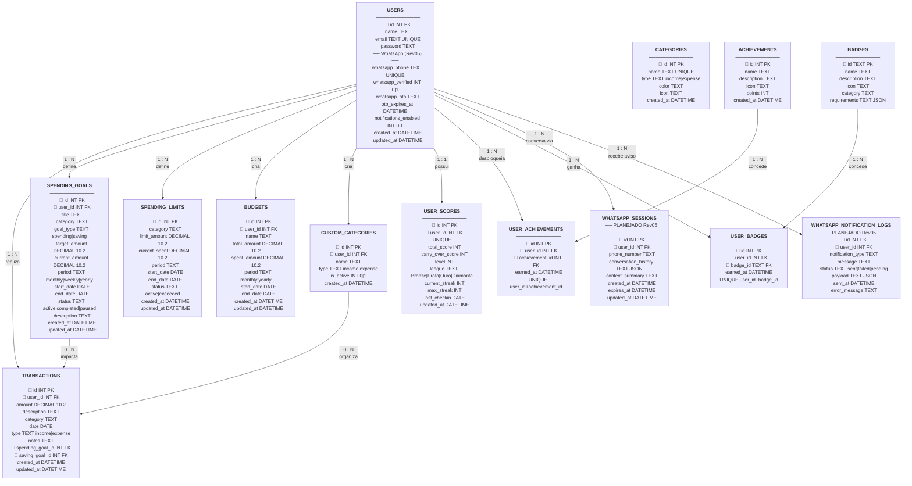

# Modelo de Dados — FYNX

> Gerado a partir do código SQL real de `FynxApi/src/database/schema.ts` e `database.ts`.
> Para importar no draw.io: **Extras → Edit Diagram → Cole o código PlantUML**

---

## 1. Tabelas do Sistema (Resumo)

| Tabela | Descrição | Status |
|---|---|---|
| `users` | Usuários do sistema | ✅ Existente |
| `categories` | Categorias globais padrão do sistema | ✅ Existente |
| `custom_categories` | Categorias personalizadas criadas por usuário | ✅ Existente |
| `transactions` | Transações financeiras (receitas e despesas) | ✅ Existente |
| `spending_goals` | Metas financeiras (poupança `saving` e gasto `spending`) | ✅ Existente |
| `spending_limits` | Limites de gastos por categoria e período | ✅ Existente |
| `budgets` | Orçamentos com períodos e valores totais | ✅ Existente |
| `user_scores` | Pontuação, nível, liga e streak de cada usuário | ✅ Existente |
| `achievements` | Catálogo global de conquistas disponíveis | ✅ Existente |
| `user_achievements` | Conquistas desbloqueadas por usuário (N:N) | ✅ Existente |
| `badges` | Catálogo global de badges | ✅ Existente |
| `user_badges` | Badges conquistadas por usuário (N:N) | ✅ Existente |
| `whatsapp_sessions` | Sessões de conversa com IA via WhatsApp | 🔜 Planejado Rev05 |
| `whatsapp_notification_logs` | Log de notificações automáticas enviadas via WhatsApp | 🔜 Planejado Rev05 |

---

## 2. DER – Fluxograma Completo (draw.io / Mermaid)

> **Como importar no draw.io:** Abra draw.io → `Extras` → `Edit Diagram` → selecione **Mermaid** → cole o código abaixo → OK.

---

## 3. DER Conceitual – PlantUML (Para draw.io como PlantUML)

> **Como usar:** Abra draw.io → Extras → Edit Diagram → Cole o código abaixo.

```plantuml
@startuml DER_Conceitual_FYNX
skinparam class {
  BackgroundColor<<entity>> #DDEEFF
  BorderColor<<entity>> #1a6ea8
  BackgroundColor<<rel>> #FFF3CC
  BorderColor<<rel>> #e6b800
  BackgroundColor<<attr>> #E8FFE8
  BorderColor<<attr>> #3a8a3a
  FontSize 12
}
hide <<entity>> methods
hide <<rel>> methods
hide <<attr>> methods
hide empty fields

' ===== ENTIDADES =====
class "USERS" <<entity>>
class "CATEGORIES" <<entity>>
class "CUSTOM_CATEGORIES" <<entity>>
class "TRANSACTIONS" <<entity>>
class "SPENDING_GOALS" <<entity>>
class "SPENDING_LIMITS" <<entity>>
class "BUDGETS" <<entity>>
class "USER_SCORES" <<entity>>
class "ACHIEVEMENTS" <<entity>>
class "USER_ACHIEVEMENTS" <<entity>>
class "BADGES" <<entity>>
class "USER_BADGES" <<entity>>

' ===== RELACIONAMENTOS =====
class "realiza" <<rel>>
class "define (meta)" <<rel>>
class "define (limite)" <<rel>>
class "cria orçamento" <<rel>>
class "possui pontuação" <<rel>>
class "desbloqueia conquista" <<rel>>
class "conquista cataloga" <<rel>>
class "ganha badge" <<rel>>
class "badge cataloga" <<rel>>
class "cria categoria" <<rel>>
class "organiza transação" <<rel>>

' ===== CARDINALIDADES =====
"USERS" "1" -- "N" "realiza"
"realiza" -- "TRANSACTIONS"

"USERS" "1" -- "N" "define (meta)"
"define (meta)" -- "SPENDING_GOALS"

"USERS" "1" -- "N" "define (limite)"
"define (limite)" -- "SPENDING_LIMITS"

"USERS" "1" -- "N" "cria orçamento"
"cria orçamento" -- "BUDGETS"

"USERS" "1" -- "1" "possui pontuação"
"possui pontuação" -- "USER_SCORES"

"USERS" "1" -- "N" "desbloqueia conquista"
"desbloqueia conquista" -- "USER_ACHIEVEMENTS"
"ACHIEVEMENTS" "1" -- "N" "conquista cataloga"
"conquista cataloga" -- "USER_ACHIEVEMENTS"

"USERS" "1" -- "N" "ganha badge"
"ganha badge" -- "USER_BADGES"
"BADGES" "1" -- "N" "badge cataloga"
"badge cataloga" -- "USER_BADGES"

"USERS" "1" -- "N" "cria categoria"
"cria categoria" -- "CUSTOM_CATEGORIES"

"CUSTOM_CATEGORIES" "0..1" -- "N" "organiza transação"
"organiza transação" -- "TRANSACTIONS"

' ===== ATRIBUTOS PRINCIPAIS =====
class "id (PK)" <<attr>>
class "name" <<attr>>
class "email" <<attr>>
"USERS" -- "id (PK)"
"USERS" -- "name"
"USERS" -- "email"

class "id (PK) " <<attr>>
class "amount" <<attr>>
class "type" <<attr>>
class "date" <<attr>>
"TRANSACTIONS" -- "id (PK) "
"TRANSACTIONS" -- "amount"
"TRANSACTIONS" -- "type"
"TRANSACTIONS" -- "date"

class "id (PK)  " <<attr>>
class "title" <<attr>>
class "goal_type" <<attr>>
class "target_amount" <<attr>>
class "status" <<attr>>
"SPENDING_GOALS" -- "id (PK)  "
"SPENDING_GOALS" -- "title"
"SPENDING_GOALS" -- "goal_type"
"SPENDING_GOALS" -- "target_amount"
"SPENDING_GOALS" -- "status"

class "id (PK)   " <<attr>>
class "category  " <<attr>>
class "limit_amount" <<attr>>
class "period" <<attr>>
"SPENDING_LIMITS" -- "id (PK)   "
"SPENDING_LIMITS" -- "category  "
"SPENDING_LIMITS" -- "limit_amount"
"SPENDING_LIMITS" -- "period"

@enduml
```

---

## 3. DER Lógico Completo (Modelo Relacional — draw.io PlantUML)

> Mapeamento completo com todos os atributos, tipos, PKs, FKs e relacionamentos.

```plantuml
@startuml ER_Logico_FYNX
hide circle
skinparam linetype ortho
skinparam entity {
  BackgroundColor #FAFEFF
  BorderColor #1a6ea8
  HeaderBackgroundColor #D0E8FF
}

' ===================================================
' USUARIOS
' ===================================================
entity "users" as USERS {
  *id : INTEGER <<PK, AUTOINCREMENT>>
  --
  *name : TEXT
  *email : TEXT <<UNIQUE>>
  password : TEXT
  created_at : DATETIME
  updated_at : DATETIME
}

' ===================================================
' CATEGORIAS GLOBAIS (seed do sistema)
' ===================================================
entity "categories" as CAT {
  *id : INTEGER <<PK, AUTOINCREMENT>>
  --
  *name : TEXT <<UNIQUE>>
  *type : TEXT <<income | expense>>
  color : TEXT
  icon : TEXT
  created_at : DATETIME
}

' ===================================================
' CATEGORIAS CUSTOMIZADAS (por usuário)
' ===================================================
entity "custom_categories" as CCAT {
  *id : INTEGER <<PK, AUTOINCREMENT>>
  --
  *user_id : INTEGER <<FK → users.id>>
  *name : TEXT
  *type : TEXT <<income | expense>>
  is_active : INTEGER <<0 | 1>>
  created_at : DATETIME
}

' ===================================================
' TRANSACOES
' ===================================================
entity "transactions" as TX {
  *id : INTEGER <<PK, AUTOINCREMENT>>
  --
  *user_id : INTEGER <<FK → users.id>>
  *amount : DECIMAL(10,2)
  *description : TEXT
  *category : TEXT
  *date : DATE
  *type : TEXT <<income | expense>>
  notes : TEXT
  spending_goal_id : INTEGER <<FK → spending_goals.id>>
  saving_goal_id : INTEGER <<FK → spending_goals.id>>
  created_at : DATETIME
  updated_at : DATETIME
}

' ===================================================
' METAS (Poupança e Gastos unificadas)
' ===================================================
entity "spending_goals" as SG {
  *id : INTEGER <<PK, AUTOINCREMENT>>
  --
  *user_id : INTEGER <<FK → users.id>>
  *title : TEXT
  *category : TEXT
  goal_type : TEXT <<spending | saving>>
  *target_amount : DECIMAL(10,2)
  current_amount : DECIMAL(10,2)
  *period : TEXT <<monthly | weekly | yearly>>
  start_date : DATE
  end_date : DATE
  *status : TEXT <<active | completed | paused>>
  description : TEXT
  created_at : DATETIME
  updated_at : DATETIME
}

' ===================================================
' LIMITES DE GASTOS
' ===================================================
entity "spending_limits" as SL {
  *id : INTEGER <<PK, AUTOINCREMENT>>
  --
  *category : TEXT
  *limit_amount : DECIMAL(10,2)
  current_spent : DECIMAL(10,2)
  *period : TEXT
  start_date : DATE
  end_date : DATE
  status : TEXT <<active | exceeded>>
  created_at : DATETIME
  updated_at : DATETIME
}

' ===================================================
' ORÇAMENTOS
' ===================================================
entity "budgets" as BUD {
  *id : INTEGER <<PK, AUTOINCREMENT>>
  --
  *user_id : INTEGER <<FK → users.id>>
  *name : TEXT
  *total_amount : DECIMAL(10,2)
  spent_amount : DECIMAL(10,2)
  *period : TEXT <<monthly | yearly>>
  *start_date : DATE
  *end_date : DATE
  created_at : DATETIME
  updated_at : DATETIME
}

' ===================================================
' PONTUAÇÃO / GAMIFICAÇÃO
' ===================================================
entity "user_scores" as US {
  *id : INTEGER <<PK, AUTOINCREMENT>>
  --
  *user_id : INTEGER <<FK → users.id, UNIQUE>>
  total_score : INTEGER
  carry_over_score : INTEGER
  level : INTEGER
  league : TEXT <<Bronze | Prata | Ouro | Diamante>>
  current_streak : INTEGER
  max_streak : INTEGER
  last_checkin : DATE
  updated_at : DATETIME
}

' ===================================================
' CONQUISTAS (Catálogo Global)
' ===================================================
entity "achievements" as ACH {
  *id : INTEGER <<PK, AUTOINCREMENT>>
  --
  *name : TEXT
  description : TEXT
  icon : TEXT
  points : INTEGER
  created_at : DATETIME
}

' ===================================================
' CONQUISTAS DO USUÁRIO (N:N)
' ===================================================
entity "user_achievements" as UA {
  *id : INTEGER <<PK, AUTOINCREMENT>>
  --
  *user_id : INTEGER <<FK → users.id>>
  *achievement_id : INTEGER <<FK → achievements.id>>
  earned_at : DATETIME
  ---
  UNIQUE(user_id, achievement_id)
}

' ===================================================
' BADGES (Catálogo Global)
' ===================================================
entity "badges" as BAD {
  *id : TEXT <<PK>>
  --
  *name : TEXT
  description : TEXT
  icon : TEXT
  category : TEXT
  requirements : TEXT <<JSON>>
}

' ===================================================
' BADGES DO USUÁRIO (N:N)
' ===================================================
entity "user_badges" as UB {
  *id : INTEGER <<PK, AUTOINCREMENT>>
  --
  *user_id : INTEGER <<FK → users.id>>
  *badge_id : TEXT <<FK → badges.id>>
  earned_at : DATETIME
  ---
  UNIQUE(user_id, badge_id)
}

' ===================================================
' RELACIONAMENTOS
' ===================================================
USERS ||--o{ TX         : "1:N registra"
USERS ||--o{ SG         : "1:N define meta"
USERS ||--o{ BUD        : "1:N cria orçamento"
USERS ||--o{ CCAT       : "1:N cria categoria"
USERS ||--o| US         : "1:1 possui pontuação"
USERS ||--o{ UA         : "1:N desbloqueia"
USERS ||--o{ UB         : "1:N ganha badge"

SG   |o--o{ TX          : "0:N impacta transações"
CCAT |o--o{ TX          : "0:N organiza"
ACH  ||--o{ UA          : "1:N concede"
BAD  ||--o{ UB          : "1:N concede"

@enduml
```

---

## 4. Dicionário de Dados Completo

### 4.1. `users`
| Coluna | Tipo | Constraints | Descrição |
|---|---|---|---|
| `id` | INTEGER | PK, AUTOINCREMENT | Identificador único do usuário |
| `name` | TEXT | NOT NULL | Nome completo |
| `email` | TEXT | UNIQUE, NOT NULL | E-mail de acesso |
| `password` | TEXT | — | Hash bcrypt da senha |
| `created_at` | DATETIME | DEFAULT NOW | Data de cadastro |
| `updated_at` | DATETIME | DEFAULT NOW | Última atualização |
| `whatsapp_phone` | TEXT | UNIQUE | Número de telefone WhatsApp (ex: +5511999999999) |
| `whatsapp_verified` | INTEGER | DEFAULT 0 | 1 se o número foi verificado via OTP |
| `whatsapp_otp` | TEXT | — | Código OTP temporário para verificação |
| `otp_expires_at` | DATETIME | — | Validade do OTP gerado |
| `notifications_enabled` | INTEGER | DEFAULT 1 | 1 se o usuário aceita notificações via WhatsApp |

> 🔜 **Colunas WhatsApp** serão adicionadas via migration no Rev05.

### 4.2. `categories`
| Coluna | Tipo | Constraints | Descrição |
|---|---|---|---|
| `id` | INTEGER | PK, AUTOINCREMENT | Identificador |
| `name` | TEXT | UNIQUE, NOT NULL | Nome da categoria |
| `type` | TEXT | CHECK(income\|expense) | Tipo da categoria |
| `color` | TEXT | — | Cor hexadecimal |
| `icon` | TEXT | — | Ícone (ex: emoji ou nome) |
| `created_at` | DATETIME | DEFAULT NOW | Data de criação |

### 4.3. `custom_categories`
| Coluna | Tipo | Constraints | Descrição |
|---|---|---|---|
| `id` | INTEGER | PK, AUTOINCREMENT | Identificador |
| `user_id` | INTEGER | FK → users.id | Dono da categoria |
| `name` | TEXT | NOT NULL | Nome dado pelo usuário |
| `type` | TEXT | CHECK(income\|expense) | Tipo da transação |
| `is_active` | INTEGER | DEFAULT 1 | Ativo/Inativo (0 ou 1) |
| `created_at` | DATETIME | DEFAULT NOW | Data de criação |

### 4.4. `transactions`
| Coluna | Tipo | Constraints | Descrição |
|---|---|---|---|
| `id` | INTEGER | PK, AUTOINCREMENT | Identificador |
| `user_id` | INTEGER | FK → users.id, NOT NULL | Proprietário da transação |
| `amount` | DECIMAL(10,2) | NOT NULL | Valor monetário |
| `description` | TEXT | NOT NULL | Descrição do lançamento |
| `category` | TEXT | NOT NULL | Nome textual da categoria |
| `date` | DATE | NOT NULL | Data da transação |
| `type` | TEXT | CHECK(income\|expense) | Receita ou despesa |
| `notes` | TEXT | — | Observações adicionais |
| `spending_goal_id` | INTEGER | FK → spending_goals.id | Meta de gasto vinculada |
| `saving_goal_id` | INTEGER | FK → spending_goals.id | Meta de poupança vinculada |
| `created_at` | DATETIME | DEFAULT NOW | Criação do registro |
| `updated_at` | DATETIME | DEFAULT NOW | Última edição |

### 4.5. `spending_goals`
| Coluna | Tipo | Constraints | Descrição |
|---|---|---|---|
| `id` | INTEGER | PK, AUTOINCREMENT | Identificador |
| `user_id` | INTEGER | FK → users.id | Proprietário da meta |
| `title` | TEXT | NOT NULL | Título descritivo |
| `category` | TEXT | NOT NULL | Categoria associada |
| `goal_type` | TEXT | DEFAULT 'spending' | `spending` ou `saving` |
| `target_amount` | DECIMAL(10,2) | NOT NULL | Valor alvo |
| `current_amount` | DECIMAL(10,2) | DEFAULT 0 | Progresso acumulado |
| `period` | TEXT | CHECK(monthly\|weekly\|yearly) | Período de referência |
| `start_date` | DATE | — | Início do período |
| `end_date` | DATE | — | Fim do período / prazo |
| `status` | TEXT | CHECK(active\|completed\|paused) | Estado atual |
| `description` | TEXT | — | Descrição opcional |
| `created_at` | DATETIME | DEFAULT NOW | Criação |
| `updated_at` | DATETIME | DEFAULT NOW | Última edição |

### 4.6. `spending_limits`
| Coluna | Tipo | Constraints | Descrição |
|---|---|---|---|
| `id` | INTEGER | PK, AUTOINCREMENT | Identificador |
| `category` | TEXT | NOT NULL | Categoria limitada |
| `limit_amount` | DECIMAL(10,2) | NOT NULL | Teto de gasto |
| `current_spent` | DECIMAL(10,2) | DEFAULT 0 | Valor já gasto no período |
| `period` | TEXT | NOT NULL | Período do limite |
| `start_date` | DATE | — | Início do período |
| `end_date` | DATE | — | Fim do período |
| `status` | TEXT | CHECK(active\|exceeded) | Estado atual |
| `created_at` | DATETIME | DEFAULT NOW | Criação |
| `updated_at` | DATETIME | DEFAULT NOW | Última edição |

### 4.7. `budgets`
| Coluna | Tipo | Constraints | Descrição |
|---|---|---|---|
| `id` | INTEGER | PK, AUTOINCREMENT | Identificador |
| `user_id` | INTEGER | FK → users.id | Proprietário |
| `name` | TEXT | NOT NULL | Nome do orçamento |
| `total_amount` | DECIMAL(10,2) | NOT NULL | Valor total planejado |
| `spent_amount` | DECIMAL(10,2) | DEFAULT 0 | Valor já consumido |
| `period` | TEXT | CHECK(monthly\|yearly) | Periodicidade |
| `start_date` | DATE | NOT NULL | Início |
| `end_date` | DATE | NOT NULL | Fim |
| `created_at` | DATETIME | DEFAULT NOW | Criação |
| `updated_at` | DATETIME | DEFAULT NOW | Última edição |

### 4.8. `user_scores`
| Coluna | Tipo | Constraints | Descrição |
|---|---|---|---|
| `id` | INTEGER | PK, AUTOINCREMENT | Identificador |
| `user_id` | INTEGER | FK → users.id, UNIQUE | Usuário (1:1) |
| `total_score` | INTEGER | DEFAULT 0 | Pontuação total acumulada |
| `carry_over_score` | INTEGER | DEFAULT 0 | Bônus carregado entre períodos |
| `level` | INTEGER | DEFAULT 1 | Nível atual |
| `league` | TEXT | DEFAULT 'Bronze' | Liga (Bronze/Prata/Ouro/Diamante) |
| `current_streak` | INTEGER | DEFAULT 0 | Sequência ativa de check-ins |
| `max_streak` | INTEGER | DEFAULT 0 | Maior sequência já registrada |
| `last_checkin` | DATE | — | Data do último check-in |
| `updated_at` | DATETIME | DEFAULT NOW | Última atualização |

### 4.9. `achievements`
| Coluna | Tipo | Constraints | Descrição |
|---|---|---|---|
| `id` | INTEGER | PK, AUTOINCREMENT | Identificador |
| `name` | TEXT | NOT NULL | Nome da conquista |
| `description` | TEXT | — | Descrição |
| `icon` | TEXT | — | Ícone/emoji |
| `points` | INTEGER | DEFAULT 0 | Pontos concedidos |
| `created_at` | DATETIME | DEFAULT NOW | Cadastro |

### 4.10. `user_achievements`
| Coluna | Tipo | Constraints | Descrição |
|---|---|---|---|
| `id` | INTEGER | PK, AUTOINCREMENT | Identificador |
| `user_id` | INTEGER | FK → users.id | Usuário |
| `achievement_id` | INTEGER | FK → achievements.id | Conquista |
| `earned_at` | DATETIME | DEFAULT NOW | Data de desbloqueio |
| _unique_ | — | UNIQUE(user_id, achievement_id) | Impede duplicatas |

### 4.11. `badges`
| Coluna | Tipo | Constraints | Descrição |
|---|---|---|---|
| `id` | TEXT | PK | ID textual (ex: "first_transaction") |
| `name` | TEXT | NOT NULL | Nome do badge |
| `description` | TEXT | — | Descrição |
| `icon` | TEXT | — | Ícone/emoji |
| `category` | TEXT | — | Categoria do badge |
| `requirements` | TEXT | — | JSON com critérios de desbloqueio |

### 4.12. `user_badges`
| Coluna | Tipo | Constraints | Descrição |
|---|---|---|---|
| `id` | INTEGER | PK, AUTOINCREMENT | Identificador |
| `user_id` | INTEGER | FK → users.id | Usuário |
| `badge_id` | TEXT | FK → badges.id | Badge conquistado |
| `earned_at` | DATETIME | DEFAULT NOW | Data de conquista |
| _unique_ | — | UNIQUE(user_id, badge_id) | Impede duplicatas |

### 4.13. `whatsapp_sessions` 🔜 Planejado Rev05
| Coluna | Tipo | Constraints | Descrição |
|---|---|---|---|
| `id` | INTEGER | PK, AUTOINCREMENT | Identificador da sessão |
| `user_id` | INTEGER | FK → users.id, NOT NULL | Usuário da sessão |
| `phone_number` | TEXT | NOT NULL | Número WhatsApp da sessão |
| `conversation_history` | TEXT | — | JSON com o histórico de mensagens (role + content) |
| `context_summary` | TEXT | — | Resumo comprimido do contexto para prompt da IA |
| `created_at` | DATETIME | DEFAULT NOW | Início da sessão |
| `expires_at` | DATETIME | NOT NULL | TTL — sessão expira após X horas de inatividade |
| `updated_at` | DATETIME | DEFAULT NOW | Última mensagem recebida |

### 4.14. `whatsapp_notification_logs` 🔜 Planejado Rev05
| Coluna | Tipo | Constraints | Descrição |
|---|---|---|---|
| `id` | INTEGER | PK, AUTOINCREMENT | Identificador do log |
| `user_id` | INTEGER | FK → users.id, NOT NULL | Destinatário |
| `notification_type` | TEXT | NOT NULL | Tipo: `goal_reached`, `limit_exceeded`, `weekly_summary`, etc. |
| `message` | TEXT | NOT NULL | Corpo da mensagem enviada |
| `status` | TEXT | CHECK(sent\|failed\|pending) | Status do envio |
| `payload` | TEXT | — | JSON com dados extras (ex: valores, categoria) |
| `sent_at` | DATETIME | — | Timestamp do envio efetivo |
| `error_message` | TEXT | — | Descrição do erro em caso de falha |

---

## 5. Regras de Integridade

| Regra | Tabela | Detalhe |
|---|---|---|
| FK Cascade Implícita | `transactions` | `spending_goal_id` e `saving_goal_id` ambos apontam para `spending_goals.id` |
| Unicidade de Conquista | `user_achievements` | Um usuário não pode ganhar a mesma conquista duas vezes |
| Unicidade de Badge | `user_badges` | Um usuário não pode ganhar o mesmo badge duas vezes |
| Unicidade de Score | `user_scores` | Relação **1:1** com `users` via `UNIQUE(user_id)` |
| Check de Tipo | `transactions`, `categories`, `custom_categories` | Valores restritos a `income` ou `expense` |
| Check de Status | `spending_goals` | Apenas `active`, `completed` ou `paused` |
| Check de Período | `spending_goals`, `budgets` | Apenas `monthly`, `weekly` ou `yearly` |
| Unicidade de Telefone | `users.whatsapp_phone` | Um número de telefone só pode estar vinculado a **um** usuário |
| OTP com TTL | `users.whatsapp_otp` | Expiração obrigatória via `otp_expires_at`; OTP invalidado após uso |
| Sessão com TTL | `whatsapp_sessions.expires_at` | Sessões expiradas não devem ser usadas; limpeza via job periódico |
| Status de Notificação | `whatsapp_notification_logs.status` | Apenas `sent`, `failed` ou `pending` |
| Integridade referencial | `whatsapp_sessions`, `whatsapp_notification_logs` | `ON DELETE CASCADE` a partir de `users` — remoção de usuário apaga histórico e logs |
