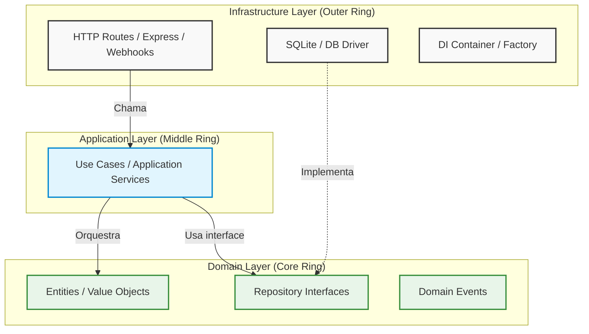
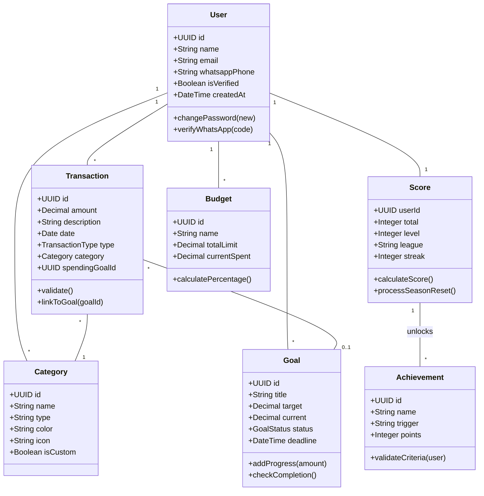
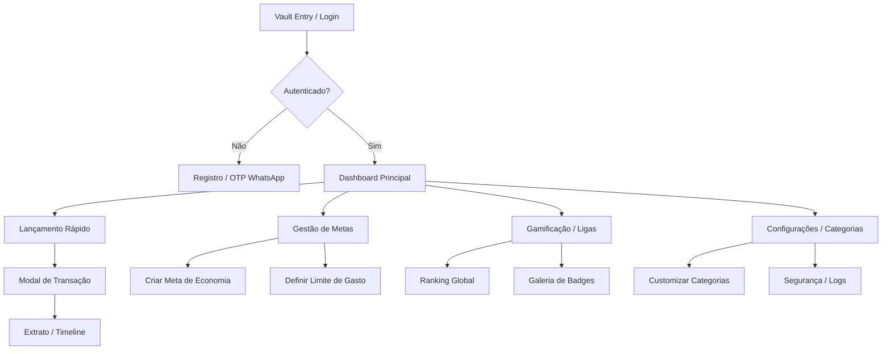

# Arquitetura e Engenharia de Software — FYNX (Rev. 06)

> Documentação aprofundada da fundação técnica, decisões arquiteturais e design patterns que governam o projeto FYNX. Desenvolvida para garantir manutenibilidade, testabilidade e escalabilidade seguindo os moldes de engenharia de software corporativa.

---

## 1. Visão Macro e Padrões Arquiteturais

O sistema FYNX completou a transição de um padrão *Transaction Script* (MVC clássico fortemente acoplado) para uma **Clean Architecture (Onion Architecture)** orientada pelos princípios táticos e estratégicos do **Domain-Driven Design (DDD)**.

### 1.1. O Princípio da Dependência (Dependency Rule)
A regra de ouro da arquitetura atual é que **as dependências de código fonte apontam apenas para dentro**, em direção às políticas de nível mais alto (Domínio).



---

## 2. Bounded Contexts (Limites de Contexto do DDD)

Para combater a complexidade e evitar "God Objects" (classes que fazem tudo), o domínio do FYNX foi particionado estrategicamente. Cada contexto possui seu próprio `Ubiquitous Language` (Linguagem Ubíqua).

| Contexto | Responsabilidade Core | Interação com outros domínios |
|---|---|---|
| **`identity`** | Autenticação, autorização, hash de senhas, ciclo de vida do usuário. | Fornece Tokens JWT validados para os outros domínios autorizarem ações. |
| **`financial`** | Coração do sistema. Orçamentos, transações, receitas, despesas e metas de gastos. | Emite eventos de domínio quando o saldo muda. **Não sabe o que é um score.** |
| **`gamification`** | Engajamento. Calcula o FYNX Score, gerencia Ligas (Bronze $\rightarrow$ Diamante), Streaks e Badges. | Ouve silenciosamente os eventos de `financial` para recalcular a pontuação do usuário. |
| **`analytics`** | Leitura massiva de dados. Gera relatórios para os gráficos do Dashboard. | Agrega dados dos demais contextos de forma puramente otimizada para leitura (Read-Model). |

---

## 3. Padrões de Projeto (Design Patterns) Implementados

A implementação limpa e sustentável exige o uso de Design Patterns maduros. Abaixo, os principais utilizados na Rev06.

### 3.1. Injeção de Dependências (DI) e Inversão de Controle (IoC)
A camada de aplicação não instancializa suas dependências. Nós invertemos o controle usando um contêiner (em `infrastructure/container.ts`). 

**Exemplo Prático (Como funciona no FYNX):**
```typescript
// 1. A interface vive no Domínio (Core)
export interface ITransactionRepository {
  save(transaction: Transaction): Promise<void>;
}

// 2. O Use Case vive na Aplicação (Middle) - Ele exige a interface, mas não sabe qual é o BD!
export class CreateTransactionUseCase {
  constructor(private readonly transactionRepo: ITransactionRepository) {}
  
  async execute(data: CreateTransactionDTO) {
    const transaction = new Transaction(data);
    await this.transactionRepo.save(transaction);
  }
}

// 3. A injeção ocorre na Infraestrutura (Outer)
const sqliteRepo = new SqliteTransactionRepository();
const createTransactionUseCase = new CreateTransactionUseCase(sqliteRepo);
```
> **Vantagem:** Para realizar Testes Unitários, basta injetar um `MockTransactionRepository` em memória, sem precisar tocar no SQLite.

### 3.2. Repository Pattern
Isola o código de regras de negócio das queries SQL. Toda interação com o banco de dados é feita através de métodos de negócio (ex: `findById`, `findByUserIdAndPeriod`) em vez de `SELECT * FROM...` espalhado no código.

### 3.3. Unit of Work (Transações Atômicas)
Em cenários onde múltiplos repositórios devem ser atualizados juntos (Ex: Criar Transação E Atualizar Meta de Economia), o sistema utiliza blocos `BEGIN TRANSACTION` e `COMMIT/ROLLBACK` gerenciados de forma abstrata, garantindo que o banco de dados não fique inconsistente caso ocorra um erro na metade do processo.

---

## 4. Fluxo de Dados: A Anatomia de uma Requisição

Como uma requisição HTTP percorre a arquitetura até o banco de dados e retorna:

1. **Client (React)** envia um `POST /api/v1/transactions`.
2. **Infrastructure / HTTP Router**: O Express recebe a requisição e passa pelo Middleware de Autenticação (`verifyToken`).
3. **Infrastructure / Validador (Zod)**: O corpo da requisição é validado em runtime. Se for inválido, retorna `400 Bad Request` imediatamente.
4. **Infrastructure / Controller**: Extrai os dados validados e invoca o `CreateTransactionUseCase`.
5. **Application / Use Case**: Orquestra o fluxo. Pede à entidade `Transaction` para se instanciar.
6. **Domain / Entity**: A entidade verifica as Regras de Negócio Puras (Ex: *O valor não pode ser negativo*).
7. **Application / Use Case**: Chama `repository.save()`.
8. **Infrastructure / Repository**: Converte a Entidade em linguagem SQL e executa o `INSERT` no SQLite.
9. **Domain / Event**: Um evento `TransactionCreatedEvent` é disparado. O Módulo de Gamificação captura e atualiza o Score em background.
10. **Controller**: Retorna `201 Created` para o Client.

---

## 5. Topologia da Codebase (Directory Map)

A estrutura de diretórios foi rigorosamente desenhada para espelhar as camadas do DDD.

```text
FynxApi/src/
├── application/         # Camada de Aplicação (Use Cases)
│   └── useCases/        # Orquestradores de regras de negócio
├── domains/             # Camada de Domínio (Bounded Contexts)
│   ├── financial/
│   │   ├── entities/    # Entidades e Value Objects puros
│   │   └── repositories/# Interfaces dos repositórios
│   ├── gamification/
│   └── identity/
├── infrastructure/      # Camada de Infraestrutura (Tecnologia Externa)
│   ├── database/        # Conexão SQLite e Scripts DDL
│   ├── http/            # Rotas Express, Middlewares e Controllers
│   ├── repositories/    # Implementações SQL concretas (SqliteTransactionRepo)
│   └── container.ts     # Injeção de Dependências global
└── shared/              # Utilitários globais (Loggers, Constantes)
```

---

---

## 6. Diagrama de Classes (Domínio Rico)

O diagrama abaixo detalha as entidades do núcleo de negócio, seus atributos e comportamentos.



---

## 7. Fluxo do Usuário e Navegação

Mapeamento de jornada desde o acesso até a gestão avançada.



---

## 8. Architectural Decision Records (ADR)

### ADR-001: SQLite para Persistência
- **Data:** Março de 2026
- **Status:** ✅ Aceito
- **Contexto:** Necessidade de uma base relacional leve, zero-config e compatível com ambientes de baixo custo.
- **Decisão:** Uso do SQLite com modo WAL para suportar concorrência e integridade ACID.

### ADR-002: JWT Stateless para Autenticação
- **Data:** Março de 2026
- **Status:** ✅ Aceito
- **Contexto:** Escalar a API sem necessidade de sessões em memória no servidor.
- **Decisão:** Tokens JWT assinados com expiração de 24h e Refresh Token.

### ADR-003: Comunicação Assíncrona via Domain Events
- **Data:** Abril de 2026
- **Status:** ✅ Aceito
- **Contexto:** Atualizar o score e verificar conquistas durante a criação de uma transação aumentava a latência da API.
- **Decisão:** O `UseCase` de transação salva no banco e dispara um evento. O `GamificationService` processa em background.

### ADR-004: Validação de Schema no Runtime com Zod
- **Data:** Abril de 2026
- **Status:** ✅ Aceito
- **Contexto:** TypeScript desaparece no runtime, deixando a API vulnerável a payloads malformados.
- **Decisão:** Uso do Zod para validar todos os inputs de Controller e garantir Type-Safety real.

### ADR-005: LLM NER para WhatsApp NLP [NOVO]
- **Data:** Abril de 2026
- **Status:** ✅ Aceito
- **Contexto:** Usuários preferem linguagem natural (ex: "gastei 50 no burger") em vez de formulários fixos.
- **Decisão:** Integração com LLM (OpenAI/Anthropic) via Agent que extrai Entidades (Valor, Descrição, Categoria) e retorna JSON estruturado.

### ADR-006: Padrão Repository e Unit of Work [NOVO]
- **Data:** Abril de 2026
- **Status:** ✅ Aceito
- **Contexto:** Acoplamento excessivo de SQL dentro dos Services dificultava testes unitários.
- **Decisão:** Abstração total via Repositórios. Transações multi-tabela gerenciadas pelo padrão Unit of Work.
