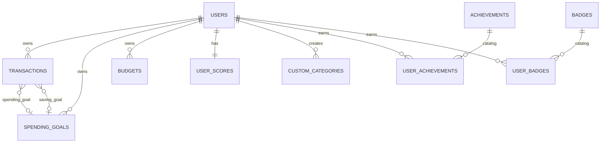

# Projeto de Persistência e Banco de Dados - FYNX Rev. 06

> Documento do modelo de dados da Rev06, validado contra `FynxApi/src/infrastructure/database/schema.ts` e `database.ts`.

---

## 1. Estratégia de Persistência

O backend usa SQLite no ambiente atual. A inicialização ocorre em `database.ts`, que executa:

1. `createTables()` com as tabelas definidas em `schema.ts`.
2. criação complementar de `custom_categories` e `budgets`.
3. `applyMigrations()` para colunas evolutivas.
4. `seedInitialData()` para categorias, usuário demo, achievements e badges.

O desenho arquitetural usa uma diretriz DDD: controllers e domínio não devem depender diretamente de SQL. Sempre que possível, a persistência deve ser acessada por services/use cases e repositories.

---

## 2. Catálogo de Tabelas e Status Real

| Tabela | Origem | Contexto | Status | Observação |
|---|---|---|---|---|
| `users` | `schema.ts` | Identity | Implementado | Guarda usuário e credenciais. |
| `categories` | `schema.ts` | Financial | Implementado | Categorias globais. |
| `transactions` | `schema.ts` | Financial | Implementado | Lançamentos financeiros. |
| `spending_goals` | `schema.ts` | Financial | Implementado | Metas de gasto e economia por `goal_type`. |
| `user_scores` | `schema.ts` | Gamification | Implementado | Score, nível, liga e streak. |
| `achievements` | `schema.ts` | Gamification | Implementado | Catálogo de conquistas. |
| `user_achievements` | `schema.ts` | Gamification | Implementado | Conquistas ganhas por usuário. |
| `badges` | `schema.ts` | Gamification | Implementado | Catálogo visual de badges. |
| `user_badges` | `schema.ts` | Gamification | Implementado | Badges ganhos por usuário. |
| `custom_categories` | `database.ts` | Financial | Implementado | Criada fora de `SCHEMA`, como compatibilidade. |
| `budgets` | `database.ts` | Financial | Implementado | Criada fora de `SCHEMA`, com nomes físicos diferentes dos tipos TS. |
| `spending_limits` | Não Encontrada | Financial | Pendente | Existe módulo de rota/service, mas não há tabela física no schema atual. |
| `whatsapp_sessions` | Não Encontrada | Omnichannel | Planejado | Não documentar como ativo. |
| `whatsapp_notification_logs` | Não Encontrada | Omnichannel | Planejado | Não documentar como ativo. |
| `audit_logs` | Não Encontrada | Admin/Audit | Planejado | Requer migration própria. |

---

## 3. Modelo Conceitual

Artefato visual DER herdado/revisado para a Rev06:




### 3.1. Cardinalidades

| Relação | Cardinalidade | Regra |
|---|---|---|
| `users -> transactions` | 1:N | Toda transação tem `user_id`. |
| `users -> spending_goals` | 1:N | Metas pertencem a um usuário. |
| `users -> budgets` | 1:N | Budgets pertencem a um usuário. |
| `users -> user_scores` | 1:1 | `user_scores.user_id` é único. |
| `users -> custom_categories` | 1:N | Categorias customizadas são isoladas por usuário. |
| `transactions -> spending_goals` | N:0..1 | `spending_goal_id` e `saving_goal_id` são opcionais. |
| `achievements -> user_achievements` | 1:N | Catálogo e relação de ganho. |
| `badges -> user_badges` | 1:N | Catálogo e relação de ganho. |

---

## 4. Modelo Lógico e Modelo Físico

### 4.1. Modelo Lógico

Artefato visual do modelo lógico relacional:


No modelo lógico, as entidades centrais são `users`, `transactions`, `spending_goals`, `budgets`, `custom_categories`, `user_scores`, `achievements` e `badges`. Relacionamentos multiusuário usam `user_id` como chave estrangeira ou critério obrigatório de isolamento.

### 4.2. Modelo Físico

O modelo físico é a implementação SQLite descrita em `schema.ts` e `database.ts`. Tipos `DECIMAL(10,2)`, `TEXT`, `DATE`, `DATETIME` e `INTEGER` são usados conforme suporte do SQLite. Tabelas criadas fora de `SCHEMA`, como `custom_categories` e `budgets`, continuam documentadas porque fazem parte da inicialização real.

---

## 5. Dicionario de Dados

### 5.1. `users`

| Coluna | Tipo | Null | Default | Regra |
|---|---|---|---|---|
| `id` | INTEGER | Não | AUTOINCREMENT | PK. |
| `name` | TEXT | Não | - | Nome do usuário. |
| `email` | TEXT | Não | - | Único. |
| `password` | TEXT | Sim no schema | - | Deve guardar hash; apesar de nullable no schema, regra exige valor para login local. |
| `created_at` | DATETIME | Sim | CURRENT_TIMESTAMP | Criação. |
| `updated_at` | DATETIME | Sim | CURRENT_TIMESTAMP | Atualização. |

### 5.2. `categories`

| Coluna | Tipo | Null | Default | Regra |
|---|---|---|---|---|
| `id` | INTEGER | Não | AUTOINCREMENT | PK. |
| `name` | TEXT | Não | - | Único global. |
| `type` | TEXT | Não | - | `income` ou `expense`. |
| `color` | TEXT | Sim | - | Uso de UI. |
| `icon` | TEXT | Sim | - | Uso de UI. |
| `created_at` | DATETIME | Sim | CURRENT_TIMESTAMP | Criação. |

### 5.3. `transactions`

| Coluna | Tipo | Null | Default | Regra |
|---|---|---|---|---|
| `id` | INTEGER | Não | AUTOINCREMENT | PK. |
| `user_id` | INTEGER | Não | - | FK para `users.id`. |
| `amount` | DECIMAL(10,2) | Não | - | Regra RN001 exige valor maior que zero. |
| `description` | TEXT | Não | - | Descrição obrigatória. |
| `category` | TEXT | Não | - | Categoria obrigatória. |
| `date` | DATE | Não | - | Data do fato financeiro. |
| `type` | TEXT | Não | - | `income` ou `expense`. |
| `notes` | TEXT | Sim | - | Observação. |
| `spending_goal_id` | INTEGER | Sim | - | FK opcional para `spending_goals.id`. |
| `saving_goal_id` | INTEGER | Sim | - | FK opcional para `spending_goals.id`. |
| `created_at` | DATETIME | Sim | CURRENT_TIMESTAMP | Criação. |
| `updated_at` | DATETIME | Sim | CURRENT_TIMESTAMP | Atualização. |

**Nota:** `transactions.types.ts` possui campos ricos como `paymentMethod`, `tags`, `location`, `recurring` e `attachments`. Esses campos não aparecem no schema físico atual. Devem ser documentados como contrato de tipo em evolução, não como colunas persistidas.

### 5.4. `spending_goals`

| Coluna | Tipo | Null | Default | Regra |
|---|---|---|---|---|
| `id` | INTEGER | Não | AUTOINCREMENT | PK. |
| `user_id` | INTEGER | Não | - | FK para `users.id`. |
| `title` | TEXT | Não | - | Nome da meta. |
| `category` | TEXT | Não | - | Categoria relacionada. |
| `goal_type` | TEXT | Sim | `spending` | `spending` ou `saving`. |
| `target_amount` | DECIMAL(10,2) | Não | - | Valor alvo. |
| `current_amount` | DECIMAL(10,2) | Sim | 0 | Progresso atual. |
| `period` | TEXT | Não | - | `monthly`, `weekly`, `yearly`. |
| `start_date` | DATE | Sim | - | Início. |
| `end_date` | DATE | Sim | - | Fim. |
| `status` | TEXT | Não | - | `active`, `completed`, `paused`. |
| `description` | TEXT | Sim | - | Observação. |
| `created_at` | DATETIME | Sim | CURRENT_TIMESTAMP | Criação. |
| `updated_at` | DATETIME | Sim | CURRENT_TIMESTAMP | Atualização. |

### 5.5. `user_scores`

| Coluna | Tipo | Null | Default | Regra |
|---|---|---|---|---|
| `id` | INTEGER | Não | AUTOINCREMENT | PK. |
| `user_id` | INTEGER | Não | - | FK Única para `users.id`. |
| `total_score` | INTEGER | Sim | 0 | Score atual. |
| `carry_over_score` | INTEGER | Sim | 0 | Pontos preservados entre temporadas. |
| `level` | INTEGER | Sim | 1 | Nível do usuário. |
| `league` | TEXT | Sim | Bronze | Liga atual. |
| `current_streak` | INTEGER | Sim | 0 | Sequência atual. |
| `max_streak` | INTEGER | Sim | 0 | Melhor sequência. |
| `last_checkin` | DATE | Sim | - | Último check-in. |
| `updated_at` | DATETIME | Sim | CURRENT_TIMESTAMP | Atualização. |

### 5.6. `achievements` e `user_achievements`

`achievements` é o catálogo de conquistas. `user_achievements` registra quais usuários ganharam cada conquista.

| Tabela | Colunas principais | Integridade |
|---|---|---|
| `achievements` | `id`, `name`, `description`, `icon`, `points` | Catálogo sem user_id. |
| `user_achievements` | `user_id`, `achievement_id`, `earned_at` | `UNIQUE(user_id, achievement_id)`. |

### 5.7. `badges` e `user_badges`

`badges` é o catálogo visual. `user_badges` guarda os badges obtidos por usuário.

| Tabela | Colunas principais | Integridade |
|---|---|---|
| `badges` | `id`, `name`, `description`, `icon`, `category`, `requirements` | `id` textual como PK. |
| `user_badges` | `user_id`, `badge_id`, `earned_at` | `UNIQUE(user_id, badge_id)`. |

### 5.8. `custom_categories`

| Coluna | Tipo | Null | Default | Regra |
|---|---|---|---|---|
| `id` | INTEGER | Não | AUTOINCREMENT | PK. |
| `user_id` | INTEGER | Não | - | FK para `users.id`. |
| `name` | TEXT | Não | - | Nome da categoria do usuário. |
| `type` | TEXT | Não | - | `income` ou `expense`. |
| `created_at` | DATETIME | Sim | CURRENT_TIMESTAMP | Criação. |
| `is_active` | INTEGER | Sim | 1 | Arquivamento lógico. |

### 5.9. `budgets`

| Coluna | Tipo | Null | Default | Regra |
|---|---|---|---|---|
| `id` | INTEGER | Não | AUTOINCREMENT | PK. |
| `user_id` | INTEGER | Não | - | FK para `users.id`. |
| `name` | TEXT | Não | - | Nome do budget. |
| `total_amount` | DECIMAL(10,2) | Não | - | Valor total planejado. |
| `spent_amount` | DECIMAL(10,2) | Sim | 0 | Valor gasto. |
| `period` | TEXT | Não | - | `monthly` ou `yearly` no schema físico atual. |
| `start_date` | DATE | Não | - | Início. |
| `end_date` | DATE | Não | - | Fim. |
| `created_at` | DATETIME | Sim | CURRENT_TIMESTAMP | Criação. |
| `updated_at` | DATETIME | Sim | CURRENT_TIMESTAMP | Atualização. |

**Divergencia técnica:** `goals.types.ts` usa `allocatedAmount`, `remainingAmount`, `status` e `period` incluindo `weekly`. O schema físico usa `total_amount`, `spent_amount`, sem `status` e sem `weekly`. Esta divergencia deve ser resolvida em migration ou camada de mapeamento.

---

## 6. DDL Atual Consolidado

O DDL fonte fica em `schema.ts` e `database.ts`. Para atender ao artefato acadêmico de script SQL, a Rev06 apresenta o extrato consolidado abaixo e mantém `schema.ts`/`database.ts` como fonte de verdade executavel.

```sql
CREATE TABLE IF NOT EXISTS users (
  id INTEGER PRIMARY KEY AUTOINCREMENT,
  name TEXT NOT NULL,
  email TEXT UNIQUE NOT NULL,
  password TEXT,
  created_at DATETIME DEFAULT CURRENT_TIMESTAMP,
  updated_at DATETIME DEFAULT CURRENT_TIMESTAMP
);

CREATE TABLE IF NOT EXISTS categories (
  id INTEGER PRIMARY KEY AUTOINCREMENT,
  name TEXT NOT NULL UNIQUE,
  type TEXT NOT NULL CHECK (type IN ('income', 'expense')),
  color TEXT,
  icon TEXT,
  created_at DATETIME DEFAULT CURRENT_TIMESTAMP
);

CREATE TABLE IF NOT EXISTS transactions (
  id INTEGER PRIMARY KEY AUTOINCREMENT,
  user_id INTEGER NOT NULL,
  amount DECIMAL(10,2) NOT NULL,
  description TEXT NOT NULL,
  category TEXT NOT NULL,
  date DATE NOT NULL,
  type TEXT NOT NULL CHECK (type IN ('income', 'expense')),
  notes TEXT,
  spending_goal_id INTEGER,
  saving_goal_id INTEGER,
  created_at DATETIME DEFAULT CURRENT_TIMESTAMP,
  updated_at DATETIME DEFAULT CURRENT_TIMESTAMP,
  FOREIGN KEY (user_id) REFERENCES users (id),
  FOREIGN KEY (spending_goal_id) REFERENCES spending_goals (id),
  FOREIGN KEY (saving_goal_id) REFERENCES spending_goals (id)
);

CREATE TABLE IF NOT EXISTS spending_goals (
  id INTEGER PRIMARY KEY AUTOINCREMENT,
  user_id INTEGER NOT NULL,
  title TEXT NOT NULL,
  category TEXT NOT NULL,
  goal_type TEXT DEFAULT 'spending',
  target_amount DECIMAL(10,2) NOT NULL,
  current_amount DECIMAL(10,2) DEFAULT 0,
  period TEXT NOT NULL CHECK (period IN ('monthly', 'weekly', 'yearly')),
  start_date DATE,
  end_date DATE,
  status TEXT NOT NULL CHECK (status IN ('active', 'completed', 'paused')),
  description TEXT,
  created_at DATETIME DEFAULT CURRENT_TIMESTAMP,
  updated_at DATETIME DEFAULT CURRENT_TIMESTAMP,
  FOREIGN KEY (user_id) REFERENCES users (id)
);

CREATE TABLE IF NOT EXISTS user_scores (
  id INTEGER PRIMARY KEY AUTOINCREMENT,
  user_id INTEGER NOT NULL UNIQUE,
  total_score INTEGER DEFAULT 0,
  carry_over_score INTEGER DEFAULT 0,
  level INTEGER DEFAULT 1,
  league TEXT DEFAULT 'Bronze',
  current_streak INTEGER DEFAULT 0,
  max_streak INTEGER DEFAULT 0,
  last_checkin DATE,
  updated_at DATETIME DEFAULT CURRENT_TIMESTAMP,
  FOREIGN KEY (user_id) REFERENCES users (id)
);

CREATE TABLE IF NOT EXISTS achievements (
  id INTEGER PRIMARY KEY AUTOINCREMENT,
  name TEXT NOT NULL,
  description TEXT,
  icon TEXT,
  points INTEGER DEFAULT 0,
  created_at DATETIME DEFAULT CURRENT_TIMESTAMP
);

CREATE TABLE IF NOT EXISTS user_achievements (
  id INTEGER PRIMARY KEY AUTOINCREMENT,
  user_id INTEGER NOT NULL,
  achievement_id INTEGER NOT NULL,
  earned_at DATETIME DEFAULT CURRENT_TIMESTAMP,
  FOREIGN KEY (user_id) REFERENCES users (id),
  FOREIGN KEY (achievement_id) REFERENCES achievements (id),
  UNIQUE(user_id, achievement_id)
);

CREATE TABLE IF NOT EXISTS badges (
  id TEXT PRIMARY KEY,
  name TEXT NOT NULL,
  description TEXT,
  icon TEXT,
  category TEXT,
  requirements TEXT
);

CREATE TABLE IF NOT EXISTS user_badges (
  id INTEGER PRIMARY KEY AUTOINCREMENT,
  user_id INTEGER NOT NULL,
  badge_id TEXT NOT NULL,
  earned_at DATETIME DEFAULT CURRENT_TIMESTAMP,
  FOREIGN KEY (user_id) REFERENCES users (id),
  FOREIGN KEY (badge_id) REFERENCES badges (id),
  UNIQUE(user_id, badge_id)
);
```

Tabelas complementares criadas em `database.ts`:

```sql
CREATE TABLE IF NOT EXISTS custom_categories (
  id INTEGER PRIMARY KEY AUTOINCREMENT,
  user_id INTEGER NOT NULL,
  name TEXT NOT NULL,
  type TEXT NOT NULL CHECK (type IN ('income', 'expense')),
  created_at DATETIME DEFAULT CURRENT_TIMESTAMP,
  is_active INTEGER DEFAULT 1,
  FOREIGN KEY (user_id) REFERENCES users (id)
);

CREATE TABLE IF NOT EXISTS budgets (
  id INTEGER PRIMARY KEY AUTOINCREMENT,
  user_id INTEGER NOT NULL,
  name TEXT NOT NULL,
  total_amount DECIMAL(10,2) NOT NULL,
  spent_amount DECIMAL(10,2) DEFAULT 0,
  period TEXT NOT NULL CHECK (period IN ('monthly', 'yearly')),
  start_date DATE NOT NULL,
  end_date DATE NOT NULL,
  created_at DATETIME DEFAULT CURRENT_TIMESTAMP,
  updated_at DATETIME DEFAULT CURRENT_TIMESTAMP,
  FOREIGN KEY (user_id) REFERENCES users (id)
);
```

---

## 7. Migrations Atuais

| Migration | Arquivo | Objetivo |
|---|---|---|
| `user_scores.league` | `database.ts` | Adiciona liga quando ausente. |
| `user_scores.carry_over_score` | `database.ts` | Adiciona carry-over. |
| `transactions.saving_goal_id` | `database.ts` | Vincula transação a meta de economia. |
| `transactions.spending_goal_id` | `database.ts` | Vincula transação a meta de gasto. |
| `user_scores.current_streak` | `database.ts` | Adiciona streak atual. |
| `user_scores.max_streak` | `database.ts` | Adiciona streak máximo. |
| `user_scores.last_checkin` | `database.ts` | Registra Último check-in. |
| `spending_goals.goal_type` | `database.ts` | Diferencia meta de gasto e economia. |

---

## 8. Migrations Recomendadas

### 8.1. Consolidar `custom_categories` e `budgets` em `schema.ts`

Motivo: reduzir divergencia entre schema base e tabelas complementares.

### 8.2. Criar `spending_limits`, se o módulo continuar separado de goals

```sql
CREATE TABLE IF NOT EXISTS spending_limits (
  id INTEGER PRIMARY KEY AUTOINCREMENT,
  user_id INTEGER NOT NULL,
  category TEXT NOT NULL,
  limit_amount DECIMAL(10,2) NOT NULL,
  current_spent DECIMAL(10,2) DEFAULT 0,
  period TEXT NOT NULL CHECK (period IN ('monthly', 'weekly', 'yearly')),
  start_date DATE NOT NULL,
  end_date DATE NOT NULL,
  status TEXT NOT NULL CHECK (status IN ('active', 'exceeded', 'paused')),
  created_at DATETIME DEFAULT CURRENT_TIMESTAMP,
  updated_at DATETIME DEFAULT CURRENT_TIMESTAMP,
  FOREIGN KEY (user_id) REFERENCES users (id)
);
```

### 8.3. Alinhar `budgets` ao contrato TypeScript

Opções:

- adaptar `goals.types.ts` ao schema físico atual; ou
- migrar banco para `allocated_amount`, `remaining_amount`, `status` e `weekly`.

### 8.4. WhatsApp e auditoria

Criar apenas quando houver rota e service reais:

- `whatsapp_sessions`
- `whatsapp_notification_logs`
- `audit_logs`

---

## 9. Índices Recomendados

| Índice | Tabela | Justificativa |
|---|---|---|
| `idx_transactions_user_date` | `transactions(user_id, date)` | Dashboard e histórico por período. |
| `idx_transactions_user_type` | `transactions(user_id, type)` | Sumarizacao de receita/despesa. |
| `idx_transactions_user_category` | `transactions(user_id, category)` | Breakdown por categoria. |
| `idx_spending_goals_user_status` | `spending_goals(user_id, status)` | Listagem de metas ativas. |
| `idx_custom_categories_user_active` | `custom_categories(user_id, is_active)` | Gerenciador de categorias. |
| `idx_user_scores_score` | `user_scores(total_score DESC)` | Ranking global. |

---

## 10. Checklist de Integridade

- Toda tabela multiusuário deve ter `user_id`.
- Toda query multiusuário deve filtrar por `user_id`.
- Campos existentes apenas em tipos TypeScript não devem ser documentados como colunas.
- Recursos planejados não devem aparecer no catálogo como ativos.
- Toda nova rota com persistência exige atualização deste documento.
