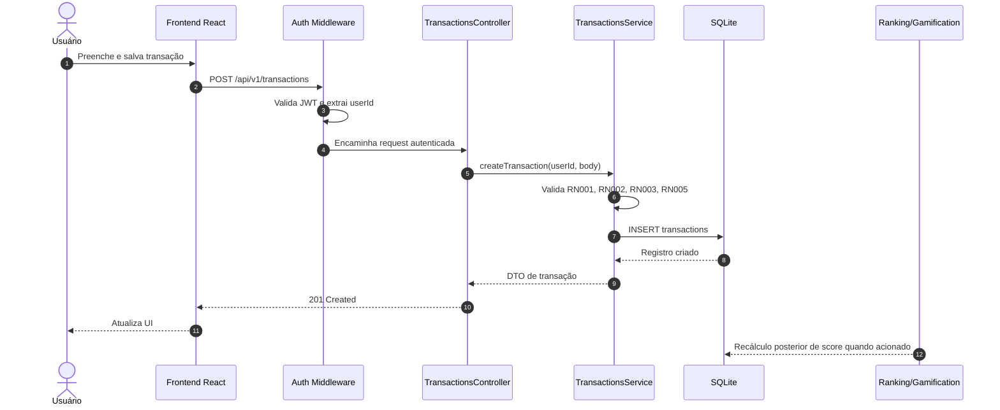
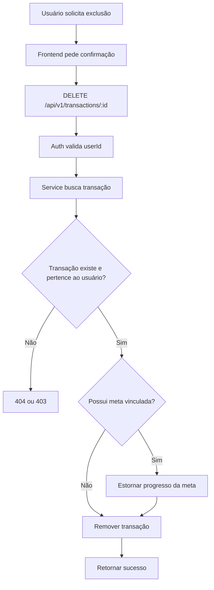
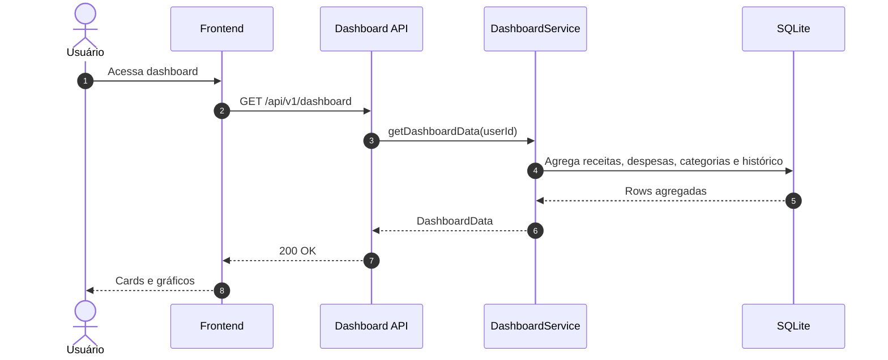
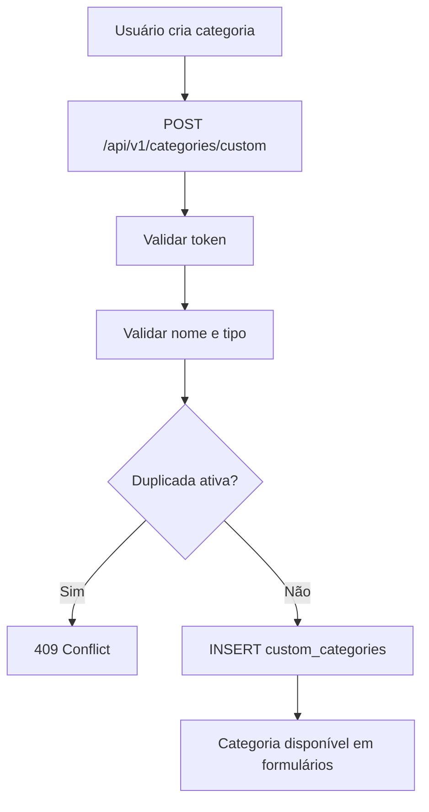
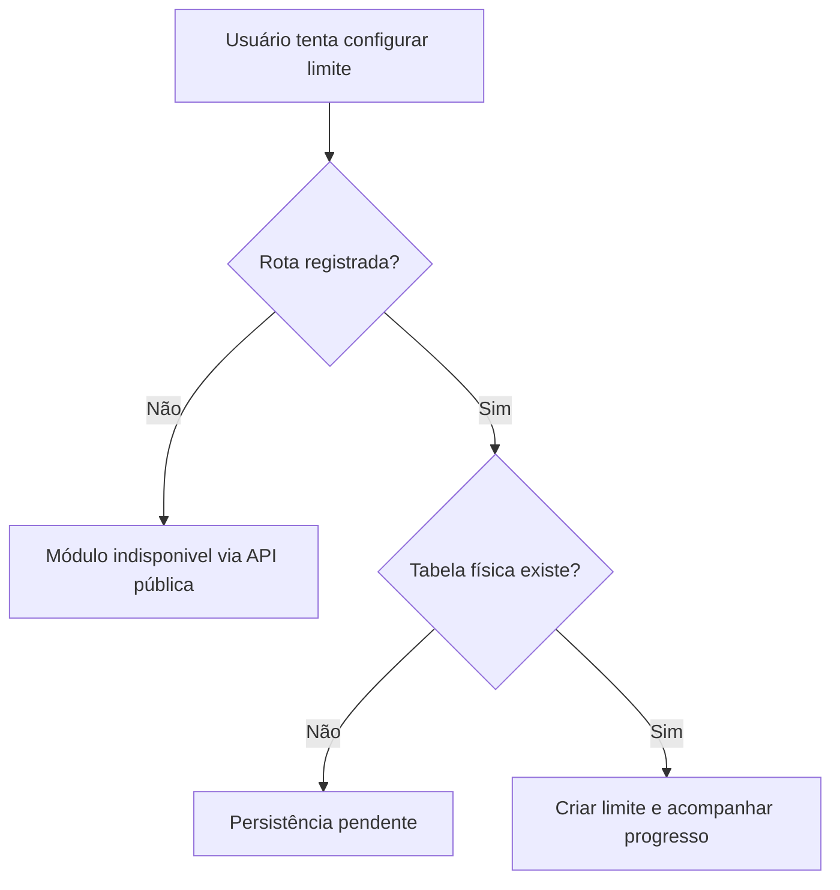
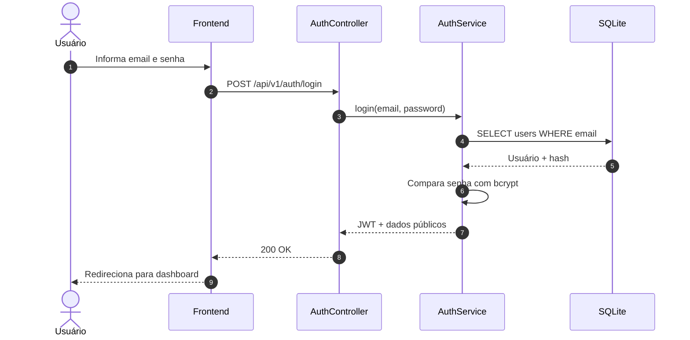
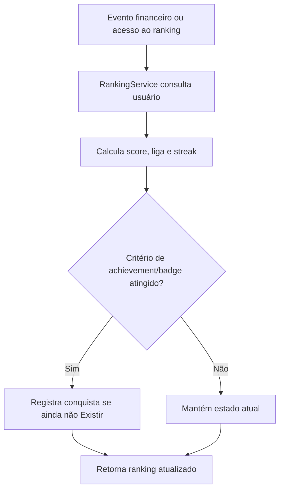

# Workflows e Mapeamento de Processos - FYNX Rev. 06

> Documento operacional dos casos de uso da Rev06. Cada fluxo conecta experiência do usuário, endpoint, camada DDD, regra de negócio e persistência.

---

## 1. Convencao de Raias

| Raia | Responsabilidade | Camada DDD |
|---|---|---|
| Usuário | Decide e aciona uma operação. | Fora do sistema |
| Frontend React | Coleta dados, valida campos básicos e chama API. | Interface |
| HTTP/Middleware | Autentica, extrai `userId`, valida contrato e chama controller. | Infrastructure |
| Controller | Traduz HTTP para chamada de service/use case. | Infrastructure/Application boundary |
| Service/Use Case | Orquestra regra de aplicação. | Application |
| Domain | Aplica invariantes, entidades, value objects e eventos. | Domain |
| Repository/Database | Persiste e consulta dados. | Infrastructure |
| Event/Gamification | Reage a eventos financeiros e atualiza score/badges. | Domain/Application |

**Padrão mínimo por caso de uso:** ator, pré-condições, fluxo principal, sad paths, pós-condições e rastreabilidade.

---

## 2. Casos de Uso

### Diagrama geral de Caso de Uso

O diagrama abaixo é o artefato acadêmico principal de Caso de Uso da Rev06. Ele deve ser mantido coerente com `REQUISITOS_E_REGRAS.md` e com a matriz `MATRIZ_DE_RASTREABILIDADE.md`.

**Checklist de validade do diagrama:** os atores devem representar Visitante, Usuário autenticado, Sistema e atores planejados apenas quando marcados como planejados; os casos de uso devem corresponder aos CSUs documentados; WhatsApp/IA e Spending Limits não devem aparecer como totalmente implementados enquanto permanecerem com status planejado/parcial.

### Padrão de especificação detalhada

Cada caso de uso da Rev06 deve possuir, no mínimo: nome, ator, descrição, fluxo principal, fluxos alternativos, pré-condições e pós-condições. Os CSUs abaixo seguem esse formato e indicam o status quando a funcionalidade É parcial ou planejada.

### CSU01 - Autenticação de usuário

| Item | Descrição |
|---|---|
| RF | RF001 |
| Endpoint | `POST /api/v1/auth/login` |
| Ator primario | Usuário registrado |
| Descrição | Permite que um usuário existente acesse o sistema com email e senha. |
| Pré-condições | Conta existente em `users`; senha cadastrada. |
| Pós-condições | JWT emitido; usuário pode acessar rotas protegidas. |

**Fluxo principal:**

1. Usuário informa email e senha na tela de login.
2. Frontend envia `POST /api/v1/auth/login`.
3. Controller valida presenca de email e senha.
4. Auth service busca usuário por email.
5. Auth service compara senha com hash persistido.
6. Auth service gera JWT com identificador do usuário.
7. API retorna token e dados públicos do usuário.
8. Frontend persiste token e navega para dashboard.

**Sad paths:**

- Email ou senha ausentes: `400`.
- Credenciais inválidas: `401`.
- Falha de banco: `500`, com log técnico.

### CSU02 - Registro de usuário

| Item | Descrição |
|---|---|
| RF | RF002 |
| Endpoint | `POST /api/v1/auth/register` |
| Ator primario | Visitante |
| Descrição | Permite criar uma nova conta local e inicializar seu estado de gamificação. |
| Pré-condições | Email ainda não cadastrado. |
| Pós-condições | Conta criada; score inicial deve existir. |

**Fluxo principal:**

1. Visitante informa nome, email e senha.
2. Frontend envia request de registro.
3. Controller valida payload.
4. Service verifica duplicidade de email.
5. Service aplica hash na senha.
6. Service cria usuário em `users`.
7. Sistema inicializa `user_scores` com score zero, nível um e liga Bronze.
8. API retorna usuário e token.

**Sad paths:**

- Email duplicado: `409`.
- Senha ou email inválidos: `400`.
- Usuário criado sem score inicial: deve ser tratado como falha de consistência e registrado como bug se ocorrer.

### CSU03 - Cadastro de transação financeira

| Item | Descrição |
|---|---|
| RF | RF003 |
| Endpoint | `POST /api/v1/transactions` |
| Ator primario | Usuário autenticado |
| Descrição | Registra uma receita ou despesa para alimentar histórico, dashboard e gamificação. |
| Pré-condições | JWT válido; categoria informada. |
| Pós-condições | Transação persistida; dashboard e ranking passam a considerar o lançamento. |

**Fluxo principal:**

1. Usuário abre formulário de transação.
2. Usuário informa tipo, valor, descrição, categoria e data.
3. Opcionalmente informa notas e meta vinculada.
4. Frontend envia payload com token.
5. Middleware autentica e injeta `userId`.
6. Controller chama service de transações.
7. Service valida `amount > 0`, tipo permitido e propriedade do usuário.
8. Repository insere linha em `transactions`.
9. Service retorna objeto criado.
10. Frontend atualiza listagem, dashboard ou cache local.

**Sad paths:**

- Valor menor ou igual a zero: `400`.
- Categoria ausente: `400`.
- Token ausente/expirado: `401`.
- Meta vinculada inexistente: `404` ou `409`, conforme implementação.

**Eventos relacionados:** criação de transação deve ser elegível a recálculo de score e badges, conforme `MOTOR_DE_GAMIFICACAO.md`.

### CSU04 - Criar meta de gasto

| Item | Descrição |
|---|---|
| RF | RF007 |
| Endpoint | `POST /api/v1/goals/spending-goals` |
| Ator primario | Usuário autenticado |
| Descrição | Cria uma meta para controlar gasto por categoria e período. |
| Pré-condições | Categoria e período definidos. |
| Pós-condições | Meta ativa para acompanhamento de gasto. |

**Fluxo principal:**

1. Usuário acessa tela de metas.
2. Seleciona criação de meta de gasto.
3. Informa título, categoria, valor alvo, período, data inicial e final.
4. Frontend envia `goalType = spending`.
5. Middleware autentica usuário.
6. Goals service valida valor e período.
7. Service persiste em `spending_goals`.
8. API retorna meta criada.
9. Frontend exibe percentual inicial de progresso.

**Sad paths:**

- Valor alvo inválido: `400`.
- Período fora do enum: `400`.
- Categoria inconsistente: `409` ou validação de domínio.

### CSU05 - Criar meta de economia

| Item | Descrição |
|---|---|
| RF | RF006 |
| Endpoint | `POST /api/v1/goals/spending-goals` com `goalType = saving` |
| Ator primario | Usuário autenticado |
| Descrição | Cria uma meta de economia com valor alvo e acompanhamento de progresso. |
| Pré-condições | Valor alvo e datas definidos. |
| Pós-condições | Meta de economia disponível para progresso manual ou por transação. |

**Fluxo principal:**

1. Usuário escolhe criar meta de economia.
2. Informa nome da meta, categoria, valor alvo e período.
3. Frontend envia request com `goalType = saving`.
4. API valida token.
5. Service valida valor, datas e status inicial.
6. Repository salva em `spending_goals`.
7. API retorna meta.
8. Frontend renderiza card de progresso.

**Sad paths:**

- Data final anterior a inicial: `400`.
- Valor alvo menor ou igual a zero: `400`.
- Falha de persistência: `500`.

### CSU06 - Vincular transação a meta

| Item | Descrição |
|---|---|
| RF | RF003, RF006, RF007 |
| Endpoint | `POST /api/v1/transactions` ou `PATCH /api/v1/goals/spending-goals/:id/progress-transaction` |
| Descrição | Associa o impacto financeiro de uma transação a uma meta ativa. |
| Relação | Extensao de CSU03 |
| Pré-condições | Usuário autenticado; meta existente e pertencente ao usuário. |
| Pós-condições | Transação registrada e progresso da meta atualizado quando aplicável. |

**Fluxo principal:**

1. Usuário seleciona uma meta ativa durante o cadastro da transação.
2. Frontend envia `savingGoalId` ou `spendingGoalId`.
3. Service valida se a meta pertence ao mesmo usuário.
4. Service persiste a transação.
5. Service atualiza progresso da meta, se o fluxo estiver habilitado.
6. API retorna transação e/ou progresso atualizado.

**Sad paths:**

- Meta não pertence ao usuário: `403` ou `404`.
- Meta concluída/pausada: `409`.
- Erro entre salvar transação e atualizar meta: requer transação atômica para evitar estado parcial.

### CSU07 - Visualizar dashboard e analytics

| Item | Descrição |
|---|---|
| RF | RF008 |
| Endpoints | `GET /api/v1/dashboard`, `GET /api/v1/dashboard/overview`, `GET /api/v1/dashboard/transactions` |
| Ator primario | Usuário autenticado |
| Descrição | Exibe indicadores financeiros consolidados e histórico do usuário. |
| Pré-condições | JWT válido. |
| Pós-condições | Dashboard renderizado com totais, categorias, histórico e gráficos. |

**Fluxo principal:**

1. Usuário acessa dashboard.
2. Frontend requisita overview e dados consolidados.
3. Middleware valida JWT.
4. Dashboard service executa agregacoes por `user_id`.
5. Service calcula receitas, despesas, saldo, categorias e histórico.
6. API retorna DTO otimizado para leitura.
7. Frontend renderiza cards e gráficos.

**Sad paths:**

- Token inválido: `401`.
- Usuário sem transações: response deve retornar listas vazias e totais zero.
- Falha de query: `500`, com log técnico.

### CSU08 - Gamificação: score, ranking, achievements e badges

| Item | Descrição |
|---|---|
| RF | RF010, RF011, RF012 |
| Endpoints | `/api/v1/ranking/*` |
| Ator primario | Usuário autenticado e sistema |
| Descrição | Exibe score, ranking, ligas, achievements e badges do usuário. |
| Pré-condições | JWT válido; usuário com registro em `user_scores` ou fallback de criação/default. |
| Pós-condições | Ranking e progresso de gamificação apresentados ao usuário. |

**Fluxo principal:**

1. Usuário acessa tela de ranking.
2. Frontend chama `GET /api/v1/ranking`.
3. Ranking service consulta transações, metas, scores, badges e achievements.
4. Service calcula score ou usa estado em `user_scores`.
5. Service determina liga, posição e estatísticas.
6. API retorna ranking consolidado.
7. Frontend exibe leaderboard, nível, badges e progresso.

**Sad paths:**

- Usuário sem linha em `user_scores`: sistema deve criar, retornar default ou registrar inconsistencia.
- Endpoint administrativo acessado por usuário comum: deve retornar `403`.
- Dados de gamificação inconsistentes: response deve degradar sem quebrar dashboard.

### CSU09 - Vincular WhatsApp

| Item | Descrição |
|---|---|
| RF | RF016 |
| Status | Planejado |
| Endpoint | Não registrado |
| Ator primario | Usuário autenticado |
| Descrição | Planeja vincular um número de WhatsApp ao usuário por OTP. |
| Pré-condições | Módulo WhatsApp implementado e provedor configurado. |
| Pós-condições | Número verificado e apto a receber comandos/notificações. |

**Fluxo planejado:**

1. Usuário informa telefone no perfil.
2. API gera OTP de uso Único.
3. Sistema envia mensagem via provedor WhatsApp.
4. Usuário confirma código na web.
5. API valida código, expiração e tentativas.
6. Sistema marca número como verificado.

**Sad paths planejados:**

- Código expirado: `403`.
- Muitas tentativas: bloqueio temporario.
- Número já vinculado a outro usuário: `409`.

### CSU10 - Registrar transação via WhatsApp

| Item | Descrição |
|---|---|
| RF | RF017 |
| Status | Planejado |
| Endpoint | Não registrado |
| Ator primario | Usuário com WhatsApp verificado |
| Descrição | Planeja registrar transações a partir de mensagens em linguagem natural. |
| Pré-condições | Número verificado e motor de extração configurado. |
| Pós-condições | Transação persistida somente após confirmação do usuário. |

**Fluxo planejado:**

1. Usuário envia mensagem em linguagem natural.
2. Webhook recebe payload do provedor.
3. Adaptador identifica número verificado.
4. LLM/NER extrai valor, tipo, categoria, descrição e data.
5. Sistema envia resumo para confirmação.
6. Usuário confirma.
7. API reutiliza o caso de uso de criação de transação.
8. Sistema responde com confirmação.

**Sad paths planejados:**

- Número não verificado: negar operação.
- Extração ambígua: pedir confirmação adicional.
- Usuário não confirma: não persistir.

### CSU11 - Consulta de status via WhatsApp

| Item | Descrição |
|---|---|
| RF | RF018 |
| Status | Planejado |
| Ator primario | Usuário com WhatsApp verificado |
| Descrição | Planeja responder consultas financeiras por WhatsApp. |
| Pré-condições | Número verificado e webhook implementado. |
| Pós-condições | Resposta enviada sem alterar dados financeiros. |

**Fluxo planejado:**

1. Usuário pergunta saldo, gasto por categoria ou progresso de meta.
2. Webhook identifica intenção.
3. Adaptador consulta dashboard/goals.
4. Sistema responde em linguagem natural.

**Sad paths planejados:**

- Intenção desconhecida: retornar opções.
- Consulta sem número verificado: bloquear.

### CSU12 - Notificações proativas

| Item | Descrição |
|---|---|
| RF | RF018 |
| Status | Planejado |
| Ator primario | Sistema |
| Descrição | Planeja enviar notificações automáticas sobre metas, limites e eventos relevantes. |
| Pré-condições | Opt-in do usuário, scheduler e provedor configurados. |
| Pós-condições | Notificação enviada ou falha registrada para retry/auditoria. |

**Fluxo planejado:**

1. Worker avalia metas e limites.
2. Sistema detecta aproximação ou estouro de limite.
3. Sistema cria evento de notificação.
4. Adaptador envia mensagem.
5. Log registra status de entrega.

**Sad paths planejados:**

- Provedor indisponivel: retry controlado.
- Usuário sem opt-in: não Enviar.

### CSU13 - Gerenciar categorias customizadas

| Item | Descrição |
|---|---|
| RF | RF013 |
| Endpoint | `/api/v1/categories/custom` |
| Ator primario | Usuário autenticado |
| Descrição | Permite gerenciar categorias personalizadas para uso em transações. |
| Pré-condições | JWT válido. |
| Pós-condições | Categoria criada, atualizada, arquivada ou removida logicamente. |

**Fluxo principal:**

1. Usuário abre modal de categorias.
2. Frontend lista categorias customizadas.
3. Usuário cria, altera, remove ou arquiva categoria.
4. API valida autenticação e ownership.
5. Service verifica duplicidade.
6. Repository persiste em `custom_categories`.
7. Frontend atualiza formulários de transação.

**Sad paths:**

- Nome duplicado ativo: `409`.
- Categoria de outro usuário: `403` ou `404`.
- Tipo inválido: `400`.

### CSU14 - Spending limits

| Item | Descrição |
|---|---|
| RF | RF014 |
| Status | Parcial |
| Endpoint | Arquivo de rotas existe, mas não registrado em `routes/index.ts`. |
| Ator primario | Usuário autenticado |
| Descrição | Define limite de gasto por categoria e período. |
| Pré-condições | Rota registrada e tabela `spending_limits` criada. |
| Pós-condições | Limite persistido e progresso atualizado por despesas. |

**Fluxo esperado após conclusão:**

1. Usuário define limite por categoria.
2. API registra limite com período.
3. Transações de despesa atualizam progresso.
4. Dashboard alerta aproximação do limite.
5. Limite pode ser pausado, atualizado ou removido.

**Lacunas atuais:**

- Prefixo `/api/v1/spending-limits` não Está exposto.
- Tabela `spending_limits` não foi encontrada no schema atual.

### CSU15 - Operações em lote de transações

| Item | Descrição |
|---|---|
| RF | RF005 |
| Endpoint | `POST /api/v1/transactions/bulk` |
| Ator primario | Usuário autenticado |
| Descrição | Executa operações em lote sobre transações, como criação ou remoção múltipla conforme contrato da API. |
| Pré-condições | JWT válido; todos os itens do lote devem pertencer ao usuário autenticado ou conter dados válidos para criação. |
| Pós-condições | Itens válidos processados conforme regra da operação; falhas devem ser retornadas de forma rastreavel. |

**Fluxo principal:**

1. Usuário ou interface seleciona várias transações ou envia vários lançamentos.
2. Frontend envia `POST /api/v1/transactions/bulk`.
3. Middleware autentica e injeta `userId`.
4. Controller valida payload básico do lote.
5. Service valida ownership, tipo, valor e categoria de cada item.
6. Service executa a operação definida para o lote.
7. API retorna resumo de sucesso/falha.
8. Frontend atualiza listagem e indicadores.

**Sad paths:**

- Lote vazio ou malformado: `400`.
- Item pertencente a outro usuário: `403` ou `404`.
- Falha parcial: retornar itens afetados e itens recusados, quando a implementação suportar resposta granular.
- Operação multi-item sem atomicidade: registrar risco de estado parcial.

---

## 3. Processos BPMN / Sequências

### Processo 1 - Criação de transação com reflexo em analytics e gamificação

### Processo 2 - Exclusão de transação e estorno de meta

### Processo 3 - Carregamento do dashboard

### Processo 4 - Categoria customizada

### Processo 5 - Spending limits parcial

### Processo 6 - Login e emissao de JWT

### Processo 7 - Atualização de score e badges

---

## 4. Referências Visuais

A pasta `imagens/` da Rev06 contem artefatos herdados da Rev05. Ao usar uma imagem, declarar seu status:

| Imagem | Uso | Status recomendado |
|---|---|---|
| `caso-de-uso-rev06.png` | Visão geral de casos de uso. | Atual, se revisada. |
| `DF - Fluxograma de usuario.svg` | Jornada de navegação. | Atualizar para rotas Rev06. |
| `DA - Cadastro de Transacao.svg` | Processo financeiro principal. | Reutilizavel. |
| `DA - Exclusao de Transacao.svg` | Exclusão/estorno. | Reutilizavel com nota DDD. |
| `DA - Meta de Gastos.svg` | Goals e budgets. | Reutilizavel. |
| `DA - Robo de Gamificacao.svg` | Score e ranking. | Reutilizavel com validação. |
| `DA - Registro por Voz.svg` | WhatsApp/IA. | Planejado. |
| `DA - Vinculacao de Numero.svg` | OTP WhatsApp. | Planejado. |

### Imagens inseridas como evidências acadêmicas

---

## 5. Checklist de Qualidade dos Fluxos

- Todo CSU tem RF associado.
- Todo fluxo implementado aponta para endpoint real.
- Todo recurso planejado esta marcado como planejado.
- Todo recurso parcial declara a lacuna técnica.
- Sad paths existem para validação, autenticação, ownership e persistência.
- Processos financeiros preservam filtro por `user_id`.
- Processos que alteram mais de uma entidade devem considerar transação atômica.
