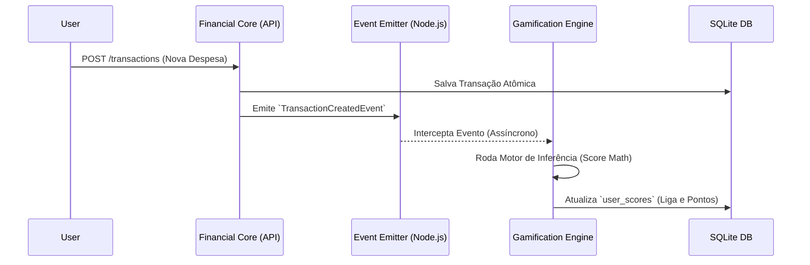

# Motor de Gamificação e Teoria dos Jogos — FYNX (Rev. 06)

> Documentação técnica do `GamificationContext`. O sistema de pontuação do FYNX não é um simples incremento linear; ele utiliza heurísticas comportamentais, teoria das perdas e sistemas de ranqueamento Elo (similar a jogos competitivos) para incentivar a disciplina financeira.

---

## 1. Arquitetura Orientada a Eventos (EDA)

Para respeitar o Domain-Driven Design (DDD), a Gamificação **não se mistura** com a Lógica Financeira. Ela opera passivamente escutando `Domain Events`.



---

## 2. Algoritmo FYNX Score (O Motor Matemático)

O score é um indicador absoluto de **Saúde e Consistência Financeira**. Diferente de pontos de experiência (XP) comuns, o FYNX Score pode diminuir, forçando o usuário a manter a disciplina.

### 2.1. A Fórmula de Risco e Retorno
```math
FYNX\_SCORE = \left( \frac{\max(0, R - D)}{R} \times 1000 \right) + (S \times 5) + (C) - \left( \max(0, D - R) \times L_m \right)
```
*Onde: $R$ = Receita Mensal, $D$ = Despesa Mensal, $S$ = Dias Ativos Seguidos (Streak), $C$ = Carry-over bônus, $L_m$ = Multiplicador da Liga.*

### 2.2. Simulações de Cenários (Test Cases de Domínio)

Para validar a robustez da fórmula, o sistema é testado contra os seguintes cenários extremos:

| Cenário | Input (R, D, S) | Cálculo | Score Resultante |
|---|---|---|---|
| **Poupador Ideal** | R: 5000, D: 2000, S: 10 | $(3000/5000 \times 1000) + (10 \times 5)$ | **650 pts** |
| **Equilíbrio (Viver no Limite)** | R: 3000, D: 3000, S: 5 | $(0/3000 \times 1000) + (5 \times 5)$ | **25 pts** |
| **Endividado (Bronze)** | R: 2000, D: 3000, S: 2 | $(0) + (10) - (1000 \times 1.0)$ | **0 pts** (Min 0) |
| **Impulsivo (Diamante)** | R: 10000, D: 15000, S: 30 | $(0) + (150) - (5000 \times 5.0)$ | **0 pts** (Penalidade Letal) |

### 2.3. Progressão de Níveis (XP Table)

Enquanto o Score é volátil, o **Nível** é cumulativo e nunca decresce. O XP é ganho em cada transação registrada ($XP = \text{Valor} \times 0.1$) e por bônus de conquistas.

| Nível | XP Necessário | Título | Recompensa Visual |
|---|---|---|---|
| 1-5 | 0 - 1.000 | Recruta Financeiro | Avatar Padrão |
| 6-15 | 1.001 - 5.000 | Sentinela do Cofre | Moldura Prateada |
| 16-30 | 5.001 - 15.000 | Guardião da Riqueza | Aura de Dashboard |
| 31-50 | 15.001 - 50.000 | Mestre do Patrimônio | Badge de Perfil Customizada |
| 50+ | 50.001+ | Lenda do FYNX | Tema Dark/Gold Exclusivo |

---

## 3. Sistema de Ligas (O "Elo" Financeiro)

A plataforma não permite que o usuário relaxe quando atinge o topo. À medida que o usuário sobe de liga, a "gravidade" do jogo aumenta, refletida no **Multiplicador de Penalidade ($L_m$)**.

### 3.1. Dinâmica de Promoção e Rebaixamento

O recálculo de ligas ocorre em dois momentos: **Instantâneo** (ao atingir o score mínimo) e **Sazonal** (ao fim da temporada).

| Liga | Score Mínimo | Multiplicador ($L_m$) | Proteção de Rebaixamento |
|---|---|---|---|
| 🥉 **Bronze** | 0 | `1.0x` | Permanente |
| 🥈 **Prata** | 500 | `1.5x` | 3 dias após promoção |
| 🥇 **Ouro** | 1.500 | `2.0x` | 5 dias após promoção |
| 💎 **Platina** | 4.000 | `3.0x` | 7 dias após promoção |
| 🏆 **Diamante** | 10.000 | `5.0x` | Sem proteção |

> *Nota Estratégica*: Um usuário **Diamante** que gasta impulsivamente perde $5\times$ mais pontos que um usuário **Bronze** pelo mesmo erro financeiro. Isso simula o risco real de grandes patrimônios: erros custam caro.

---

## 4. Sistema de Conquistas (Achievements) e Badges

As conquistas são gatilhos de recompensa que premiam comportamentos de longo prazo e marcos de aprendizado financeiro.

### 4.1. Catálogo Técnico de Badges (Expandido)

| ID | Nome | Gatilho de Domínio | Pontos | Icon (Frontend) |
|---|---|---|---|---|
| `badge_novice` | **Primeiro Passo** | Primeira transação criada. | `+50` | `seedling` |
| `badge_saver` | **Poupador Iniciante** | Saldo líquido $> R\$ 1.000$. | `+200` | `piggy-bank` |
| `badge_consistent`| **Mestre do Hábito** | Streak ininterrupto de 30 dias. | `+500` | `calendar-check` |
| `badge_disciplined`| **Sob Controle** | 3 meses sem estourar nenhum limite. | `+1000` | `shield-check` |
| `badge_investor` | **Visão de Futuro** | Primeira meta de economia concluída. | `+300` | `trending-up` |
| `badge_night_owl` | **Coruja Financeira** | Lançamento realizado entre 00h e 05h. | `+20` | `moon` |
| `badge_math_wiz` | **Calculista** | Registrou 50 transações via WhatsApp NLP. | `+150` | `brain` |
| `badge_whale` | **Baleia de Ouro** | Saldo líquido $> R\$ 50.000$. | `+2000` | `crown` |
| `badge_early_bird` | **Madrugador** | Registro financeiro antes das 08h. | `+30` | `sun` |
| `badge_zen` | **Paz Orçamentária** | Fechou o mês com 100% dos limites respeitados. | `+600` | `lotus` |

### 4.2. Lógica de Validação de Achievements (Domain Logic)

Cada achievement possui um `CriteriaValidator` que roda de forma isolada. Exemplo de validação da `badge_disciplined`:
1. O sistema verifica a tabela `spending_limits`.
2. Se `current_spent < limit_amount` para todos os registros dos últimos 90 dias.
3. Dispara o evento `AchievementUnlockedEvent`.

---

## 5. Lógica de Consistência (Streaks)

O streak é o principal motor de retenção do FYNX. Ele premia o usuário não pelo volume de dinheiro, mas pela frequência de atenção às suas finanças.

### 5.1. Regras de Incremento
- **Check-in Válido**: Ocorre quando o usuário abre o App (ou interage via WhatsApp) e realiza pelo menos uma ação (visualizar dashboard ou criar transação).
- **Janela de Streak**: O usuário tem até 36 horas desde o último check-in para realizar o próximo. Se ultrapassar 36h, o `current_streak` volta a `0`.
- **Multiplicador de Streak**:
  - $1-7$ dias: $1.0x$ bônus.
  - $8-14$ dias: $1.2x$ bônus.
  - $15-30$ dias: $1.5x$ bônus.
  - $30+$ dias: $2.0x$ bônus.

### 5.2. Sistema de "Congelamento" (Streak Freeze)
Usuários de nível alto (30+) podem comprar um "Streak Freeze" usando pontos acumulados (500 pts). Isso permite pular 1 dia de check-in sem resetar o contador, útil para viagens ou períodos offline.

---

## 6. Governança e Anti-Cheating

A integridade do Ranking Global é fundamental para manter a competição saudável.

### 6.1. Defesa contra "Farming" e Manipulação
- **Rate Limit de Score**: Criar 100 transações de R$ 1,00 no mesmo dia não gerará pontuação infinita. O sistema consolida a equação de *Taxa de Economia Mensal*, então picotar transações não altera o resultado macro.
- **Validação de IPs**: Múltiplos logins de IPs geolocalizados em regiões muito distantes em curto intervalo bloqueiam temporariamente o ganho de pontos para evitar compartilhamento de contas para "farmar" ranking.
- **Audit Log**: Todas as alterações de score significativas são registradas em uma tabela de auditoria (`score_audit_logs`) para análise em caso de comportamento anômalo no Top 10 global.

### 6.2. Reset Sazonal (Temporadas)
O sistema opera em janelas mensais chamadas de "Temporadas".
1. **Dia 1 às 00:00 UTC**: Um Job assíncrono (ex: via `node-cron`) bloqueia as gravações de score temporariamente.
2. **Cristalização**: O Ranking do mês fechado é movido para uma tabela histórica. Os 3 primeiros de cada liga ganham uma badge exclusiva de "Top 3 Temporada X".
3. **Carry-Over**: O novo score do usuário começa valendo $20\%$ do que ele terminou no mês passado. Isso garante que o esforço anterior seja recompensado, mas não torne o ranking imutável.
4. **Recálculo de Ligas**: As faixas de corte das ligas são recalculadas. Se a média de score da comunidade subiu, o sarrafo para entrar na liga *Diamante* também sobe (Sistema Dinâmico).

---

## 7. Experiência Visual e Feedback (UX)

A gamificação é reforçada por elementos visuais na interface que transformam a gestão financeira em um jogo prazeroso.

### 7.1. Gatilhos Visuais e Sonoros
- **Barra de XP**: Exibe o progresso para o próximo nível com animação de "preenchimento" suave.
- **Confete de Conquista**: Animação de partículas disparada no frontend ao desbloquear uma badge rara.
- **Efeito de Liga**: O Dashboard muda sutilmente de cor/tema conforme a liga do usuário.
  - *Bronze*: Tons de marrom e cobre.
  - *Diamante*: Tons de azul escuro com brilhos holográficos nas bordas dos cards.
- **Haptic Feedback (Mobile)**: Pequenas vibrações ao confirmar uma transação via WhatsApp, reforçando a sensação de "tarefa concluída".

### 7.2. Painel do Jogador (Profile Summary)
Um componente centralizado que exibe:
- Avatar customizável.
- Vitrine de Badges (Top 3 favoritas).
- Gráfico de Radar: Compara o usuário com a média da sua liga em 4 eixos: *Economia, Disciplina, Consistência e Planejamento*.
