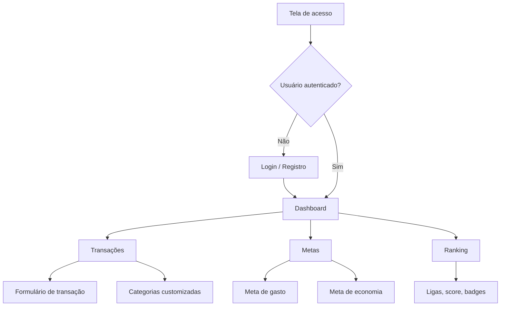

# Protótipos, UI/UX e Comparativo com Sistema Implementado - FYNX Rev. 06

> Artefato acadêmico para protótipos de telas, mapa de navegação, fluxo de telas e comparativo entre protótipo e sistema implementado.

---

## 1. Fonte dos Artefatos Visuais

| Origem | Conteúdo | Status |
|---|---|---|
| `imagens/ui-*.png` | Cópias autocontidas dos screenshots do sistema implementado | Evidência atual de UI |
| `../../manual-usuario/*.png` | Origem histórica dos screenshots copiados | Referência externa ao pacote Rev06 |
| `../Doc-Tecnica-Rev05/*.png` | Telas históricas da documentação anterior | Referência/protótipo legado |
| `imagens/DF - Fluxograma de usuario.svg` | Fluxo geral de usuário | Herdado; deve ser revisado quando rotas mudarem |
| `imagens/caso-de-uso-rev06.png` | Caso de uso Rev06 | Atual se validado com requisitos |

**Nota:** não foi encontrado arquivo Figma ou Justmind no repositório. Para fins de entrega, a Rev06 trata os screenshots e imagens de telas como evidência visual/protótipo documentado, declarando essa limitação de forma transparente. As imagens essenciais foram copiadas para `imagens/` para que o pacote Rev06 seja visualizável de forma autocontida.

---

## 2. Mapa de Navegação

Imagem complementar herdada:

---

## 3. Inventario de Telas

| Tela | Evidência visual | Módulo | Status |
|---|---|---|---|
| Acesso/Login | `imagens/ui-tela-acesso.png` | Auth | Implementado |
| Dashboard | `imagens/ui-dashboard-1.png`, `imagens/ui-dashboard-2.png` | Dashboard/Analytics | Implementado |
| Transações | `imagens/ui-form-transacao.png` | Financial Core | Implementado |
| Categorias customizadas | `imagens/ui-form-categorias.png` | Financial Core | Implementado |
| Metas de gasto | `imagens/ui-form-meta-gastos.png` | Goals/Budgets | Implementado |
| Metas de economia | `imagens/ui-form-meta-poupanca.png`, `imagens/ui-goals.png` | Goals/Budgets | Implementado |
| Ranking | `imagens/ui-ranking-1.png`, `imagens/ui-ranking-2.png` | Gamification | Implementado |

### 3.1. Evidências Visuais Inseridas

---

## 4. Comparativo Protótipo x Implementação

| Área | Protótipo/Referência | Implementado | Diferenças relevantes | Status |
|---|---|---|---|---|
| Login | Tela de acesso histórica e screenshot atual | Login com JWT e persistência de token | A arquitetura atual usa auth backend real; imagens antigas podem não refletir todos os estados de erro | Compatível |
| Dashboard | Cards e gráficos financeiros | Cards, resumo, histórico e gráficos via API | Deve manter estados vazios e carregamento documentados em manual | Compatível |
| Transações | Modal/formulário de lançamento | CRUD via `/api/v1/transactions` | Campos ricos de TS podem não persistir fisicamente | Compatível com ressalva |
| Metas | Telas de metas de gasto/economia | `spending_goals` com `goal_type` | Nome físico `spending_goals` cobre gasto e economia | Compatível |
| Ranking | Tela de ranking e ligas | Ranking, score, badges e achievements | Reset de temporada exige controle admin futuro | Compatível com ressalva |
| Categorias | Formulário de categorias | CRUD/arquivo lógico via `/categories/custom` | Usa `is_active` para arquivar | Compatível |
| WhatsApp/IA | Fluxos visuais herdados | Não implementado como rota registrada | Deve permanecer planejado | Não implementado |

---

## 5. Critérios de Aceite UI/UX

- Toda tela principal deve aparecer no manual ou nesta matriz.
- Toda tela deve apontar para o módulo e requisito correspondente em `MATRIZ_DE_RASTREABILIDADE.md`.
- Quando uma tela for herdada da Rev05, seu status deve ser declarado como Referência/protótipo legado.
- O comparativo não deve ocultar diferenças entre protótipo e implementação atual.
