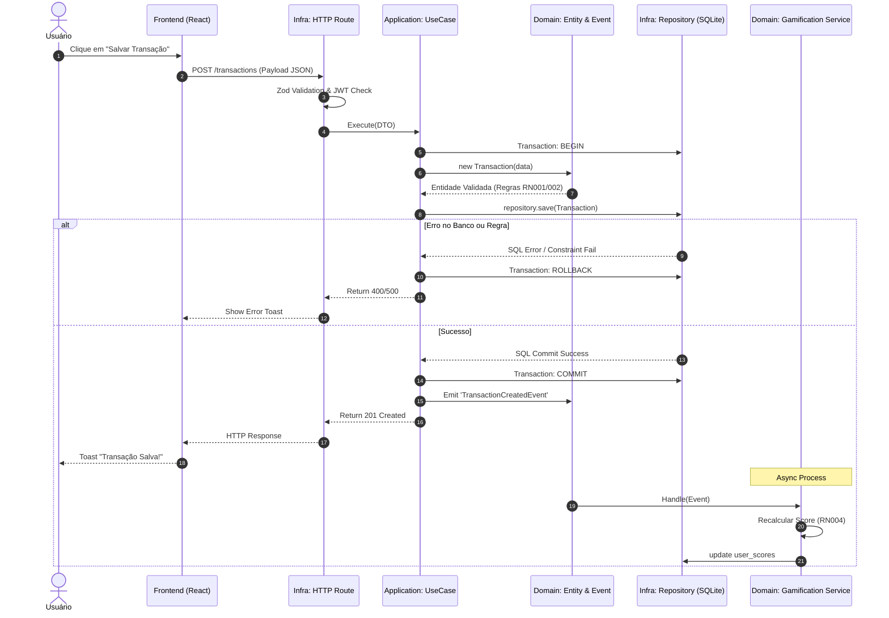

# Workflows e Mapeamento de Processos — FYNX (Rev. 06)

> Documentação acadêmica e técnica detalhando o comportamento dinâmico do sistema FYNX. Este arquivo substitui os antigos diagramas estáticos por fluxos de interação rigorosamente mapeados para os Bounded Contexts (DDD).

---

## 1. Casos de Uso (CSU) - Especificação Técnica

Cada Caso de Uso reflete uma rota de ponta-a-ponta, desde a intenção do usuário no Frontend até a persistência transacional no Backend. Foram mapeados 12 Casos de Uso críticos que cobrem desde o fluxo financeiro básico até a inteligência de gamificação e integração Omnichannel.

### CSU01: Autenticação de Usuário (Identity Context)
| Detalhe | Descrição |
| :--- | :--- |
| **Ator Primário** | Usuário Registrado |
| **Atores Secundários**| N/A |
| **Pré-condições** | O usuário deve possuir uma conta ativa na base `users`. |
| **Fluxo Principal** | 1. O usuário submete formulário com Email e Senha.<br>2. Frontend envia `POST /api/v1/auth/login`.<br>3. `AuthenticateUserUseCase` busca usuário e valida o hash `Bcrypt`.<br>4. O sistema assina o Payload JWT e devolve 200 OK.<br>5. O Frontend armazena o token na `LocalStorage` e roteia para `/dashboard`. |
| **Exceções (Sad Path)** | 3a. Conta não encontrada ou Hash não bate: Retorna `401 Unauthorized`. |
| **Pós-condições** | Usuário autenticado e Token JWT persistido no client-side. |

### CSU02: Registro de Usuário (Identity Context)
| Detalhe | Descrição |
| :--- | :--- |
| **Ator Primário** | Usuário não registrado |
| **Pré-condições** | Email ainda não cadastrado no sistema. |
| **Fluxo Principal** | 1. Usuário preenche Nome, Email e Senha.<br>2. Sistema verifica unicidade do email (RN005).<br>3. Aplica hashing Bcrypt na senha.<br>4. Cria registro na tabela `users`.<br>5. Dispara `UserRegisteredDomainEvent`.<br>6. O Módulo de Gamificação inicializa o Score (CSU08). |
| **Exceções (Sad Path)** | 2a. Email já existe: Retorna `409 Conflict`. |
| **Pós-condições** | Usuário criado, score inicializado e login automático realizado. |

### CSU03: Registro de Transação Financeira (Financial Context)
| Detalhe | Descrição |
| :--- | :--- |
| **Ator Primário** | Usuário Autenticado |
| **Pré-condições** | Possuir Token JWT válido na requisição. |
| **Fluxo Principal** | 1. Usuário preenche valor numérico, data, tipo e categoria.<br>2. Frontend aciona `POST /api/v1/transactions`.<br>3. O Middleware de Auth extrai o `user_id` do Token.<br>4. A Entidade `Transaction` valida as regras de negócio ($valor > 0$).<br>5. (Opcional) Vincula a uma Meta (CSU06).<br>6. O `Unit of Work` salva a transação no SQLite via `Repository`.<br>7. O Domínio dispara o evento `TransactionCreatedEvent`. |
| **Exceções (Sad Path)** | 4a. Valor $\le 0$: Retorna `400 Bad Request`. |
| **Gatilhos de Domínio**| O `GamificationService` escuta o evento e recalcula o score do usuário em background. |

### CSU04: Criar Metas de Gasto (Orçamento)
| Detalhe | Descrição |
| :--- | :--- |
| **Ator Primário** | Usuário Autenticado |
| **Pré-condições** | Possuir Token JWT válido. |
| **Fluxo Principal** | 1. Usuário seleciona "Criar Meta de Gasto".<br>2. Define categoria, valor limite e período (mensal/semanal).<br>3. Sistema persiste registro com `goal_type='spending'`.<br>4. Sistema calcula consumo atual para a categoria no período. |
| **Pós-condições** | Monitoramento de teto ativo para a categoria selecionada. |

### CSU05: Criar Metas de Economia (Saving Goal)
| Detalhe | Descrição |
| :--- | :--- |
| **Ator Primário** | Usuário Autenticado |
| **Pré-condições** | Possuir Token JWT válido. |
| **Fluxo Principal** | 1. Usuário define Nome da Meta, Valor Alvo e Prazo.<br>2. Sistema persiste com `goal_type='saving'`.<br>3. Meta nasce com `current_amount = 0`. |
| **Pós-condições** | Meta visível no Dashboard para vinculação de receitas. |

### CSU06: Vincular Transação a uma Meta
| Detalhe | Descrição |
| :--- | :--- |
| **Ator Primário** | Usuário Autenticado |
| **Relacionamento** | `<<extend>>` de **CSU03** |
| **Fluxo Principal** | 1. Durante o registro da transação, o usuário seleciona uma meta ativa.<br>2. O backend recebe `saving_goal_id` ou `spending_goal_id`.<br>3. O sistema atualiza o `current_amount` da meta correspondente dentro da mesma transação SQL da criação do lançamento. |
| **Pós-condições** | Progresso da meta atualizado proporcionalmente ao valor do lançamento. |

### CSU07: Visualizar Dashboard e Analytics
| Detalhe | Descrição |
| :--- | :--- |
| **Ator Primário** | Usuário Autenticado |
| **Fluxo Principal** | 1. Frontend solicita `GET /api/v1/dashboard`.<br>2. Backend executa agregações SQL (SUM, COUNT) por período.<br>3. Retorna saldo total, receitas vs despesas e distribuição por categoria.<br>4. Frontend renderiza gráficos via `Recharts`. |
| **Pós-condições** | Visão consolidada da saúde financeira apresentada. |

### CSU08: Gestão de Gamificação (Score e Ligas)
| Detalhe | Descrição |
| :--- | :--- |
| **Ator Primário** | Sistema (Automático) |
| **Gatilho** | `TransactionCreatedEvent` ou `CheckInEvent` |
| **Fluxo Principal** | 1. O `GamificationService` intercepta o evento.<br>2. Aplica a fórmula: $Score = (\text{Econ}) + (\text{Consist}) - (\text{Penal})$.<br>3. Verifica se o novo Score exige mudança de Liga (Bronze $\rightarrow$ Prata).<br>4. Atualiza a tabela `user_scores`. |
| **Pós-condições** | Ranking global e status competitivo atualizados. |

### CSU09: Vincular WhatsApp (Omnichannel)
| Detalhe | Descrição |
| :--- | :--- |
| **Ator Primário** | Usuário Autenticado (Web) |
| **Atores Secundários**| Meta Cloud API / Evolution API |
| **Fluxo Principal** | 1. Usuário informa número de telefone no Perfil.<br>2. Backend gera OTP de 6 dígitos (validade 10 min).<br>3. Envia código via WhatsApp.<br>4. Usuário insere código na Web.<br>5. Sistema valida e marca `whatsapp_verified = true`. |
| **Exceções (Sad Path)** | 5a. Código expirado ou incorreto: Retorna `403 Forbidden`. |

### CSU10: Registrar Transação via WhatsApp (IA)
| Detalhe | Descrição |
| :--- | :--- |
| **Ator Primário** | Usuário (WhatsApp) |
| **Atores Secundários**| LLM (OpenAI/Anthropic) |
| **Fluxo Principal** | 1. Usuário envia: "Gastei 50 no almoço".<br>2. Webhook repassa para o LLM.<br>3. LLM extrai JSON: `{amount: 50, category: 'Alimentação', type: 'expense'}`.<br>4. Backend invoca `CreateTransactionUseCase` (reaproveitando CSU03).<br>5. Confirmação enviada via chat. |

### CSU11: Consulta de Status via WhatsApp
| Detalhe | Descrição |
| :--- | :--- |
| **Ator Primário** | Usuário (WhatsApp) |
| **Fluxo Principal** | 1. Usuário pergunta: "Qual meu saldo?" ou "Como está minha meta?".<br>2. IA interpreta a intenção e busca dados no banco.<br>3. Formata resposta amigável com os valores atuais. |

### CSU12: Notificações Proativas
| Detalhe | Descrição |
| :--- | :--- |
| **Ator Primário** | Sistema (Automático) |
| **Gatilho** | Consumo de Meta $\ge 75\%$ ou Meta Concluída. |
| **Fluxo Principal** | 1. Worker de monitoramento detecta o limite atingido.<br>2. Dispara mensagem via Evolution API: "Cuidado! Você já gastou 80% do seu limite de Lazer". |

---

## 2. Mapeamento BPMN (Business Process Model and Notation)

Os fluxos de negócio do FYNX são divididos em Raias de responsabilidade para garantir a separação de conceitos (Separation of Concerns).

### Processo 1: Ciclo de Vida de uma Transação (Com Rollback e Gamificação)
O processo abaixo descreve a coreografia entre as camadas do sistema durante um lançamento financeiro.



### Processo 2: Estorno e Exclusão (Integridade Referencial)
Diferente de um delete simples, a exclusão no FYNX exige a recomposição do saldo de metas vinculadas.

1. **[Raia Usuário]**: Solicita exclusão via UI.
2. **[Raia Backend]**: 
    - Busca transação original.
    - Identifica se há `saving_goal_id`.
    - Se sim, subtrai o valor do `current_amount` da meta (Estorno).
    - Executa `DELETE` físico.
3. **[Raia Gamificação]**: Dispara `TransactionDeletedEvent` para reduzir o score que havia sido ganho.

---

## 3. Workflow de Inteligência Artificial (Módulo WhatsApp)

O fluxo de integração utiliza uma arquitetura de Adaptadores Externos para manter o Core do sistema agnóstico à interface.

```mermaid
graph TD
    W[Usuário no WhatsApp] -->|Envia: "Gastei 50 no Mc"| WEBHOOK
    
    subgraph "Infrastructure (External Adapters)"
        WEBHOOK[Evolution API Webhook]
        LLM[OpenAI / Anthropic API]
    end
    
    WEBHOOK -->|Repassa Texto Bruto| LLM
    LLM -->|Extração NER: {amount: 50, cat: 'Alimentação'}| UC
    
    subgraph "Application Core"
        UC[CreateTransactionUseCase]
    end
    
    UC -->|Inicia Fluxo Padrão| DB[(Banco de Dados)]
    UC -->|Confirmação| W
```

> **Nota Técnica**: A beleza do DDD é que o `CreateTransactionUseCase` não distingue se a chamada veio de um clique no React ou de um áudio processado por IA. A lógica de negócio é única e centralizada.

