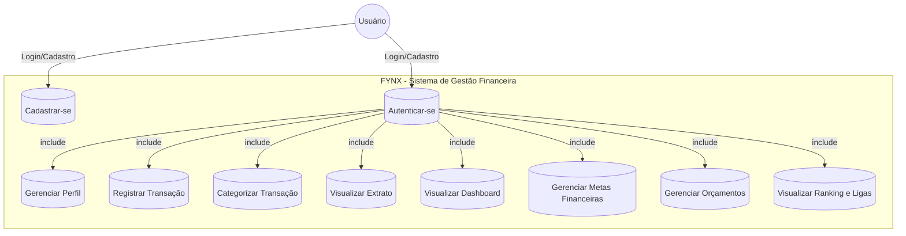
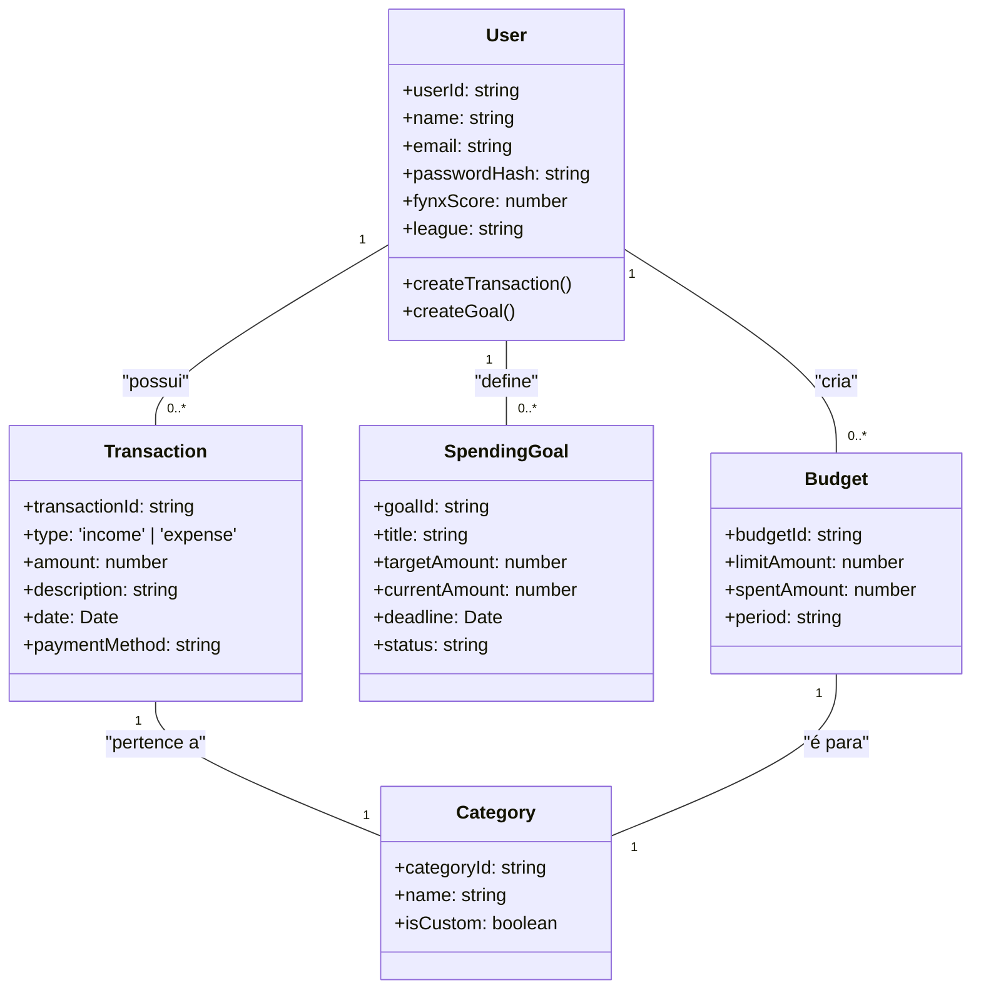

# **Documentação Técnica Completa de Software: FYNX**

**Sistema de Gestão Financeira Pessoal com Gamificação**

**Versão 2.0 - Documentação Técnica Avançada**

**Autores: Danilo Araujo, Giulianna Mota, Matheus Bernardes**

**Data: Janeiro 2025**

---

## **ÍNDICE DETALHADO**

1.  [**Introdução e Visão Geral**](#1-introdução-e-visão-geral)
    1.1. [Tema e Contexto](#11-tema-e-contexto)
    1.2. [Objetivo e Escopo do Projeto](#12-objetivo-e-escopo-do-projeto)
    1.3. [Delimitação e Restrições](#13-delimitação-e-restrições)
    1.4. [Justificativa Técnica e de Negócio](#14-justificativa-técnica-e-de-negócio)
    1.5. [Stakeholders e Público-Alvo](#15-stakeholders-e-público-alvo)

2.  [**Análise de Requisitos**](#2-análise-de-requisitos)
    2.1. [Descrição do Problema de Negócio](#21-descrição-do-problema-de-negócio)
    2.2. [Análise de Stakeholders](#22-análise-de-stakeholders)
    2.3. [Regras de Negócio Detalhadas](#23-regras-de-negócio-detalhadas)
    2.4. [Casos de Uso Expandidos](#24-casos-de-uso-expandidos)
    2.5. [Requisitos Funcionais Detalhados](#25-requisitos-funcionais-detalhados)
    2.6. [Requisitos Não-Funcionais e Atributos de Qualidade](#26-requisitos-não-funcionais-e-atributos-de-qualidade)

3.  [**Arquitetura e Design do Sistema**](#3-arquitetura-e-design-do-sistema)
    3.1. [Visão Arquitetural Geral](#31-visão-arquitetural-geral)
    3.2. [Arquitetura de Software Detalhada](#32-arquitetura-de-software-detalhada)
    3.3. [Padrões Arquiteturais e de Design](#33-padrões-arquiteturais-e-de-design)
    3.4. [Diagramas de Componentes e Deployment](#34-diagramas-de-componentes-e-deployment)
    3.5. [Modelo de Dados e Persistência](#35-modelo-de-dados-e-persistência)

4.  [**Especificações Técnicas**](#4-especificações-técnicas)
    4.1. [Stack Tecnológico Completo](#41-stack-tecnológico-completo)
    4.2. [APIs e Interfaces](#42-apis-e-interfaces)
    4.3. [Segurança e Autenticação](#43-segurança-e-autenticação)
    4.4. [Performance e Escalabilidade](#44-performance-e-escalabilidade)
    4.5. [Monitoramento e Observabilidade](#45-monitoramento-e-observabilidade)

5.  [**Implementação e Estrutura de Código**](#5-implementação-e-estrutura-de-código)
    5.1. [Organização do Projeto (Monorepo)](#51-organização-do-projeto-monorepo)
    5.2. [Convenções de Código e Padrões](#52-convenções-de-código-e-padrões)
    5.3. [Configurações e Environment](#53-configurações-e-environment)
    5.4. [Build e Deploy](#54-build-e-deploy)

6.  [**Diagramas Técnicos Avançados**](#6-diagramas-técnicos-avançados)
    6.1. [Diagramas de Sequência](#61-diagramas-de-sequência)
    6.2. [Diagramas de Estado](#62-diagramas-de-estado)
    6.3. [Diagramas de Comunicação](#63-diagramas-de-comunicação)
    6.4. [Fluxo de Dados e Integração](#64-fluxo-de-dados-e-integração)

7.  [**Qualidade e Testes**](#7-qualidade-e-testes)
    7.1. [Estratégia de Testes](#71-estratégia-de-testes)
    7.2. [Cobertura e Métricas](#72-cobertura-e-métricas)
    7.3. [Testes de Performance](#73-testes-de-performance)
    7.4. [Testes de Segurança](#74-testes-de-segurança)

8.  [**Operação e Manutenção**](#8-operação-e-manutenção)
    8.1. [Deployment e DevOps](#81-deployment-e-devops)
    8.2. [Monitoramento em Produção](#82-monitoramento-em-produção)
    8.3. [Troubleshooting e Logs](#83-troubleshooting-e-logs)
    8.4. [Backup e Disaster Recovery](#84-backup-e-disaster-recovery)

9.  [**Roadmap e Evolução**](#9-roadmap-e-evolução)
    9.1. [Versão Atual (MVP)](#91-versão-atual-mvp)
    9.2. [Próximas Funcionalidades](#92-próximas-funcionalidades)
    9.3. [Evolução Técnica](#93-evolução-técnica)
    9.4. [Migração e Refatoração](#94-migração-e-refatoração)

10. [**Anexos Técnicos**](#10-anexos-técnicos)
    10.1. [Glossário Técnico](#101-glossário-técnico)
    10.2. [Referências e Bibliografia](#102-referências-e-bibliografia)
    10.3. [Configurações de Exemplo](#103-configurações-de-exemplo)
    10.4. [Scripts e Utilitários](#104-scripts-e-utilitários)

---

## **1. Introdução e Visão Geral** {#1-introdução-e-visão-geral}

### **1.1. Tema e Contexto** {#11-tema-e-contexto}

O projeto FYNX representa uma solução inovadora no domínio de **Gestão de Finanças Pessoais com Gamificação**, desenvolvida como uma aplicação web moderna utilizando tecnologias de ponta. O sistema combina funcionalidades robustas de controle financeiro com elementos de gamificação para aumentar o engajamento e a disciplina financeira dos usuários.

**Contexto Tecnológico:**
- **Arquitetura**: Monorepo com separação clara entre frontend e backend
- **Paradigma**: Single-Page Application (SPA) com API RESTful
- **Deployment**: Aplicação distribuída com proxy reverso integrado
- **Escalabilidade**: Arquitetura preparada para crescimento horizontal

**Domínio de Aplicação:**
- Gestão de receitas e despesas pessoais
- Planejamento financeiro com metas e orçamentos
- Sistema de ranking e ligas competitivas
- Analytics e insights financeiros personalizados

### **1.2. Objetivo e Escopo do Projeto** {#12-objetivo-e-escopo-do-projeto}

**Objetivo Geral:**
Desenvolver uma plataforma web completa que democratize o acesso a ferramentas de gestão financeira pessoal, combinando simplicidade de uso com funcionalidades avançadas de análise e gamificação.

**Objetivos Específicos:**

1. **Técnicos:**
   - Implementar arquitetura escalável e maintível
   - Garantir performance otimizada (< 2s tempo de resposta)
   - Assegurar segurança de dados financeiros sensíveis
   - Desenvolver interface responsiva e acessível

2. **Funcionais:**
   - Centralizar controle de transações financeiras
   - Automatizar cálculos de metas e orçamentos
   - Implementar sistema de pontuação e ranking
   - Fornecer dashboards analíticos em tempo real

3. **De Negócio:**
   - Aumentar engajamento através de gamificação
   - Reduzir complexidade da gestão financeira
   - Promover educação financeira através de métricas
   - Criar base para monetização futura

**Escopo do Sistema:**
- **Incluído**: Gestão de transações, metas, orçamentos, ranking, dashboards
- **Excluído**: Integração bancária, investimentos, criptomoedas, pagamentos

### **1.3. Delimitação e Restrições** {#13-delimitação-e-restrições}

**Delimitações Técnicas:**
- Sistema web-only (sem aplicativo mobile nativo)
- Dados em memória (sem persistência em banco de dados)
- Autenticação simulada (sem OAuth real implementado)
- Ambiente de desenvolvimento/demonstração

**Restrições de Implementação:**
- **Tecnológicas**: Node.js + React ecosystem
- **Temporais**: Desenvolvimento em sprint único
- **Recursos**: Equipe de 3 desenvolvedores
- **Orçamento**: Projeto acadêmico sem custos de infraestrutura

**Limitações Atuais:**
- Dados não persistem entre sessões
- Sem integração com APIs bancárias
- Sem notificações push ou email
- Sem suporte a múltiplas moedas

### **1.4. Justificativa Técnica e de Negócio** {#14-justificativa-técnica-e-de-negócio}

**Justificativa Técnica:**

1. **Escolha do Stack:**
   - **React + TypeScript**: Type safety, componentes reutilizáveis, ecosystem maduro
   - **Express.js**: Simplicidade, flexibilidade, performance adequada
   - **Vite**: Build rápido, HMR eficiente, configuração mínima
   - **TailwindCSS**: Utility-first, consistência visual, produtividade

2. **Arquitetura Monorepo:**
   - Simplifica versionamento e deployment
   - Facilita compartilhamento de tipos TypeScript
   - Reduz complexidade de configuração
   - Melhora experiência de desenvolvimento

3. **Padrões Implementados:**
   - **Controller-Service**: Separação de responsabilidades
   - **Component-Based**: Reutilização e manutenibilidade
   - **Hook Pattern**: Lógica de estado encapsulada
   - **Provider Pattern**: Gerenciamento de estado global

**Justificativa de Negócio:**

1. **Lacuna de Mercado:**
   - Aplicações existentes são complexas ou caras
   - Falta de gamificação efetiva em soluções atuais
   - Necessidade de soluções educativas para jovens

2. **Proposta de Valor:**
   - Interface intuitiva e moderna
   - Gamificação motivacional
   - Gratuidade e acessibilidade
   - Foco em educação financeira

### **1.5. Stakeholders e Público-Alvo** {#15-stakeholders-e-público-alvo}

**Stakeholders Primários:**
- **Usuários Finais**: Indivíduos buscando controle financeiro
- **Equipe de Desenvolvimento**: Giulianna, Gustavo, Matheus
- **Instituição Acadêmica**: Avaliação e feedback educacional

**Público-Alvo Detalhado:**

1. **Primário (18-35 anos):**
   - Jovens profissionais iniciando vida financeira
   - Estudantes universitários com renda limitada
   - Freelancers com renda variável

2. **Secundário (35-50 anos):**
   - Profissionais estabelecidos buscando otimização
   - Pais ensinando educação financeira aos filhos
   - Pessoas em transição de carreira

**Personas Técnicas:**
- **Usuário Casual**: Busca simplicidade e automação
- **Usuário Analítico**: Quer métricas detalhadas e insights
- **Usuário Competitivo**: Motivado por ranking e conquistas

### **1.1. Tema** {#tema}

O projeto aborda o desenvolvimento de uma plataforma digital para **Gestão de Finanças Pessoais com Gamificação**, denominada FYNX. A solução visa atender usuários que desejam controlar suas receitas, despesas e metas financeiras de forma intuitiva, enquanto são motivados por meio de um sistema de pontuação, ligas e conquistas.

### **1.2. Objetivo do Projeto** {#objetivo-do-projeto}

O objetivo geral é fornecer uma solução web moderna, acessível e motivadora para que usuários possam monitorar suas finanças, estabelecer metas de economia e acompanhar sua evolução financeira por meio de métricas de desempenho gamificadas, transformando o controle financeiro em uma jornada engajadora.

### **1.3. Delimitação do Problema** {#delimitação-do-problema}

Apesar da existência de diversos aplicativos de gestão financeira, ainda há lacunas no que diz respeito à combinação de simplicidade, centralização de informações e, principalmente, à manutenção da motivação do usuário a longo prazo. Este projeto se delimita ao desenvolvimento de um sistema web com foco em três processos de negócio fundamentais:

1.  **Dashboard Financeiro**: Para controle de receitas, despesas e visualização do balanço geral.
2.  **Gestão de Metas e Orçamentos**: Para planejamento e acompanhamento de objetivos financeiros.
3.  **Gamificação**: Um sistema de ranking, ligas e pontuação para incentivar hábitos financeiros saudáveis.

### **1.4. Justificativa da Escolha do Tema** {#justificativa-da-escolha-do-tema}

A gestão de finanças pessoais é frequentemente percebida como uma tarefa complexa e tediosa, levando muitos a um controle manual, desorganizado ou inexistente, o que pode resultar em prejuízos e estresse. Uma solução centralizada que incorpora elementos de gamificação tem o potencial de aumentar o engajamento, reduzir falhas humanas e, fundamentalmente, ampliar a consciência sobre a importância da saúde financeira de uma maneira lúdica e positiva.

---

## **2. Análise de Requisitos** {#2-análise-de-requisitos}

### **2.1. Metodologia de Levantamento** {#21-metodologia-de-levantamento}

**Técnicas Utilizadas:**
- **Brainstorming**: Sessões colaborativas da equipe
- **Benchmarking**: Análise de aplicações similares (Mint, YNAB, PocketGuard)
- **Personas**: Definição de perfis de usuário típicos
- **User Stories**: Narrativas centradas no usuário
- **Prototipagem**: Validação de conceitos através de mockups

**Processo de Validação:**
1. **Elicitação**: Identificação inicial de necessidades
2. **Análise**: Categorização e priorização
3. **Especificação**: Documentação formal
4. **Validação**: Revisão com stakeholders
5. **Gestão**: Controle de mudanças e rastreabilidade

### **2.2. Requisitos Funcionais Detalhados** {#22-requisitos-funcionais-detalhados}

#### **2.2.1. Módulo de Autenticação** {#221-módulo-de-autenticação}

**RF001 - Login de Usuário**
- **Descrição**: Sistema deve permitir autenticação de usuários
- **Critérios de Aceitação**:
  - Validação de credenciais (email/senha)
  - Redirecionamento para dashboard após login
  - Mensagens de erro para credenciais inválidas
- **Prioridade**: Alta
- **Complexidade**: Baixa

**RF002 - Gestão de Sessão**
- **Descrição**: Manter estado de autenticação durante navegação
- **Critérios de Aceitação**:
  - Persistência de sessão entre páginas
  - Logout automático por inatividade
  - Proteção de rotas privadas
- **Prioridade**: Alta
- **Complexidade**: Média

#### **2.2.2. Módulo de Transações** {#222-módulo-de-transações}

**RF003 - Cadastro de Transações**
- **Descrição**: Permitir registro de receitas e despesas
- **Critérios de Aceitação**:
  - Campos obrigatórios: valor, tipo, categoria, data
  - Validação de formato de moeda
  - Categorização automática sugerida
- **Prioridade**: Alta
- **Complexidade**: Média

**RF004 - Listagem de Transações**
- **Descrição**: Exibir histórico de transações com filtros
- **Critérios de Aceitação**:
  - Paginação para grandes volumes
  - Filtros por data, categoria, tipo
  - Ordenação por diferentes campos
- **Prioridade**: Alta
- **Complexidade**: Média

**RF005 - Edição de Transações**
- **Descrição**: Permitir modificação de transações existentes
- **Critérios de Aceitação**:
  - Formulário pré-preenchido
  - Validação de dados modificados
  - Histórico de alterações
- **Prioridade**: Média
- **Complexidade**: Baixa

**RF006 - Exclusão de Transações**
- **Descrição**: Remover transações do sistema
- **Critérios de Aceitação**:
  - Confirmação antes da exclusão
  - Soft delete para auditoria
  - Atualização automática de totais
- **Prioridade**: Média
- **Complexidade**: Baixa

#### **2.2.3. Módulo de Metas Financeiras** {#223-módulo-de-metas-financeiras}

**RF007 - Criação de Metas**
- **Descrição**: Definir objetivos financeiros com prazos
- **Critérios de Aceitação**:
  - Valor alvo e data limite obrigatórios
  - Categorização por tipo de meta
  - Cálculo automático de progresso
- **Prioridade**: Alta
- **Complexidade**: Média

**RF008 - Acompanhamento de Progresso**
- **Descrição**: Visualizar evolução das metas em tempo real
- **Critérios de Aceitação**:
  - Barra de progresso visual
  - Percentual de conclusão
  - Projeção de alcance baseada em histórico
- **Prioridade**: Alta
- **Complexidade**: Média

**RF009 - Notificações de Meta**
- **Descrição**: Alertar sobre marcos importantes das metas
- **Critérios de Aceitação**:
  - Notificação ao atingir 50%, 75%, 100%
  - Alerta de prazo próximo ao vencimento
  - Sugestões de ajuste quando necessário
- **Prioridade**: Baixa
- **Complexidade**: Alta

#### **2.2.4. Módulo de Orçamentos** {#224-módulo-de-orçamentos}

**RF010 - Definição de Orçamentos**
- **Descrição**: Estabelecer limites de gastos por categoria
- **Critérios de Aceitação**:
  - Orçamento mensal por categoria
  - Valores baseados em histórico ou definidos manualmente
  - Múltiplos períodos (semanal, mensal, anual)
- **Prioridade**: Alta
- **Complexidade**: Média

**RF011 - Monitoramento de Gastos**
- **Descrição**: Acompanhar gastos versus orçamento planejado
- **Critérios de Aceitação**:
  - Indicadores visuais de status (verde/amarelo/vermelho)
  - Percentual utilizado do orçamento
  - Projeção de gastos para fim do período
- **Prioridade**: Alta
- **Complexidade**: Média

#### **2.2.5. Módulo de Gamificação** {#225-módulo-de-gamificação}

**RF012 - Sistema de Pontuação**
- **Descrição**: Atribuir pontos baseados em comportamentos financeiros
- **Critérios de Aceitação**:
  - Pontos por transações registradas
  - Bônus por metas atingidas
  - Penalidades por orçamentos estourados
- **Prioridade**: Média
- **Complexidade**: Alta

**RF013 - Ranking de Usuários**
- **Descrição**: Classificar usuários em ligas competitivas
- **Critérios de Aceitação**:
  - Ligas: Ferro, Bronze, Prata, Ouro, Diamante
  - Promoção/rebaixamento baseado em pontuação
  - Histórico de posições
- **Prioridade**: Média
- **Complexidade**: Alta

**RF014 - Conquistas e Badges**
- **Descrição**: Sistema de recompensas por marcos alcançados
- **Critérios de Aceitação**:
  - Badges por diferentes tipos de conquistas
  - Progresso visível para próximas conquistas
  - Compartilhamento de conquistas
- **Prioridade**: Baixa
- **Complexidade**: Média

#### **2.2.6. Módulo de Dashboard e Relatórios** {#226-módulo-de-dashboard-e-relatórios}

**RF015 - Dashboard Principal**
- **Descrição**: Visão consolidada da situação financeira
- **Critérios de Aceitação**:
  - Resumo de receitas/despesas do mês
  - Progresso das principais metas
  - Gráficos de tendências
- **Prioridade**: Alta
- **Complexidade**: Alta

**RF016 - Relatórios Analíticos**
- **Descrição**: Gerar insights detalhados sobre padrões financeiros
- **Critérios de Aceitação**:
  - Análise de gastos por categoria
  - Tendências temporais
  - Comparativos entre períodos
- **Prioridade**: Média
- **Complexidade**: Alta

### **2.3. Requisitos Não Funcionais** {#23-requisitos-não-funcionais}

#### **2.3.1. Performance** {#231-performance}

**RNF001 - Tempo de Resposta**
- **Descrição**: Sistema deve responder rapidamente às interações
- **Critério**: Tempo de resposta < 2 segundos para 95% das operações
- **Medição**: Ferramentas de profiling e monitoramento
- **Prioridade**: Alta

**RNF002 - Throughput**
- **Descrição**: Capacidade de processar múltiplas requisições
- **Critério**: Suportar 100 usuários simultâneos
- **Medição**: Testes de carga com ferramentas como Artillery
- **Prioridade**: Média

**RNF003 - Otimização de Bundle**
- **Descrição**: Minimizar tamanho dos arquivos JavaScript/CSS
- **Critério**: Bundle inicial < 500KB gzipped
- **Medição**: Webpack Bundle Analyzer
- **Prioridade**: Média

#### **2.3.2. Usabilidade** {#232-usabilidade}

**RNF004 - Interface Responsiva**
- **Descrição**: Adaptação a diferentes tamanhos de tela
- **Critério**: Funcional em dispositivos 320px - 1920px
- **Medição**: Testes em diferentes resoluções
- **Prioridade**: Alta

**RNF005 - Acessibilidade**
- **Descrição**: Conformidade com padrões de acessibilidade
- **Critério**: WCAG 2.1 nível AA
- **Medição**: Ferramentas como axe-core
- **Prioridade**: Média

**RNF006 - Intuitividade**
- **Descrição**: Interface deve ser autoexplicativa
- **Critério**: Usuário consegue completar tarefas básicas sem treinamento
- **Medição**: Testes de usabilidade
- **Prioridade**: Alta

#### **2.3.3. Confiabilidade** {#233-confiabilidade}

**RNF007 - Disponibilidade**
- **Descrição**: Sistema deve estar operacional continuamente
- **Critério**: 99% de uptime durante horário comercial
- **Medição**: Monitoramento de infraestrutura
- **Prioridade**: Alta

**RNF008 - Recuperação de Erros**
- **Descrição**: Sistema deve se recuperar graciosamente de falhas
- **Critério**: Fallbacks para operações críticas
- **Medição**: Testes de falha simulada
- **Prioridade**: Média

**RNF009 - Consistência de Dados**
- **Descrição**: Integridade dos dados financeiros
- **Critério**: Zero perda de dados durante operações normais
- **Medição**: Validação de integridade
- **Prioridade**: Alta

#### **2.3.4. Segurança** {#234-segurança}

**RNF010 - Proteção de Dados**
- **Descrição**: Dados sensíveis devem ser protegidos
- **Critério**: Criptografia para dados em trânsito
- **Medição**: Auditoria de segurança
- **Prioridade**: Alta

**RNF011 - Autenticação Segura**
- **Descrição**: Processo de login deve ser seguro
- **Critério**: Proteção contra ataques de força bruta
- **Medição**: Testes de penetração
- **Prioridade**: Alta

**RNF012 - Validação de Entrada**
- **Descrição**: Todas as entradas devem ser validadas
- **Critério**: Sanitização contra XSS e injection
- **Medição**: Testes de segurança automatizados
- **Prioridade**: Alta

#### **2.3.5. Manutenibilidade** {#235-manutenibilidade}

**RNF013 - Qualidade de Código**
- **Descrição**: Código deve seguir padrões de qualidade
- **Critério**: Cobertura de testes > 80%
- **Medição**: Ferramentas de análise estática
- **Prioridade**: Média

**RNF014 - Documentação**
- **Descrição**: Sistema deve ser bem documentado
- **Critério**: Documentação atualizada para todas as APIs
- **Medição**: Revisão manual da documentação
- **Prioridade**: Média

**RNF015 - Modularidade**
- **Descrição**: Arquitetura deve ser modular e extensível
- **Critério**: Baixo acoplamento entre módulos
- **Medição**: Métricas de complexidade ciclomática
- **Prioridade**: Alta

### **2.4. Regras de Negócio** {#24-regras-de-negócio}

#### **2.4.1. Transações** {#241-transações}

**RN001 - Validação de Valores**
- Valores devem ser positivos e maiores que zero
- Formato monetário brasileiro (R$ 0,00)
- Limite máximo de R$ 999.999,99 por transação

**RN002 - Categorização**
- Toda transação deve ter uma categoria
- Categorias padrão: Alimentação, Transporte, Lazer, Saúde, Educação, Outros
- Usuário pode criar categorias personalizadas

**RN003 - Data de Transação**
- Data não pode ser futura (máximo: data atual)
- Data mínima: 1 ano atrás
- Formato: DD/MM/AAAA

#### **2.4.2. Metas Financeiras** {#242-metas-financeiras}

**RN004 - Prazo de Metas**
- Data limite deve ser futura
- Prazo mínimo: 1 semana
- Prazo máximo: 5 anos

**RN005 - Valor de Meta**
- Valor deve ser positivo
- Mínimo: R$ 10,00
- Máximo: R$ 1.000.000,00

**RN006 - Progresso de Meta**
- Calculado baseado em transações de receita
- Atualizado em tempo real
- Considera apenas transações após criação da meta

#### **2.4.3. Sistema de Pontuação** {#243-sistema-de-pontuação}

**RN007 - Cálculo de Pontos**
- +10 pontos por transação registrada
- +50 pontos por meta atingida
- +20 pontos por orçamento respeitado
- -30 pontos por orçamento estourado

**RN008 - Ligas e Ranking**
- Ferro: 0-99 pontos
- Bronze: 100-299 pontos
- Prata: 300-599 pontos
- Ouro: 600-999 pontos
- Diamante: 1000+ pontos

**RN009 - Período de Avaliação**
- Pontuação resetada mensalmente
- Histórico mantido para análise
- Promoção/rebaixamento no início de cada mês

### **2.5. Matriz de Rastreabilidade** {#25-matriz-de-rastreabilidade}

| Requisito | Módulo | Prioridade | Complexidade | Status | Casos de Teste |
|-----------|--------|------------|--------------|--------|-----------------|
| RF001 | Autenticação | Alta | Baixa | ✅ Implementado | TC001-TC003 |
| RF002 | Autenticação | Alta | Média | ✅ Implementado | TC004-TC006 |
| RF003 | Transações | Alta | Média | ✅ Implementado | TC007-TC012 |
| RF004 | Transações | Alta | Média | ✅ Implementado | TC013-TC018 |
| RF005 | Transações | Média | Baixa | ✅ Implementado | TC019-TC021 |
| RF006 | Transações | Média | Baixa | ✅ Implementado | TC022-TC024 |
| RF007 | Metas | Alta | Média | ✅ Implementado | TC025-TC030 |
| RF008 | Metas | Alta | Média | ✅ Implementado | TC031-TC033 |
| RF009 | Metas | Baixa | Alta | ❌ Não Implementado | - |
| RF010 | Orçamentos | Alta | Média | ✅ Implementado | TC034-TC039 |
| RF011 | Orçamentos | Alta | Média | ✅ Implementado | TC040-TC042 |
| RF012 | Gamificação | Média | Alta | ✅ Implementado | TC043-TC048 |
| RF013 | Gamificação | Média | Alta | ✅ Implementado | TC049-TC054 |
| RF014 | Gamificação | Baixa | Média | ❌ Não Implementado | - |
| RF015 | Dashboard | Alta | Alta | ✅ Implementado | TC055-TC060 |
| RF016 | Dashboard | Média | Alta | ✅ Implementado | TC061-TC066 |

## **2. Descrição Geral do Sistema** {#descrição-geral-do-sistema}

### **2.1. Descrição do Problema** {#descrição-do-problema}

-   **Afetados pelo sistema**: Indivíduos que buscam uma forma mais eficiente e menos maçante de controlar suas finanças pessoais, bem como aqueles com dificuldade em manter a disciplina para economizar e planejar.
-   **Impacto do sistema**: O sistema visa facilitar o controle de receitas e despesas, incentivar a disciplina financeira por meio de recompensas e competição saudável, e ampliar a consciência sobre os próprios hábitos de consumo.
-   **Solução para o problema**: A implementação de uma plataforma web responsiva e segura que centraliza todas as ferramentas de gestão financeira (transações, metas, orçamentos) e as integra a um sistema de gamificação robusto.

### **2.2. Principais Envolvidos e suas Características** {#principais-envolvidos-e-suas-características}

-   **Usuário Final**: O principal ator do sistema. É qualquer pessoa que se cadastra na plataforma para gerenciar suas finanças. O usuário pode registrar transações, definir metas, visualizar dashboards e participar do sistema de ranking.

### **2.3. Regras de Negócio** {#regras-de-negócio}

-   **Privacidade de Dados**: Um usuário só pode acessar e gerenciar suas próprias informações financeiras.
-   **Metas Financeiras**: Cada meta deve ter um valor-alvo, um prazo e um status (ex: "Em andamento", "Concluída").
-   **Orçamentos**: Os orçamentos são definidos por categoria para um período específico (geralmente mensal) e seu progresso é atualizado em tempo real.
-   **Sistema de Pontuação (FYNX Score)**: O rankeamento é calculado periodicamente com base na economia do usuário, na frequência de uso da plataforma (streaks) e no cumprimento de metas.
-   **Sistema de Ligas**: Os usuários são classificados em ligas (de Ferro a Diamante) com base em seu FYNX Score, com possibilidade de promoção ou rebaixamento.

---

## **3. Requisitos do Sistema** {#requisitos-do-sistema}

### **3.1. Diagrama de Casos de Uso** {#diagrama-de-casos-de-uso}

O diagrama a seguir ilustra as principais interações do ator "Usuário" com o sistema FYNX.



### **3.2. Descrição dos Casos de Uso** {#descrição-dos-casos-de-uso}

-   **UC01 Cadastrar-se**: Permite que um novo usuário crie uma conta na plataforma informando seus dados pessoais e credenciais de acesso.
-   **UC02 Autenticar-se**: Permite que um usuário já cadastrado acesse sua conta. Inclui login com e-mail/senha e login social (OAuth).
-   **UC03 Gerenciar Perfil**: Permite ao usuário editar suas informações pessoais, como nome e foto.
-   **UC04 Registrar Transação**: Permite ao usuário registrar novas receitas ou despesas, informando valor, data e descrição.
-   **UC05 Categorizar Transação**: Permite que o usuário associe cada transação a uma categoria (pré-definida ou personalizada).
-   **UC06 Visualizar Extrato**: Exibe uma lista detalhada e filtrável de todas as transações do usuário.
-   **UC07 Visualizar Dashboard**: Apresenta uma visão geral da saúde financeira do usuário, com gráficos, saldos e resumos.
-   **UC08 Gerenciar Metas Financeiras**: Permite ao usuário criar, acompanhar e concluir metas de economia.
-   **UC09 Gerenciar Orçamentos**: Permite ao usuário definir limites de gastos mensais por categoria e acompanhar o consumo.
-   **UC10 Visualizar Ranking e Ligas**: Exibe a posição do usuário no ranking global, sua liga atual e seu progresso.

### **3.3. Requisitos Funcionais** {#requisitos-funcionais}

| ID | Título | Descrição | Prioridade |
| :--- | :--- | :--- | :--- |
| RF-01 | Cadastro de Usuário | O sistema deve permitir o cadastro de novos usuários com nome, e-mail válido e senha segura. | Alta |
| RF-02 | Autenticação de Usuário | O sistema deve permitir o login de usuários com e-mail/senha e login social (Google, Apple). | Alta |
| RF-03 | Gestão de Perfil | O usuário deve poder editar suas informações de perfil, como nome e foto. | Média |
| RF-04 | Registro de Transações | Permitir que o usuário registre receitas e despesas com valor, tipo, data e descrição. | Alta |
| RF-05 | Categorização de Transações | O usuário deve poder classificar transações em categorias pré-definidas ou personalizadas. | Alta |
| RF-06 | Extrato de Transações | Exibir um extrato detalhado com filtros por data, categoria e tipo (receita/despesa). | Alta |
| RF-07 | Dashboard de Controle | Exibir um resumo financeiro com gráficos de distribuição de gastos, saldo total e balanço mensal. | Alta |
| RF-08 | Cálculo de Rankeamento | O sistema deve calcular a pontuação (FYNX Score) com base em economia, streaks e registros. | Alta |
| RF-09 | Ranking Global e Ligas | Exibir um ranking com a posição dos usuários e classificá-los em ligas (Ferro a Diamante). | Alta |
| RF-10 | Gestão de Orçamentos | Permitir que o usuário crie orçamentos mensais por categoria e acompanhe o progresso. | Alta |
| RF-11 | Gestão de Metas Financeiras | Permitir que o usuário defina metas de economia com valor-alvo, prazo e status. | Alta |

### **3.4. Requisitos Não-Funcionais** {#requisitos-não-funcionais}

| ID | Descrição | Categoria | Métrica | Prioridade |
| :--- | :--- | :--- | :--- | :--- |
| RNF-01 | Usabilidade | A interface deve ser intuitiva, responsiva e adaptável a dispositivos web e mobile. | Testes de usabilidade, design responsivo. | Alta |
| RNF-02 | Segurança | Todas as senhas devem ser criptografadas (hashing) e a comunicação deve usar SSL/TLS. | Aderência a práticas de segurança OWASP. | Alta |
| RNF-03 | Privacidade | Garantir que cada usuário só possa acessar seus próprios dados financeiros. | Controle de acesso por usuário (RBAC/ABAC). | Alta |
| RNF-04 | Performance | O sistema deve ter um tempo de resposta rápido, carregando páginas e dados em menos de 2 segundos. | Tempo de resposta ≤ 2s para 95% das requisições. | Alta |
| RNF-05 | Confiabilidade | O sistema deve ser resistente a falhas e manter a integridade dos dados financeiros. | Backups regulares, uptime ≥ 99.8%. | Alta |
| RNF-06 | Escalabilidade | A arquitetura deve suportar um aumento no número de usuários e transações sem degradação. | Capacidade de escalar horizontalmente. | Média |

---

## **4. Análise e Design** {#análise-e-design}

### **4.1. Arquitetura do Sistema** {#arquitetura-do-sistema}

O projeto FYNX é estruturado como um **monorepo**, contendo duas aplicações principais: o frontend (`FynxV2`) e o backend (`FynxApi`). Esta abordagem foi escolhida para simplificar o desenvolvimento, o versionamento e o processo de build na fase inicial do projeto, mantendo uma separação lógica clara entre as camadas de apresentação e de negócio.

-   **Frontend (`FynxV2`)**: Uma Single-Page Application (SPA) construída com React, Vite e TypeScript. É responsável por toda a interface do usuário, interações e visualização de dados.
-   **Backend (`FynxApi`)**: Uma API RESTful desenvolvida com Node.js, Express e TypeScript. É responsável pelas regras de negócio, processamento de dados e comunicação com o banco de dados (atualmente em memória).

#### **Diagrama de Arquitetura**

```
┌──────────────────────────┐     HTTP/S (JSON)      ┌──────────────────────────┐
│      Frontend (FynxV2)   │                      │      Backend (FynxApi)   │
│      (Cliente/Browser)   │                      │      (Servidor)          │
├──────────────────────────┤                      ├──────────────────────────┤
│                          │                      │                          │
│   React 18 + TypeScript  │                      │   Node.js + TypeScript   │
│   Vite (Dev Server)      │                      │   Express 5 (API)        │
│   React Router (Rotas)   │                      │   CORS, DotEnv           │
│   TailwindCSS (Estilos)  │                      │                          │
│   shadcn/ui (Componentes)│                      │   Padrão Controller/Service│
│   TanStack Query (Estado)│                      │                          │
│                          │                      │                          │
└─────────────┬────────────┘                      └─────────────┬────────────┘
              |                                                 |
              | API Calls via Proxy (/api)                      | Lógica de Negócio
              |                                                 |
              ▼                                                 ▼
┌──────────────────────────┐                      ┌──────────────────────────┐
│  Requisições para /api/v1│ ───────────────────▶ │   Endpoints /api/v1/*    │
└──────────────────────────┘                      │ (Dashboard, Transactions,│
                                                  │  Goals, Ranking, etc.)   │
                                                  └─────────────┬────────────┘
                                                                |
                                                                ▼
                                                  ┌──────────────────────────┐
                                                  │   Banco de Dados (Mock)  │
                                                  │   (Arrays em memória)    │
                                                  └──────────────────────────┘
```

### **4.2. Modelo do Domínio (Diagrama de Classes)** {#modelo-do-domínio-diagrama-de-classes}

O diagrama abaixo representa as principais entidades do sistema e seus relacionamentos.



### **4.3. Diagramas de Atividades** {#diagramas-de-atividades}

#### **Atividade: Registrar uma Nova Transação**

```mermaid
graph TD
    A[Usuário clica em "Adicionar Transação"] --> B{Abre o formulário de transação};
    B --> C[Preenche os campos: valor, tipo, descrição, data, categoria];
    C --> D[Clica em "Salvar"];
    D --> E{Sistema valida os dados};
    E -- Dados Válidos --> F[Salva a transação no banco de dados];
    F --> G[Atualiza o saldo do usuário];
    G --> H[Atualiza o progresso do orçamento da categoria];
    H --> I[Recalcula o FYNX Score do usuário];
    I --> J[Exibe notificação de sucesso];
    J --> K[Fim];
    E -- Dados Inválidos --> L[Exibe mensagem de erro no formulário];
    L --> B;
```

### **4.4. Modelo de Dados** {#modelo-de-dados}

#### **Estado Atual (Banco de Dados em Memória)**

Atualmente, o sistema utiliza arrays em memória para simular um banco de dados, o que é ideal para prototipagem e desenvolvimento. Os dados são mockados dentro dos arquivos de serviço no backend (ex: `transactions.service.ts`).

-   **Implicações**: Os dados não são persistentes e são perdidos a cada reinicialização do servidor. Não há suporte para concorrência ou consultas complexas.

#### **Evolução Recomendada (Modelo Lógico Relacional)**

Para um ambiente de produção, a migração para um banco de dados relacional como o **PostgreSQL** com o **Prisma ORM** é recomendada.

-   **Tabela `Users`**: `id` (PK), `name`, `email` (UNIQUE), `password_hash`, `fynx_score`, `league`, `created_at`.
-   **Tabela `Transactions`**: `id` (PK), `user_id` (FK), `type`, `amount`, `description`, `date`, `category_id` (FK), `created_at`.
-   **Tabela `Categories`**: `id` (PK), `user_id` (FK, se for customizada), `name`.
-   **Tabela `SpendingGoals`**: `id` (PK), `user_id` (FK), `title`, `target_amount`, `current_amount`, `deadline`, `status`, `created_at`.
-   **Tabela `Budgets`**: `id` (PK), `user_id` (FK), `category_id` (FK), `limit_amount`, `period` (ex: "2025-10"), `created_at`.

### **4.5. Padrões de Design (Design Patterns)** {#padrões-de-design-design-patterns}

-   **Backend (`FynxApi`)**:
    -   **Controller-Service**: Separação clara de responsabilidades, onde os *Controllers* lidam com as requisições HTTP e os *Services* contêm a lógica de negócio.
    -   **Module Pattern**: A API é organizada em módulos de domínio (`dashboard`, `transactions`, `goals`, etc.), promovendo a coesão e o baixo acoplamento.
    -   **Singleton**: Os serviços que gerenciam os dados em memória são instanciados como singletons, garantindo um único ponto de acesso aos dados mockados.

-   **Frontend (`FynxV2`)**:
    -   **Component-Based Architecture**: A UI é construída a partir de componentes reutilizáveis e independentes (padrão no React).
    -   **Hook Pattern**: A lógica de estado e ciclo de vida é encapsulada em hooks customizados (ex: `useDashboard`), promovendo a reutilização.
    -   **Provider Pattern**: Usado para gerenciar estados globais, como o tema da aplicação (`next-themes`) e o estado da barra lateral.

---

## **5. Arquitetura Detalhada do Sistema** {#arquitetura-detalhada-do-sistema}

### **5.1. Visão Geral da Arquitetura** {#visão-geral-da-arquitetura}

O sistema FYNX adota uma arquitetura de **Single Page Application (SPA)** com **API RESTful**, implementada em um **monorepo** que facilita o desenvolvimento integrado e a manutenção. A arquitetura segue os princípios de **separação de responsabilidades**, **baixo acoplamento** e **alta coesão**.

```
┌─────────────────────────────────────────────────────────────────┐
│                        FYNX ECOSYSTEM                          │
├─────────────────────────────────────────────────────────────────┤
│  ┌─────────────────┐    HTTP/REST    ┌─────────────────────┐   │
│  │   FynxV2        │ ◄──────────────► │     FynxApi         │   │
│  │   (Frontend)    │                  │     (Backend)       │   │
│  │                 │                  │                     │   │
│  │ • React 18      │                  │ • Express.js        │   │
│  │ • TypeScript    │                  │ • TypeScript        │   │
│  │ • Vite          │                  │ • Node.js           │   │
│  │ • TailwindCSS   │                  │ • CORS              │   │
│  │ • Shadcn/UI     │                  │ • In-Memory DB      │   │
│  │ • TanStack      │                  │ • RESTful API       │   │
│  │ • Framer Motion │                  │ • MVC Pattern       │   │
│  └─────────────────┘                  └─────────────────────┘   │
│           │                                      │               │
│           │                                      │               │
│  ┌─────────────────┐                  ┌─────────────────────┐   │
│  │   Browser       │                  │   File System       │   │
│  │   (Runtime)     │                  │   (Data Storage)    │   │
│  └─────────────────┘                  └─────────────────────┘   │
└─────────────────────────────────────────────────────────────────┘
```

### **5.2. Arquitetura do Frontend (FynxV2)** {#arquitetura-do-frontend-fynxv2}

#### **5.2.1. Estrutura de Camadas**

```
┌─────────────────────────────────────────────────────────────┐
│                    FRONTEND LAYERS                         │
├─────────────────────────────────────────────────────────────┤
│  ┌─────────────────────────────────────────────────────┐   │
│  │              PRESENTATION LAYER                     │   │
│  │  ┌─────────────┐ ┌─────────────┐ ┌─────────────┐   │   │
│  │  │   Pages     │ │ Components  │ │   Layouts   │   │   │
│  │  │             │ │             │ │             │   │   │
│  │  │ • Login     │ │ • Button    │ │ • AppLayout │   │   │
│  │  │ • Dashboard │ │ • Card      │ │ • Sidebar   │   │   │
│  │  │ • Goals     │ │ • Form      │ │ • Header    │   │   │
│  │  │ • Ranking   │ │ • Table     │ │             │   │   │
│  │  └─────────────┘ └─────────────┘ └─────────────┘   │   │
│  └─────────────────────────────────────────────────────┘   │
│  ┌─────────────────────────────────────────────────────┐   │
│  │               BUSINESS LAYER                        │   │
│  │  ┌─────────────┐ ┌─────────────┐ ┌─────────────┐   │   │
│  │  │   Hooks     │ │   Context   │ │   Utils     │   │   │
│  │  │             │ │             │ │             │   │   │
│  │  │ • useDash   │ │ • Theme     │ │ • Format    │   │   │
│  │  │ • useAuth   │ │ • Sidebar   │ │ • Validate  │   │   │
│  │  │ • useQuery  │ │ • Toast     │ │ • Calculate │   │   │
│  │  └─────────────┘ └─────────────┘ └─────────────┘   │   │
│  └─────────────────────────────────────────────────────┘   │
│  ┌─────────────────────────────────────────────────────┐   │
│  │                DATA LAYER                           │   │
│  │  ┌─────────────┐ ┌─────────────┐ ┌─────────────┐   │   │
│  │  │   API       │ │   Cache     │ │   Types     │   │   │
│  │  │             │ │             │ │             │   │   │
│  │  │ • Fetch     │ │ • TanStack  │ │ • TS Types  │   │   │
│  │  │ • Axios     │ │ • Local     │ │ • Interfaces│   │   │
│  │  │ • REST      │ │ • Session   │ │ • Enums     │   │   │
│  │  └─────────────┘ └─────────────┘ └─────────────┘   │   │
│  └─────────────────────────────────────────────────────┘   │
└─────────────────────────────────────────────────────────────┘
```

#### **5.2.2. Fluxo de Dados no Frontend**

```
User Interaction
       │
       ▼
┌─────────────┐    Event     ┌─────────────┐    State      ┌─────────────┐
│   Component │ ────────────► │    Hook     │ ────────────► │   Context   │
│             │              │             │              │             │
│ • onClick   │              │ • useState  │              │ • Global    │
│ • onSubmit  │              │ • useEffect │              │ • Theme     │
│ • onChange  │              │ • useQuery  │              │ • User      │
└─────────────┘              └─────────────┘              └─────────────┘
       │                            │                            │
       │                            ▼                            │
       │                    ┌─────────────┐                     │
       │                    │  API Call   │                     │
       │                    │             │                     │
       │                    │ • GET       │                     │
       │                    │ • POST      │                     │
       │                    │ • PUT       │                     │
       │                    │ • DELETE    │                     │
       │                    └─────────────┘                     │
       │                            │                            │
       │                            ▼                            │
       │                    ┌─────────────┐                     │
       │                    │   Backend   │                     │
       │                    │   Response  │                     │
       │                    └─────────────┘                     │
       │                            │                            │
       │                            ▼                            │
       │                    ┌─────────────┐                     │
       │                    │   Cache     │                     │
       │                    │   Update    │                     │
       │                    └─────────────┘                     │
       │                            │                            │
       │                            ▼                            │
       └────────────────────► Re-render ◄─────────────────────────┘
```

### **5.3. Arquitetura do Backend (FynxApi)** {#arquitetura-do-backend-fynxapi}

#### **5.3.1. Estrutura Modular**

```
┌─────────────────────────────────────────────────────────────┐
│                    BACKEND MODULES                         │
├─────────────────────────────────────────────────────────────┤
│                                                             │
│  ┌─────────────┐  ┌─────────────┐  ┌─────────────┐        │
│  │  Dashboard  │  │Transactions │  │    Goals    │        │
│  │   Module    │  │   Module    │  │   Module    │        │
│  │             │  │             │  │             │        │
│  │ ┌─────────┐ │  │ ┌─────────┐ │  │ ┌─────────┐ │        │
│  │ │Controller│ │  │ │Controller│ │  │ │Controller│ │        │
│  │ └─────────┘ │  │ └─────────┘ │  │ └─────────┘ │        │
│  │ ┌─────────┐ │  │ ┌─────────┐ │  │ ┌─────────┐ │        │
│  │ │ Service │ │  │ │ Service │ │  │ │ Service │ │        │
│  │ └─────────┘ │  │ └─────────┘ │  │ └─────────┘ │        │
│  │ ┌─────────┐ │  │ ┌─────────┐ │  │ ┌─────────┐ │        │
│  │ │ Routes  │ │  │ │ Routes  │ │  │ │ Routes  │ │        │
│  │ └─────────┘ │  │ └─────────┘ │  │ └─────────┘ │        │
│  │ ┌─────────┐ │  │ ┌─────────┐ │  │ ┌─────────┐ │        │
│  │ │  Types  │ │  │ │  Types  │ │  │ │  Types  │ │        │
│  │ └─────────┘ │  │ └─────────┘ │  │ └─────────┘ │        │
│  └─────────────┘  └─────────────┘  └─────────────┘        │
│                                                             │
│  ┌─────────────┐  ┌─────────────┐  ┌─────────────┐        │
│  │  Ranking    │  │Spending Lim.│  │   Common    │        │
│  │   Module    │  │   Module    │  │   Module    │        │
│  │             │  │             │  │             │        │
│  │ ┌─────────┐ │  │ ┌─────────┐ │  │ ┌─────────┐ │        │
│  │ │Controller│ │  │ │Controller│ │  │ │Middleware│ │        │
│  │ └─────────┘ │  │ └─────────┘ │  │ └─────────┘ │        │
│  │ ┌─────────┐ │  │ ┌─────────┐ │  │ ┌─────────┐ │        │
│  │ │ Service │ │  │ │ Service │ │  │ │ Utils   │ │        │
│  │ └─────────┘ │  │ └─────────┘ │  │ └─────────┘ │        │
│  │ ┌─────────┐ │  │ ┌─────────┐ │  │ ┌─────────┐ │        │
│  │ │ Routes  │ │  │ │ Routes  │ │  │ │ Config  │ │        │
│  │ └─────────┘ │  │ └─────────┘ │  │ └─────────┘ │        │
│  │ ┌─────────┐ │  │ ┌─────────┐ │  │ ┌─────────┐ │        │
│  │ │  Types  │ │  │ │  Types  │ │  │ │ Types   │ │        │
│  │ └─────────┘ │  │ └─────────┘ │  │ └─────────┘ │        │
│  └─────────────┘  └─────────────┘  └─────────────┘        │
└─────────────────────────────────────────────────────────────┘
```

#### **5.3.2. Fluxo de Requisição (Request Flow)**

```
HTTP Request
     │
     ▼
┌─────────────┐    Middleware    ┌─────────────┐    Route      ┌─────────────┐
│   Express   │ ───────────────► │    CORS     │ ────────────► │   Router    │
│   Server    │                  │   JSON      │              │             │
│             │                  │   Logger    │              │ • /api/v1   │
│ Port: 3001  │                  │   Error     │              │ • /dashboard│
└─────────────┘                  └─────────────┘              └─────────────┘
                                                                      │
                                                                      ▼
                                                              ┌─────────────┐
                                                              │ Controller  │
                                                              │             │
                                                              │ • Validate  │
                                                              │ • Parse     │
                                                              │ • Delegate  │
                                                              └─────────────┘
                                                                      │
                                                                      ▼
                                                              ┌─────────────┐
                                                              │   Service   │
                                                              │             │
                                                              │ • Business  │
                                                              │ • Logic     │
                                                              │ • Data      │
                                                              └─────────────┘
                                                                      │
                                                                      ▼
                                                              ┌─────────────┐
                                                              │  In-Memory  │
                                                              │  Database   │
                                                              │             │
                                                              │ • Arrays    │
                                                              │ • Objects   │
                                                              │ • Mock Data │
                                                              └─────────────┘
                                                                      │
                                                                      ▼
                                                              ┌─────────────┐
                                                              │   Response  │
                                                              │             │
                                                              │ • JSON      │
                                                              │ • Status    │
                                                              │ • Headers   │
                                                              └─────────────┘
```

### **5.4. Diagramas de Sequência** {#diagramas-de-sequência}

#### **5.4.1. Autenticação de Usuário**

```
┌─────────┐    ┌─────────┐    ┌─────────┐    ┌─────────┐
│ Usuario │    │Frontend │    │Backend  │    │Database │
└────┬────┘    └────┬────┘    └────┬────┘    └────┬────┘
     │              │              │              │
     │ 1. Login     │              │              │
     │─────────────►│              │              │
     │              │ 2. POST      │              │
     │              │ /auth/login  │              │
     │              │─────────────►│              │
     │              │              │ 3. Validate  │
     │              │              │ Credentials  │
     │              │              │─────────────►│
     │              │              │              │
     │              │              │ 4. User Data │
     │              │              │◄─────────────│
     │              │ 5. JWT Token │              │
     │              │ + User Info  │              │
     │              │◄─────────────│              │
     │ 6. Redirect  │              │              │
     │ to Dashboard │              │              │
     │◄─────────────│              │              │
     │              │              │              │
```

#### **5.4.2. Criação de Transação**

```
┌─────────┐    ┌─────────┐    ┌─────────┐    ┌─────────┐    ┌─────────┐
│ Usuario │    │Frontend │    │Backend  │    │Database │    │Dashboard│
└────┬────┘    └────┬────┘    └────┬────┘    └────┬────┘    └────┬────┘
     │              │              │              │              │
     │ 1. Add       │              │              │              │
     │ Transaction  │              │              │              │
     │─────────────►│              │              │              │
     │              │ 2. POST      │              │              │
     │              │ /transactions│              │              │
     │              │─────────────►│              │              │
     │              │              │ 3. Validate  │              │
     │              │              │ Data         │              │
     │              │              │─────────────►│              │
     │              │              │              │              │
     │              │              │ 4. Save      │              │
     │              │              │ Transaction  │              │
     │              │              │─────────────►│              │
     │              │              │              │              │
     │              │              │ 5. Update    │              │
     │              │              │ Score        │              │
     │              │              │─────────────────────────────►│
     │              │              │              │              │
     │              │ 6. Success   │              │              │
     │              │ Response     │              │              │
     │              │◄─────────────│              │              │
     │ 7. Update UI │              │              │              │
     │◄─────────────│              │              │              │
     │              │              │              │              │
```

### **5.5. Diagrama de Estados** {#diagrama-de-estados}

#### **5.5.1. Estados da Meta Financeira**

```
                    ┌─────────────┐
                    │   CRIADA    │
                    │             │
                    │ • valor: 0  │
                    │ • status:   │
                    │   pending   │
                    └──────┬──────┘
                           │
                           │ start()
                           ▼
                    ┌─────────────┐
              ┌────►│ EM PROGRESSO│
              │     │             │
              │     │ • valor > 0 │
              │     │ • status:   │
              │     │   active    │
              │     └──────┬──────┘
              │            │
    update()  │            │ complete()
              │            ▼
              │     ┌─────────────┐
              │     │  CONCLUÍDA  │
              │     │             │
              │     │ • valor =   │
              │     │   target    │
              │     │ • status:   │
              │     │   completed │
              │     └─────────────┘
              │            │
              │            │ restart()
              └────────────┘
```

### **5.6. Especificações Técnicas Detalhadas** {#especificações-técnicas-detalhadas}

#### **5.6.1. API Endpoints**

| Método | Endpoint | Descrição | Request Body | Response |
|--------|----------|-----------|--------------|----------|
| GET | `/api/v1/dashboard` | Dados do dashboard | - | `DashboardData` |
| GET | `/api/v1/transactions` | Lista transações | - | `Transaction[]` |
| POST | `/api/v1/transactions` | Cria transação | `CreateTransaction` | `Transaction` |
| PUT | `/api/v1/transactions/:id` | Atualiza transação | `UpdateTransaction` | `Transaction` |
| DELETE | `/api/v1/transactions/:id` | Remove transação | - | `{ success: boolean }` |
| GET | `/api/v1/goals` | Lista metas | - | `Goal[]` |
| POST | `/api/v1/goals` | Cria meta | `CreateGoal` | `Goal` |
| PUT | `/api/v1/goals/:id` | Atualiza meta | `UpdateGoal` | `Goal` |
| DELETE | `/api/v1/goals/:id` | Remove meta | - | `{ success: boolean }` |
| GET | `/api/v1/ranking` | Ranking usuários | - | `RankingData` |
| GET | `/api/v1/spending-limits` | Limites gastos | - | `SpendingLimit[]` |
| POST | `/api/v1/spending-limits` | Cria limite | `CreateSpendingLimit` | `SpendingLimit` |

#### **5.6.2. Estrutura de Dados**

```typescript
// Tipos principais do sistema
interface Transaction {
  id: string;
  userId: string;
  type: 'income' | 'expense';
  amount: number;
  category: string;
  description: string;
  date: string;
  createdAt: string;
  updatedAt: string;
}

interface Goal {
  id: string;
  userId: string;
  title: string;
  description: string;
  targetAmount: number;
  currentAmount: number;
  deadline: string;
  status: 'pending' | 'active' | 'completed' | 'cancelled';
  createdAt: string;
  updatedAt: string;
}

interface User {
  id: string;
  name: string;
  email: string;
  fynxScore: number;
  league: 'iron' | 'bronze' | 'silver' | 'gold' | 'diamond';
  streak: number;
  totalSavings: number;
  createdAt: string;
}

interface DashboardData {
  totalBalance: number;
  monthlyIncome: number;
  monthlyExpenses: number;
  savingsRate: number;
  recentTransactions: Transaction[];
  activeGoals: Goal[];
  fynxScore: number;
  league: string;
  streak: number;
}
```

#### **5.6.3. Configurações de Performance**

```typescript
// Frontend Performance Settings
const PERFORMANCE_CONFIG = {
  // React Query Cache
  cacheTime: 5 * 60 * 1000, // 5 minutos
  staleTime: 2 * 60 * 1000,  // 2 minutos
  
  // Pagination
  defaultPageSize: 10,
  maxPageSize: 50,
  
  // Debounce
  searchDebounce: 300, // ms
  inputDebounce: 500,  // ms
  
  // Animation
  transitionDuration: 200, // ms
  
  // Bundle Splitting
  chunkSize: 500000, // 500KB
  
  // Image Optimization
  lazyLoading: true,
  webpSupport: true
};

// Backend Performance Settings
const API_CONFIG = {
  // Rate Limiting
  windowMs: 15 * 60 * 1000, // 15 minutos
  maxRequests: 100,
  
  // CORS
  origin: process.env.FRONTEND_URL || 'http://localhost:5173',
  credentials: true,
  
  // JSON Parsing
  limit: '10mb',
  
  // Compression
  threshold: 1024, // bytes
  
  // Timeout
  requestTimeout: 30000 // 30 segundos
};
```

### **5.7. Segurança** {#segurança}

#### **5.7.1. Medidas de Segurança Implementadas**

```
┌─────────────────────────────────────────────────────────────┐
│                    SECURITY LAYERS                         │
├─────────────────────────────────────────────────────────────┤
│                                                             │
│  ┌─────────────────────────────────────────────────────┐   │
│  │                FRONTEND SECURITY                    │   │
│  │                                                     │   │
│  │ • Input Validation (Zod Schema)                    │   │
│  │ • XSS Protection (React Built-in)                  │   │
│  │ • CSRF Protection (SameSite Cookies)               │   │
│  │ • Content Security Policy (CSP)                    │   │
│  │ • Secure Headers (Helmet.js)                       │   │
│  │ • Environment Variables (.env)                     │   │
│  └─────────────────────────────────────────────────────┘   │
│                                                             │
│  ┌─────────────────────────────────────────────────────┐   │
│  │                TRANSPORT SECURITY                   │   │
│  │                                                     │   │
│  │ • HTTPS Only (Production)                          │   │
│  │ • CORS Configuration                               │   │
│  │ • Rate Limiting                                    │   │
│  │ • Request Size Limits                              │   │
│  │ • Timeout Protection                               │   │
│  └─────────────────────────────────────────────────────┘   │
│                                                             │
│  ┌─────────────────────────────────────────────────────┐   │
│  │                BACKEND SECURITY                     │   │
│  │                                                     │   │
│  │ • Input Sanitization                               │   │
│  │ • SQL Injection Prevention (N/A - In-Memory)       │   │
│  │ • Authentication Middleware                        │   │
│  │ • Authorization Checks                             │   │
│  │ • Error Handling (No Stack Traces)                 │   │
│  │ • Logging & Monitoring                             │   │
│  └─────────────────────────────────────────────────────┘   │
└─────────────────────────────────────────────────────────────┘
```

#### **5.7.2. Plano de Evolução de Segurança**

```
FASE ATUAL (MVP)          FASE 2 (Produção)         FASE 3 (Escala)
┌─────────────────┐      ┌─────────────────┐       ┌─────────────────┐
│ • Mock Auth     │ ───► │ • JWT Tokens    │ ────► │ • OAuth 2.0     │
│ • In-Memory DB  │      │ • PostgreSQL    │       │ • 2FA           │
│ • Basic CORS    │      │ • Encryption    │       │ • Audit Logs    │
│ • Dev Mode      │      │ • SSL/TLS       │       │ • Compliance    │
│                 │      │ • Backup        │       │ • Penetration   │
│                 │      │ • Monitoring    │       │   Testing       │
└─────────────────┘      └─────────────────┘       └─────────────────┘
```

---

## **6. Conclusões e Considerações Finais** {#conclusões-e-considerações-finais}

O projeto FYNX demonstra a viabilidade de criar uma plataforma de gestão financeira que é ao mesmo tempo poderosa e engajadora. A arquitetura de monorepo com separação clara entre frontend e backend provou ser eficaz para o estágio atual, permitindo um desenvolvimento ágil e integrado.

A escolha de tecnologias modernas como React, TypeScript e TailwindCSS no frontend, e Express no backend, fornece uma base sólida e escalável. A documentação detalhada da API e da arquitetura, como visto nos arquivos `README.md` e `ARCHITECTURE.md`, foi crucial para guiar o desenvolvimento.

Como próximos passos, a evolução mais crítica é a **substituição do banco de dados em memória por uma solução persistente** (como PostgreSQL + Prisma), a implementação de um sistema de **autenticação robusto com JWT**, e a expansão das funcionalidades de gamificação com mais tipos de conquistas e interações sociais.

O sistema, como projetado, reforça a ideia de que a tecnologia pode ser uma forte aliada na promoção da saúde financeira, transformando uma tarefa potencialmente árdua em uma experiência motivadora e recompensadora.

---

## **6. Glossário de Termos** {#glossário-de-termos}

-   **FYNX Score**: Pontuação gamificada que reflete a saúde financeira e o engajamento do usuário.
-   **Gamificação**: Uso de mecânicas de jogos (pontos, ranking, ligas) para aumentar o engajamento do usuário.
-   **Ligas**: Níveis de classificação (Ferro, Bronze, Prata, Ouro, Diamante) que indicam o progresso do usuário no sistema.
-   **Monorepo**: Estratégia de desenvolvimento onde o código de múltiplos projetos (neste caso, frontend e backend) é armazenado em um único repositório.
-   **shadcn/ui**: Coleção de componentes de UI reutilizáveis para React, construídos sobre Radix UI e TailwindCSS.
-   **Streak**: Sequência de dias consecutivos em que o usuário interage com a plataforma, gerando pontos de bônus.
-   **TanStack Query**: Biblioteca para gerenciar o estado do servidor (server state) em aplicações React, lidando com cache, revalidação e sincronização de dados.

---

## **7. Bibliografia** {#bibliografia}

-   FOWLER, Martin. *Patterns of Enterprise Application Architecture*. Addison-Wesley, 2003.
-   GAMMA, Erich, et al. *Design Patterns: Elements of Reusable Object-Oriented Software*. Addison-Wesley, 1994.
-   SOMMERVILLE, Ian. *Engenharia de Software*. 10ª ed. Pearson, 2019.
-   Documentação oficial do React, Vite, Express, TypeScript e TailwindCSS.