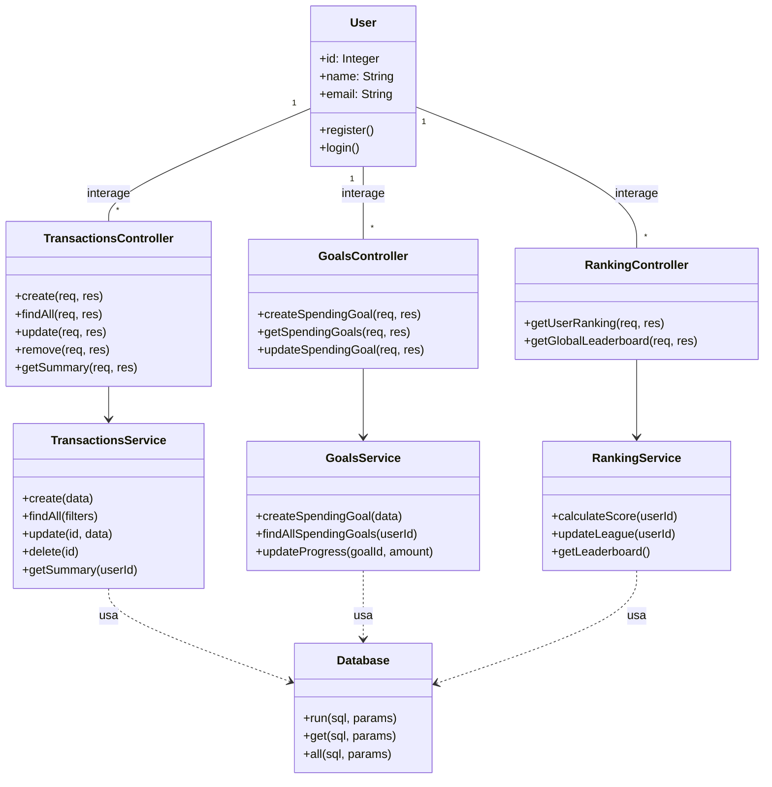
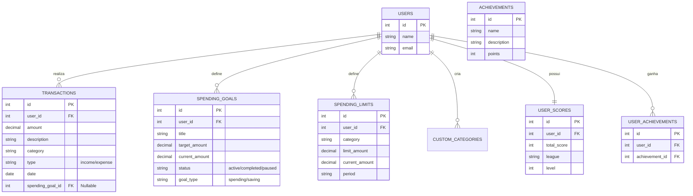
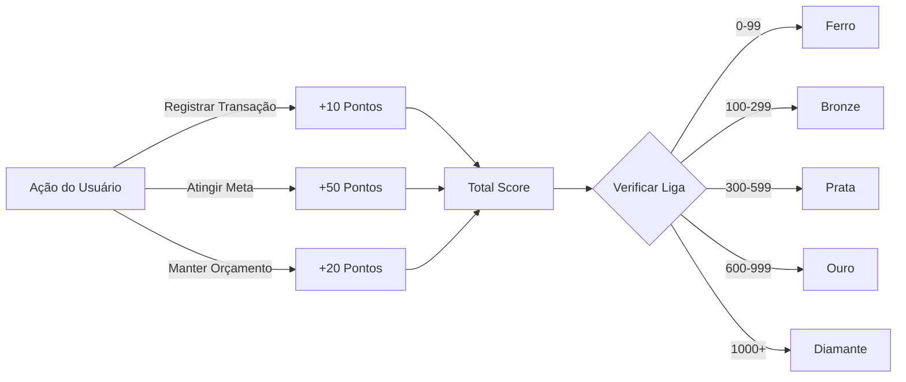
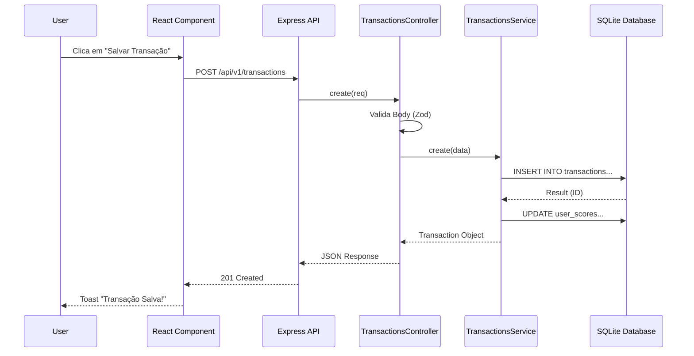

# Documentação Técnica de Desenvolvimento - FYNX (Rev. 04)

## Projeto FYNX - Sistema de Gestão Financeira

**Desenvolvido por:** Matheus Bernardes, Giulianna Mota, Danilo Paiva  
**Revisão Técnica:** Agentic AI (Baseado na Codebase Atual)

## Sumário

1.  **Descrição Geral do Sistema**
    *   1.1. Tema e Objetivo
    *   1.2. Justificativa e Delimitação do Problema
    *   1.3. Público-Alvo
2.  **Engenharia de Requisitos**
    *   2.1. Regras de Negócio
    *   2.2. Requisitos Funcionais (RF)
    *   2.3. Requisitos Não Funcionais (RNF)
3.  **Modelagem e Design do Sistema**
    *   3.1. Diagramas de Caso de Uso (Mermaid + Fluxos Detalhados)
    *   3.2. Estrutura de Classes - Backend (Mermaid + Cartões CRC)
    *   3.3. Modelagem de Dados - ERD (Mermaid + Dicionário de Dados)
    *   3.4. Fluxos de Processos e Lógica (Mermaid)
4.  **Arquitetura de Desenvolvimento**
    *   4.1. Visão Geral da Arquitetura
    *   4.2. Diagrama de Arquitetura do Sistema
    *   4.3. Stack Tecnológico Detalhado
    *   4.4. Estrutura de Diretórios
5.  **Documentação da API**
    *   5.1. Rotas, Endpoints e Payloads
    *   5.2. Diagramas de Sequência

---

## 1. Descrição Geral do Sistema

### 1.1. Tema e Objetivo
O projeto aborda o desenvolvimento de uma plataforma digital para gestão de finanças pessoais, denominada **FYNX**. O objetivo é fornecer uma solução web moderna, acessível e motivadora para que usuários possam monitorar suas finanças, estabelecer metas de economia e acompanhar sua evolução financeira por meio de métricas de desempenho gamificadas.

### 1.2. Justificativa e Delimitação do Problema
A gestão financeira pessoal é frequentemente percebida como complexa e tediosa. O FYNX soluciona este problema centralizando as finanças e integrando dashboards, metas e orçamentos a um sistema motivacional. A gamificação transforma o monitoramento de gastos em uma "jornada", onde a economia gera pontos e reconhecimento (Ligas e Rankings).

### 1.3. Público-Alvo
Destina-se a qualquer pessoa que busca estruturar e controlar suas finanças de forma prática, otimizada e descontraída.

---

## 2. Engenharia de Requisitos

### 2.1. Regras de Negócio (RN)

| ID | Regra de Negócio | Descrição |
|---|---|---|
| **RN001** | Validação de Valores | Valores devem ser positivos. Formato monetário BRL. |
| **RN002** | Categorização | Toda transação deve ter uma categoria (Padrão ou Personalizada). |
| **RN003** | Data de Transação | Data não pode ser futura. |
| **RN004** | Metas de Economia | Devem ter valor alvo positivo e data limite futura. |
| **RN005** | Pontuação (Gamificação) | +10 pts/transação, +50 pts/meta atingida. |
| **RN006** | Sistema de Ligas | Ferro (0-99), Bronze (100-299), Prata (300-599), Ouro (600-999), Diamante (1000+). |
| **RN007** | Reset de Temporada | Pontuação é resetada mensalmente (Carry-over pode existir). |

### 2.2. Requisitos Funcionais (RF)

*   **RF01 - Gestão de Usuários:** Cadastro e Login (Simulado/Básico na versão atual).
*   **RF02 - Transações:** Registrar receitas e despesas com categorias.
*   **RF03 - Dashboard:** Visão geral de saldo, receitas vs despesas e gráficos.
*   **RF04 - Metas (Goals):** Criar e acompanhar metas de economia e orçamentos de gastos.
*   **RF05 - Ranking:** Visualizar posição global e liga atual.
*   **RF06 - Categorias Personalizadas:** Criar categorias próprias.

### 2.3. Requisitos Não Funcionais (RNF)

*   **RNF01 - Responsividade:** Interface adaptável (Mobile-First/Desktop).
*   **RNF02 - Performance:** Respostas rápidas da API (< 200ms).
*   **RNF03 - Persistência:** Dados salvos em banco relacional (SQLite em Dev, PostgreSQL em Prod).

---

## 3. Modelagem e Design do Sistema

### 3.1. Diagramas de Caso de Uso

```mermaid
useCaseDiagram
    actor Usuario as "Usuário"

    package "Gestão Financeira" {
        usecase "Registrar Transação" as UC1
        usecase "Gerenciar Metas" as UC2
        usecase "Visualizar Dashboard" as UC3
        usecase "Gerenciar Categorias" as UC4
    }

    package "Gamificação" {
        usecase "Visualizar Ranking" as UC5
        usecase "Ver Conquistas" as UC6
    }

    Usuario --> UC1
    Usuario --> UC2
    Usuario --> UC3
    Usuario --> UC4
    Usuario --> UC5
    Usuario --> UC6
```

#### Detalhamento dos Casos de Uso

**CSU01: Fazer Login**
| Detalhe | Descrição |
| :--- | :--- |
| **Ator Primário** | Usuário |
| **Pré-condições** | Usuário registrado. |
| **Fluxo Principal** | 1. Usuário informa credenciais.<br>2. Sistema valida.<br>3. Acesso concedido. |
| **Pós-condições** | Usuário autenticado. |

**CSU02: Registrar Usuário**
| Detalhe | Descrição |
| :--- | :--- |
| **Ator Primário** | Usuário |
| **Pré-condições** | Nenhuma. |
| **Fluxo Principal** | 1. Usuário preenche dados (nome, email).<br>2. Sistema cria registro no DB.<br>3. Sistema cria pontuação inicial (Level 1). |
| **Pós-condições** | Novo usuário criado. |

**CSU03: Adicionar Transação**
| Detalhe | Descrição |
| :--- | :--- |
| **Ator Primário** | Usuário |
| **Pré-condições** | Usuário logado. |
| **Fluxo Principal** | 1. Usuário acessa "Nova Transação".<br>2. Preenche valor, descrição, data e seleciona categoria.<br>3. (Opcional) Vincula a uma Meta de Economia.<br>4. Confirma a operação.<br>5. Sistema valida dados (RN001, RN003).<br>6. Sistema persiste a transação.<br>7. Sistema atualiza saldo e pontuação (+10 pts). |
| **Pós-condições** | Transação salva, saldo atualizado, pontuação incrementada. |

**CSU04: Criar Metas de Gasto (Orçamento)**
| Detalhe | Descrição |
| :--- | :--- |
| **Ator Primário** | Usuário |
| **Pré-condições** | Usuário logado. |
| **Fluxo Principal** | 1. Usuário seleciona "Criar Meta de Gasto".<br>2. Define categoria e valor limite.<br>3. Sistema salva meta com type='spending'. |
| **Pós-condições** | Limite de gasto ativo. |

**CSU05: Criar Metas de Economia**
| Detalhe | Descrição |
| :--- | :--- |
| **Ator Primário** | Usuário |
| **Pré-condições** | Usuário logado. |
| **Fluxo Principal** | 1. Usuário seleciona "Criar Meta de Economia".<br>2. Define valor alvo e data.<br>3. Sistema salva meta com type='saving'. |
| **Pós-condições** | Meta de economia ativa. |

**CSU06: Adicionar Transação a uma Meta**
| Detalhe | Descrição |
| :--- | :--- |
| **Ator Primário** | Usuário |
| **Pré-condições** | Meta existente. |
| **Fluxo Principal** | 1. No formulário de transação, usuário seleciona uma meta.<br>2. Sistema vincula o ID da meta à transação.<br>3. Sistema atualiza `current_amount` da meta. |
| **Pós-condições** | Progresso da meta atualizado. |

**CSU07: Visualizar Dashboard**
| Detalhe | Descrição |
| :--- | :--- |
| **Ator Primário** | Usuário |
| **Pré-condições** | Usuário logado. |
| **Fluxo Principal** | 1. Sistema busca saldo total.<br>2. Sistema busca últimas transações.<br>3. Sistema calcula totais por categoria.<br>4. Exibe gráficos e resumos. |
| **Pós-condições** | Visão geral apresentada. |

**CSU08: Visualizar Ranking Global**
| Detalhe | Descrição |
| :--- | :--- |
| **Ator Primário** | Usuário |
| **Pré-condições** | Usuário logado. |
| **Fluxo Principal** | 1. Usuário acessa "Ranking".<br>2. Sistema calcula pontuação total (FynxScore).<br>3. Sistema determina a Liga atual (RN006).<br>4. Sistema exibe lista ordenada de usuários.<br>5. Usuário vê sua posição e badge da liga. |
| **Pós-condições** | Usuário ciente de sua classificação. |

### 3.2. Estrutura de Classes (Backend)

O backend segue o padrão **Controller-Service-Repository**.

> **Nota sobre a Classe Usuário:** Embora não exista um `UsersController` explícito na implementação atual (pois o foco é na gestão financeira e a autenticação é simplificada), a entidade `User` é fundamental para o modelo de dados e é representada implicitamente em todas as operações através do `userId`.



#### Cartões CRC (Class-Responsibility-Collaborator)

**User**
| Responsabilidades | Colaboradores |
| :--- | :--- |
| Representar a identidade do usuário no sistema. | - |
| Fornecer dados para autenticação e perfil. | TransactionsController, GoalsController, RankingController |

**TransactionsController**
| Responsabilidades | Colaboradores |
| :--- | :--- |
| Receber requisições HTTP de transações. | TransactionsService |
| Validar dados de entrada (Body/Query). | - |
| Formatar respostas JSON para o cliente. | - |

**TransactionsService**
| Responsabilidades | Colaboradores |
| :--- | :--- |
| Implementar regras de negócio de transações. | Database |
| Calcular totais e resumos financeiros. | GoalsService (atualizar metas) |
| Validar consistência dos dados. | RankingService (atualizar pontuação) |

**GoalsController**
| Responsabilidades | Colaboradores |
| :--- | :--- |
| Gerenciar endpoints de metas e orçamentos. | GoalsService |
| Validar payloads de criação/edição de metas. | - |

**GoalsService**
| Responsabilidades | Colaboradores |
| :--- | :--- |
| Gerenciar ciclo de vida de metas (Active/Completed). | Database |
| Calcular progresso das metas. | TransactionsService |
| Verificar se orçamentos foram estourados. | - |

**RankingController**
| Responsabilidades | Colaboradores |
| :--- | :--- |
| Expor endpoints de gamificação e ranking. | RankingService |

**RankingService**
| Responsabilidades | Colaboradores |
| :--- | :--- |
| Calcular FynxScore e nível do usuário. | Database |
| Gerenciar sistema de Ligas e Conquistas. | - |
| Gerar leaderboard global. | - |

**Database**
| Responsabilidades | Colaboradores |
| :--- | :--- |
| Gerenciar conexão com o banco SQLite. | - |
| Executar queries SQL (run, get, all). | Services (Transactions, Goals, Ranking) |
| Inicializar schema e seed de dados. | - |

### 3.3. Modelagem de Dados (ERD e Dicionário)



#### Dicionário de Dados (Entidades Detalhadas)

**Tabela: USERS**
| Coluna | Tipo | Restrição | Descrição |
| :--- | :--- | :--- | :--- |
| `id` | INTEGER | PK, AutoInc | Identificador único do usuário. |
| `name` | TEXT | Not Null | Nome completo. |
| `email` | TEXT | Unique, Not Null | E-mail de login. |

**Tabela: TRANSACTIONS**
| Coluna | Tipo | Restrição | Descrição |
| :--- | :--- | :--- | :--- |
| `id` | INTEGER | PK, AutoInc | Identificador único da transação. |
| `user_id` | INTEGER | FK, Not Null | Referência ao usuário dono da transação. |
| `amount` | DECIMAL(10,2) | Not Null | Valor monetário da transação. |
| `description` | TEXT | Not Null | Descrição curta (ex: "Almoço"). |
| `category` | TEXT | Not Null | Categoria (ex: "Alimentação"). |
| `type` | TEXT | Check('income','expense') | Tipo da movimentação. |
| `date` | DATE | Not Null | Data da ocorrência. |
| `spending_goal_id` | INTEGER | FK, Nullable | Vínculo opcional com uma meta. |

**Tabela: SPENDING_GOALS (Metas)**
| Coluna | Tipo | Restrição | Descrição |
| :--- | :--- | :--- | :--- |
| `id` | INTEGER | PK, AutoInc | Identificador único da meta. |
| `title` | TEXT | Not Null | Nome da meta (ex: "Viagem 2024"). |
| `target_amount` | DECIMAL | Not Null | Valor alvo a ser atingido. |
| `current_amount` | DECIMAL | Default 0 | Valor já economizado/gasto. |
| `goal_type` | TEXT | Default 'spending' | Tipo: 'spending' (limite) ou 'saving' (economia). |
| `status` | TEXT | Check('active'...) | Estado atual da meta. |

**Tabela: SPENDING_LIMITS**
| Coluna | Tipo | Restrição | Descrição |
| :--- | :--- | :--- | :--- |
| `id` | INTEGER | PK, AutoInc | Identificador único. |
| `category` | TEXT | Not Null | Categoria monitorada. |
| `limit_amount` | DECIMAL | Not Null | Valor limite para o período. |
| `period` | TEXT | Check('monthly'...) | Periodicidade do limite. |

**Tabela: CUSTOM_CATEGORIES**
| Coluna | Tipo | Restrição | Descrição |
| :--- | :--- | :--- | :--- |
| `id` | INTEGER | PK, AutoInc | Identificador único. |
| `name` | TEXT | Not Null | Nome da categoria personalizada. |
| `type` | TEXT | Check('income','expense') | Tipo da categoria. |

**Tabela: USER_SCORES (Gamificação)**
| Coluna | Tipo | Restrição | Descrição |
| :--- | :--- | :--- | :--- |
| `user_id` | INTEGER | FK, Unique | Usuário a que se refere o score. |
| `total_score` | INTEGER | Default 0 | Pontuação acumulada na temporada. |
| `league` | TEXT | Default 'Bronze' | Liga atual (Ferro, Bronze, etc.). |
| `level` | INTEGER | Default 1 | Nível do usuário (RPG-like). |

**Tabela: ACHIEVEMENTS (Conquistas)**
| Coluna | Tipo | Restrição | Descrição |
| :--- | :--- | :--- | :--- |
| `id` | INTEGER | PK, AutoInc | Identificador único. |
| `name` | TEXT | Not Null | Nome da conquista. |
| `points` | INTEGER | Not Null | Pontos concedidos ao desbloquear. |

### 3.4. Fluxos de Processos e Lógica

#### Fluxo de Processamento de Transação
Visualiza o caminho desde a requisição até a persistência e efeitos colaterais (atualização de saldo e metas).

```mermaid
flowchart TD
    A[Início: Requisição POST /transactions] --> B{Validar Dados?}
    B -- Inválido --> C[Retornar Erro 400]
    B -- Válido --> D[TransactionsService.create]
    D --> E[Persistir Transação no DB]
    E --> F{Vinculado a Meta?}
    F -- Sim --> G[Atualizar Progresso da Meta]
    F -- Não --> H[Verificar Limites de Gastos]
    G --> H
    H --> I[Atualizar Pontuação do Usuário (+10pts)]
    I --> J[Retornar Sucesso 201]
```

#### Lógica de Ranking e Gamificação
Como as ações do usuário influenciam sua posição e liga.



---

## 4. Arquitetura de Desenvolvimento

### 4.1. Visão Geral
O FYNX utiliza uma arquitetura monolítica modularizada para o backend (API) e uma Single Page Application (SPA) para o frontend.

*   **Frontend:** React com Vite, comunicando-se via REST API.
*   **Backend:** Node.js com Express, servindo dados JSON.
*   **Database:** SQLite (arquivo local `fynx.db`) para desenvolvimento ágil.

### 4.2. Diagrama de Arquitetura do Sistema

Este diagrama ilustra a comunicação entre os componentes principais do sistema.

```mermaid
graph TD
    subgraph Client [Cliente (Navegador)]
        UI[React UI Components]
        Store[TanStack Query Cache]
        Router[React Router]
    end

    subgraph Server [Backend (Node.js/Express)]
        API[API Gateway / Routes]
        Auth[Auth Middleware]
        Controllers[Controllers Layer]
        Services[Services Layer]
    end

    subgraph Data [Persistência]
        DB[(SQLite Database)]
    end

    UI -->|Interação| Store
    Store -->|HTTP Request| API
    Router -->|Navegação| UI

    API --> Auth
    Auth --> Controllers
    Controllers --> Services
    Services -->|SQL Queries| DB
    DB -->|Result Sets| Services
```

### 4.3. Stack Tecnológico

| Camada | Tecnologia | Versão/Detalhe |
|---|---|---|
| **Frontend** | React | 18.3 |
| | TypeScript | 5.6 |
| | Vite | 5.4 |
| | TailwindCSS | 3.4 (Estilização) |
| | TanStack Query | v5 (Gerenciamento de Estado Server-side) |
| **Backend** | Node.js | 20+ |
| | Express | 5.1.0 |
| | SQLite3 | Driver nativo |
| | Zod | Validação de Schemas |

### 4.4. Estrutura de Diretórios

```
ProjetoFynx/
├── FynxApi/ (Backend)
│   ├── src/
│   │   ├── database/ (Conexão e Migrations manuais)
│   │   ├── modules/ (Feature-based: transactions, goals, ranking...)
│   │   ├── routes/ (Definição de rotas da API)
│   │   └── server.ts (Entry point)
│
├── FynxV2/ (Frontend)
│   ├── src/
│   │   ├── components/ (UI e Widgets)
│   │   ├── pages/ (Views: Index, Ranking, Goal...)
│   │   ├── services/ (Axios/Fetch calls)
│   │   └── tours/ (Guias de usuário Driver.js)
│   │   └── tours/ (Guias de usuário Driver.js)
```

---

## 5. Documentação da API

### 5.1. Rotas, Endpoints e Payloads

Abaixo estão detalhados os endpoints principais e os dados necessários para realizar as requisições.

#### **Transações**

*   **POST** `/api/v1/transactions`
    *   **Descrição:** Cria uma nova transação financeira.
    *   **Payload (JSON):**
        ```json
        {
          "userId": 1,
          "amount": 150.00,
          "description": "Compras Supermercado",
          "category": "Alimentação",
          "type": "expense",
          "date": "2024-11-24",
          "spendingGoalId": 5  // Opcional, vincula a uma meta
        }
        ```
    *   **Resposta (201):** Objeto da transação criada.

*   **GET** `/api/v1/transactions`
    *   **Descrição:** Lista transações com filtros.
    *   **Query Params:** `?userId=1&type=expense&category=Alimentação&dateFrom=2024-01-01`

#### **Metas (Goals)**

*   **POST** `/api/v1/goals`
    *   **Descrição:** Cria uma nova meta de economia ou limite de gastos.
    *   **Payload (JSON):**
        ```json
        {
          "userId": 1,
          "title": "Viagem Férias",
          "target_amount": 5000.00,
          "goal_type": "saving", // ou 'spending'
          "period": "monthly",   // se for spending
          "end_date": "2025-12-31"
        }
        ```

#### **Ranking**

*   **GET** `/api/v1/ranking`
    *   **Descrição:** Retorna a posição do usuário e o leaderboard global.
    *   **Query Params:** `?userId=1`
    *   **Resposta (200):**
        ```json
        {
          "userRank": { "position": 5, "score": 1200, "league": "Ouro" },
          "leaderboard": [ ... ]
        }
        ```

### 5.2. Diagrama de Sequência: Ciclo de Vida da Requisição

Exemplo de como uma requisição flui do componente React até o banco de dados.


